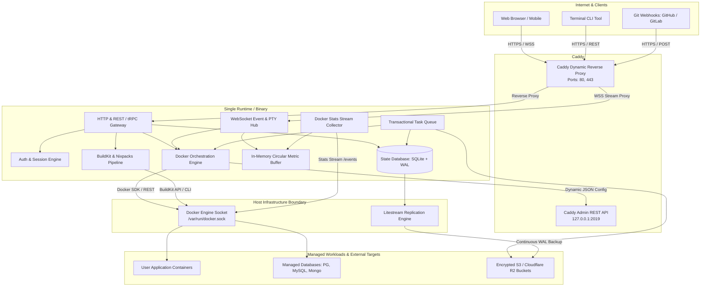

# 01. System Topology & Architecture

This document specifies the structural topology, component boundaries, inter-process communication (IPC) protocols, and deployment models for the next-generation PaaS.

---

## 1. Top-Level Architectural Topology

---

## 2. Component Boundaries & Responsibilities

### A. Edge Ingress: Caddy Dynamic Proxy
- **Role**: Termination of public HTTP/HTTPS traffic on ports 80 and 443; automatic ACME certificate management; routing traffic to user applications and internal control plane.
- **Contract Boundary**: Controlled strictly over loopback HTTP via its Admin API (`http://127.0.0.1:2019`).
- **Isolation**: Caddy runs in its own network namespace or container sharing the internal PaaS Docker bridge network (`paas-network`).

### B. Control Plane Core: Single Runtime
- **Role**: Consolidates API routing, authentication, RBAC, background job processing, container lifecycle management, real-time log multiplexing, and metrics collection.
- **Contract Boundary**: 
  - Exposes typed REST/tRPC APIs for frontend and CLI.
  - Exposes an authenticated WebSocket endpoint (`/ws/events`) for real-time logs, PTY terminal, container stats, and deployment progress.
- **State Store**: SQLite in Write-Ahead-Logging (`WAL`) mode with foreign key enforcement (`PRAGMA foreign_keys = ON;`), continuously replicated to S3 via **Litestream**.

### C. Container Engine Boundary: Docker Socket
- **Role**: Local container virtualization, container networking, volume mounting, and image builds.
- **Contract Boundary**: Native Docker Engine API socket (`/var/run/docker.sock`). No intermediate shelling or CLI wrapping.

---

## 3. Communication Protocols & Data Formats

| Boundary Path | Protocol | Serialization Format | Authentication Mechanism |
| :--- | :--- | :--- | :--- |
| **Client -> Caddy** | HTTPS / WSS | TLS 1.3 / HTTP/2 & HTTP/3 | Public / TLS Certificates |
| **Caddy -> Control Plane** | HTTP / WS | JSON / Binary Frame Stream | Loopback / Internal Network |
| **Control Plane -> Caddy Admin** | HTTP REST | JSON (`/config/apps/http/...`) | Localhost loopback binding (`127.0.0.1:2019`) |
| **Control Plane -> Docker Engine** | Unix Socket | HTTP/1.1 over Unix Domain Socket | Filesystem permissions on socket (`0660 root:docker`) |
| **Control Plane -> S3 Storage** | HTTPS | AWS S3 REST API (SigV4) | AWS Access Key / Secret Key / IAM Role |
| **Client -> WS Hub** | WSS | JSON Envelope / Raw ANSI Binary | Encrypted Session Cookie / API Token |

---

## 4. Deployment Topologies

### Topology 1: Single-Node Sovereign Deployment (Recommended Standard)
* Target: Dedicated VPS, Bare-Metal Server, Homelab, Single Cloud Instance.
* Characteristics:
  * 1 Control plane container.
  * 1 Caddy ingress container.
  * 1 SQLite database file backed up continuously to S3 via Litestream.
  * All applications and managed databases run on the local Docker engine.
  * Zero external dependencies (No external database, no Redis, no cloud coordinator).

### Topology 2: Distributed Multi-Server Control Plane
* Target: Multi-node clusters where 1 Control Plane coordinates multiple remote worker nodes.
* Characteristics:
  * **Primary Node**: Runs the Web UI, API Gateway, and SQLite/Postgres state database.
  * **Worker Nodes**: Run a lightweight Agent (or communicate directly via Docker socket over **mTLS / WireGuard tunnel**).
  * **Ingress**: Caddy instances running at edge or per-node with distributed DNS (Cloudflare DNS-01 integration).

---

## 5. Architectural Edge Cases & Failure Modes

| Subsystem Failure | Failure Mechanism | Architectural Recovery Strategy |
| :--- | :--- | :--- |
| **Control Plane Crash** | Unhandled fatal error or OOM in control plane process. | Control plane container restarts cleanly in <1s; existing user application containers and Caddy proxy continue running uninterrupted because Docker daemon runs out-of-process. |
| **Docker Socket Hang** | Docker daemon stalls or deadlocks on container stats/pull. | All Docker API client calls wrap an explicit context with hard timeouts (`context.WithTimeout(ctx, 15*time.Second)`). Goroutine pools are never blocked permanently. |
| **Corrupted Control Plane Disk** | Hardware failure or filesystem corruption on host VPS. | Litestream point-in-time recovery pulls the latest SQLite snapshot and WAL frames from S3 storage during container initialization. |
| **Caddy Dynamic API Desync** | Control plane restarts while Caddy state was modified. | On startup, the control plane executes a full **Ingress Reconciliation Pass**, querying the database for all active domains and pushing the complete canonical routing tree to Caddy Admin API. |
| **Host Reboot / Power Loss** | Host server undergoes ungraceful reboot. | Docker daemon auto-starts with `restart: always` or `systemd` unit; container restart policies bring applications back online; Caddy loads its persisted dynamic configuration. |
