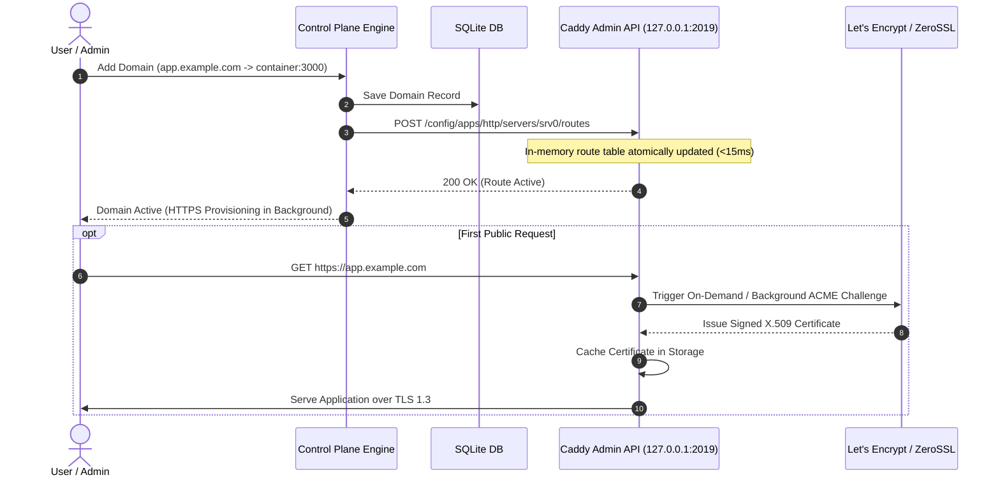

# 02. Ingress & Dynamic Routing Engine

This document details the reverse proxy architecture, dynamic routing via Caddy's JSON Admin API, automated TLS certificate lifecycle management, and ingress edge cases.

---

## 1. Architectural Choice: Why Caddy Admin API?

Traditional PaaS architectures rely on writing Traefik YAML/JSON configuration files or Nginx configuration blocks to disk, requiring filesystem polling or process signals (`SIGHUP`).

### Comparison Matrix

| Dimension | Caddy Dynamic Admin API | Traefik Dynamic File Provider | Nginx Config Generation |
| :--- | :--- | :--- | :--- |
| **Configuration Interface** | REST API (`POST /config/...`) | Watching disk files (`.yml` / `.toml`) | Template rendering + `nginx -s reload` |
| **Apply Latency** | **< 15 ms** (in-memory atomic swap) | 1,000 – 3,000 ms (file watch loop) | 500 – 2,000 ms (fork + reload) |
| **Zero-Downtime TLS** | **Native** (automatic ACME in Go) | Native (Traefik ACME store) | Requires external `certbot` daemon |
| **Crash Risk on Invalid Config**| **Zero** (API rejects invalid payload with 400; keeps old routes active) | File syntax errors can crash or disable entire router | Bad config test can abort reload or break live routing |
| **Filesystem State** | 100% in-memory / zero file locks | Prone to file write race conditions | Prone to broken symlinks / partial writes |

---

## 2. Ingress Dataflow & Dynamic Route Lifecycle



---

## 3. Caddy JSON Route Payload Specification

When a service route is registered or modified, the control plane constructs a canonical JSON route definition and commits it to Caddy:

```json
{
  "@id": "route_app_123_custom_domain",
  "match": [
    {
      "host": ["app.example.com"]
    }
  ],
  "handle": [
    {
      "handler": "subroute",
      "routes": [
        {
          "handle": [
            {
              "handler": "headers",
              "response": {
                "set": {
                  "X-Frame-Options": ["SAMEORIGIN"],
                  "X-Content-Type-Options": ["nosniff"],
                  "Strict-Transport-Security": ["max-age=31536000; includeSubDomains; preload"]
                }
              }
            },
            {
              "handler": "reverse_proxy",
              "upstreams": [
                {
                  "dial": "paas-app-container-123:3000"
                }
              ],
              "transport": {
                "protocol": "http",
                "keep_alive": {
                  "max_idle_conns": 100
                }
              }
            }
          ]
        }
      ]
    }
  ],
  "terminal": true
}
```

---

## 4. Automated TLS Lifecycle (ACME Protocol)

### A. HTTP-01 Challenges
- Used for standard domain names (`app.example.com`).
- Caddy automatically binds to port 80, intercepts `.well-known/acme-challenge/*`, solves the token verification challenge, and forwards all standard HTTP traffic to HTTPS via a `308 Permanent Redirect`.

### B. DNS-01 Challenges (Wildcards & Internal Networks)
- Required for wildcard domains (`*.apps.example.com`) or servers behind private firewalls.
- Control plane provides pluggable DNS provider credentials (Cloudflare, AWS Route53, DigitalOcean, Hetzner) to Caddy via the `tls.issuance.acme` module.

### C. On-Demand TLS with Security Whitelist
- To support arbitrary custom domains configured by tenants without pre-registering certificates:
- Enable Caddy's `on_demand_tls` module.
- **Security Invariant**: Caddy must be configured with an `ask` endpoint pointing back to the Control Plane:
  ```json
  "on_demand": {
    "ask": "http://127.0.0.1:8080/api/internal/verify-domain"
  }
  ```
- **Mitigation against Denial-of-Service / Certificate Rate Limiting**: If an attacker points 10,000 dummy domains to the server IP, the Control Plane rejects unverified domains with HTTP 403, preventing Let's Encrypt rate limit exhaustion.

---

## 5. Ingress Edge Cases & Resiliency Matrix

| Edge Case | Failure Mechanism | Architectural Solution |
| :--- | :--- | :--- |
| **Let's Encrypt Rate Limit Hit** | Rapid domain creation hitting the 50 certs/week/domain limit. | Automatic failover to **ZeroSSL** as fallback ACME provider; staging environment detection for local development. |
| **Flapping / Unresolvable Domains** | Tenant adds a domain whose DNS records are not yet propagated. | Background DNS validator checks `A` and `AAAA` records before triggering active ACME issuance, preventing failed challenge accumulation. |
| **WebSocket Connection Drops** | Long-lived WebSocket terminals or real-time feeds getting killed by proxy idle timeouts. | Caddy upstream transport configured with `read_timeout: 0` and `write_timeout: 0` for WebSocket paths, combined with client-side heartbeats. |
| **CAA Record Blocks** | Customer's DNS has CAA records blocking Let's Encrypt or ZeroSSL. | Domain diagnostics endpoint audits CAA records via DNS resolver and alerts tenant in UI before certificate generation stalls. |
| **Large File Uploads (`413 Payload Too Large`)** | Reverse proxy abruptly terminating multipart form file uploads. | Remove default request body ceilings on reverse proxy upstreams (`request_body` buffer limit set to stream directly to container). |
| **Upstream Container Restarting** | Request arrives while application container is restarting or unhealthy. | Caddy configured with active health checks and retry backoff (`retries: 3`), returning a clean 503 Maintenance page instead of a raw connection reset. |
