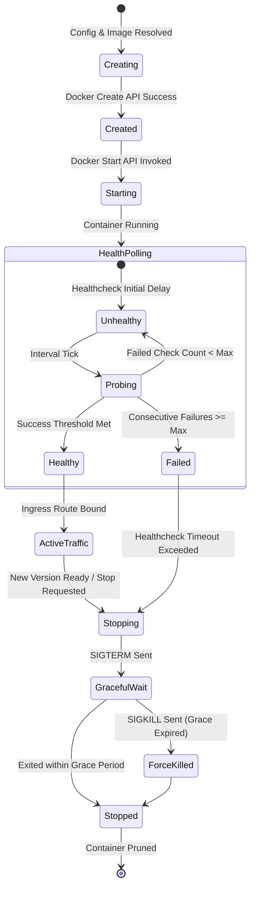
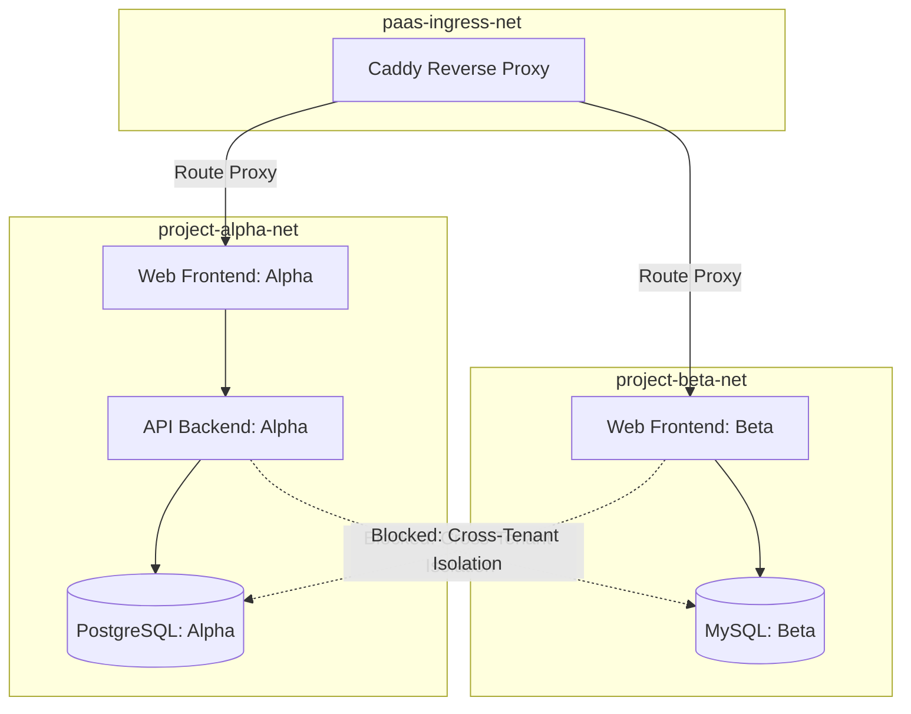

# 03. Container Orchestration & Runtime Engine

This document details the direct Docker Engine API integration, container lifecycle state machine, zero-downtime rolling restart protocols, network isolation boundaries, and storage volume architectures.

---

## 1. Direct Docker Engine API Architecture

The control plane establishes a direct HTTP-over-Unix-socket connection with `/var/run/docker.sock` using official SDK bindings.

### Communication Rules:
1. **Zero Shelling**: No calls to `child_process.exec("docker run ...")` or `os/exec`.
2. **Context Cancellation**: Every API invocation passes a Go `context.Context` or Node `AbortSignal` with an explicit timeout.
3. **Stream Safety**: Container stdio streams (`attach`, `logs`, `exec`) use Docker's multiplexed stream format (8-byte header: 1 byte stream type + 3 bytes padding + 4 bytes big-endian length) decoded via binary parsers.

```mermaid
graph LR
    subgraph Control Plane Core
        ORCH[Orchestration Engine]
        LOG_PARSER[Docker Multiplexed Stream Parser]
        HEALTH_MON[Health Check Poller]
    end

    subgraph Docker Engine Daemon
        SOCK[(/var/run/docker.sock)]
        ENGINE[containerd / runc]
    end

    subgraph Managed Containers
        C_OLD[Application Container: v1 (Active)]
        C_NEW[Application Container: v2 (Booting)]
    end

    ORCH -->|POST /containers/create| SOCK
    ORCH -->|POST /containers/{id}/start| SOCK
    SOCK --> ENGINE
    ENGINE --> C_NEW
    HEALTH_MON -->|GET /containers/{id}/json| SOCK
    SOCK --> LOG_PARSER
    LOG_PARSER -->|Decoded Stdout/Stderr| ORCH
```

---

## 2. Container Lifecycle State Machine



---

## 3. Zero-Downtime Rolling Deployment Protocol (Start-before-Stop)

To achieve true zero-downtime updates without port collision hazards:

1. **Random Ephemeral Container Naming**: New version is provisioned with a unique immutable name (e.g. `app_<id>_<short_sha>_<timestamp>`).
2. **Dedicated Internal Project Network**: Containers communicate over an internal Docker bridge network (`project_<id>_net`). Ports are **not** mapped directly to the host IP (preventing port collision); instead, containers expose standard ports internally.
3. **Boot New Container**: Execute `container.Start()` for Version 2.
4. **Health Probing**: Poll Docker Engine health state (`State.Health.Status == "healthy"`) or issue active HTTP probe (`GET /health`) against the new container's internal IP.
5. **Atomic Ingress Switchover**: Once healthy, issue `POST /config/apps/http/servers/srv0/routes` to Caddy Admin API, instantaneously swapping the upstream IP from `v1` to `v2`.
6. **Graceful Drain & Teardown**:
   - Send `SIGTERM` to Version 1 with a configurable grace period (`StopTimeout: 30s`).
   - If Version 1 fails to exit within 30 seconds, send `SIGKILL`.
   - Remove Version 1 container.

---

## 4. Volume Architecture & Permissions

### Storage Types:
1. **Named Volumes (`paas_data_<app_id>_<vol_name>`)**: Recommended for all application data and managed databases. Docker manages volume storage under `/var/lib/docker/volumes/`, offering native snapshot compatibility and isolation.
2. **Host Bind Mounts (`/opt/paas/binds/...`)**: Permitted only when explicit host directory access is required.

### UID/GID Ownership Normalization:
When mounting volumes to non-root containers (e.g. Postgres `uid: 999`, Node `uid: 1000`):
- The control plane checks volume permissions prior to container boot.
- If initial volume directory permissions are root-owned (`0700 root`), the engine executes an initialization chown task or uses Docker's `User` directive safely.

---

## 5. Network Isolation & Security Boundaries



- **Per-Project Bridge Networks**: Each project receives an isolated Docker network. Services inside `Project Alpha` cannot resolve or reach containers in `Project Beta`.
- **Ingress Network Sharing**: Only the frontend entrypoints of each application attach to `paas-ingress-net` alongside Caddy. Database containers are attached strictly to internal project networks and never expose ports to public host interfaces.

---

## 6. Runtime Edge Cases & Resiliency Matrix

| Edge Case | Failure Mechanism | Architectural Solution |
| :--- | :--- | :--- |
| **Port Conflicts on Host** | Two apps attempting to bind host port 3000. | Zero host port exposure for applications; all traffic routed via internal container network IPs managed by Caddy. |
| **Ungraceful SIGKILL on Database** | Container forcefully killed mid-transaction, risking corruption. | Managed database containers are given an extended graceful shutdown timeout (`StopTimeout: 120s`) allowing clean WAL flush. |
| **Zombie / Leaked Containers** | Deployment pipeline aborted mid-flight, leaving dangling test containers. | All transient containers created during builds/tests are assigned an auto-cleanup label (`paas.transient=true`) and tracked in a global reconciler that prunes orphaned resources. |
| **Docker Engine Out-of-Space (`ENOSPC`)** | Unused image layers and builder cache filling host disk. | Scheduled GC cron invoking Docker API `POST /images/prune` and `POST /build/prune` with age filters (`until=72h`). |
| **Memory / CPU Starvation** | Single rogue tenant consumes 100% host CPU or RAM. | Hard resource constraints applied at container creation (`HostConfig.Memory`, `HostConfig.NanoCPUs`, `HostConfig.MemorySwap = Memory`). |
