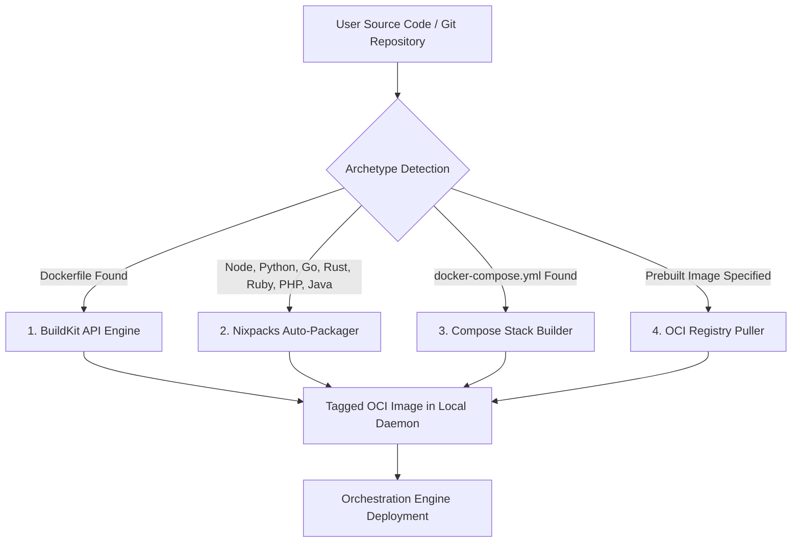
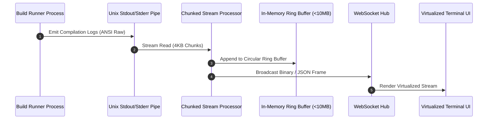

# 04. Build Pipelines & Artifact Packaging

This document specifies the architecture for building container images from source code, Git repositories, Dockerfiles, and Compose stacks without leaking secrets or buffering unbounded build output in memory.

---

## 1. Build Pipeline Archetypes

The build engine supports four primary packaging archetypes:



---

## 2. Secure Secret Injection vs Layer Leakage

### The Anti-Pattern (Dokploy / Naive Builders)
Injecting build secrets via standard Docker `ARG` or `ENV` instructions in Dockerfiles bakes secret tokens directly into the immutable container layer metadata, allowing anyone with `docker inspect` or image pull access to extract API keys.

### The Clean Pattern: BuildKit Secret Mounts
Secrets are passed exclusively as ephemeral BuildKit secret mounts:
- Command: `docker buildx build --secret id=API_KEY,env=API_KEY ...`
- In Dockerfile:
  ```dockerfile
  # Secrets are mounted in-memory at /run/secrets/ and NEVER committed to image layers
  RUN --mount=type=secret,id=API_KEY \
      export API_KEY=$(cat /run/secrets/API_KEY) && \
      npm run build
  ```

---

## 3. Real-Time Streaming Log Architecture



### Memory Safety Guarantees:
- **No Unbounded Strings**: Never perform `allLogs += chunk`. Logs are stored in a fixed-size ring buffer (e.g. max 5,000 lines or 10 MB in memory) and streamed directly to a temporary build log file on disk.
- **Backpressure Handling**: If a WebSocket client experiences slow network ingestion, the control plane applies consumer backpressure or drops transient rendering frames while preserving the full log file on disk.

---

## 4. Build Cancellation & Resource Reclamation Protocol

When a user cancels a deployment or a newer Git commit supersedes an active build:

1. **Signal Process Group**: The build process is spawned inside a dedicated POSIX Process Group (`Setpgid: true`).
2. **Graceful Kill (`SIGTERM`)**: Send `SIGTERM` to `-pgid` (the negative PID targets all child subprocesses, including nested compilers and Nixpacks binaries).
3. **Hard Kill (`SIGKILL`)**: After a 5-second grace period, send `SIGKILL` to `-pgid`.
4. **Dangling Image & Cache Prune**: Query Docker Engine for dangling intermediate build containers (`label: paas.build.id=<id>`) and remove them atomically.

---

## 5. Build Pipeline Edge Cases & Resiliency Matrix

| Edge Case | Failure Mechanism | Architectural Solution |
| :--- | :--- | :--- |
| **Compiler Out-of-Memory (OOM)** | Large Webpack, Next.js, or Rust compilation exceeding host RAM and triggering Linux OOM killer. | Build processes are sandboxed inside Docker containers with explicit memory ceilings (`--memory=4g`) and swap allocations (`--memory-swap=6g`). |
| **Infinite Build / Network Hang** | `npm install` or `cargo build` hanging indefinitely on a broken network socket. | Strict global build timeout (configurable, default: 20 minutes). A background timer cancels the build context on expiry. |
| **Monorepo Root Directory Misalignment** | Monorepo where sub-service is in `packages/backend` and requires root context for dependencies. | Explicit separation between `ContextPath` (repository root `.`) and `DockerfilePath` (`packages/backend/Dockerfile`). |
| **Recursive Git Submodules** | Private Git submodules failing authentication during automated clone. | Pass an ephemeral SSH agent socket or OAuth token to `git clone --recurse-submodules` without writing keys to disk. |
| **Cache Poisoning** | Outdated Nixpacks layer cache causing stale application builds. | Provide a one-click "Clean Build" option (`--no-cache`) in UI and API, wiping BuildKit cache refs for that application ID. |
