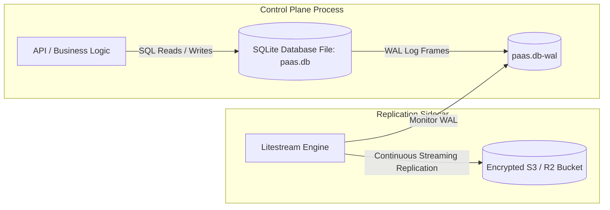
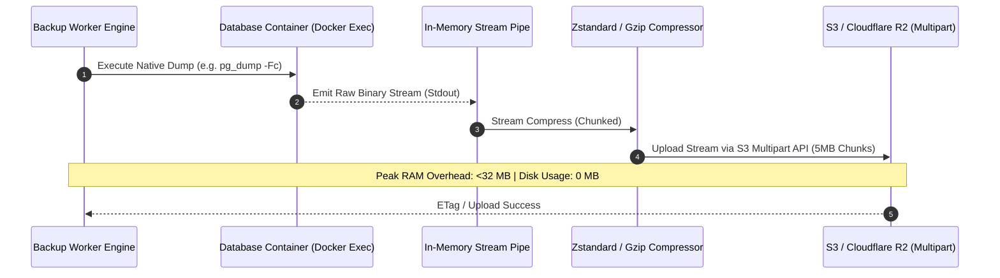
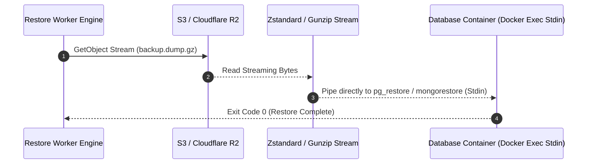

# 05. State Storage, Managed Databases & Streaming Backups

This document details the persistence architecture for the PaaS control plane, the lifecycle management of one-click managed databases, and the zero-disk-bloat streaming S3 backup & restore engine.

---

## 1. Control Plane Persistence: SQLite (WAL) + Litestream

For single-node deployments, running a separate PostgreSQL or MySQL container for the control plane introduces needless memory overhead, connection pool tuning, and circular startup dependencies (who starts the database that the orchestrator needs to start?).

### Architecture:
- **Engine**: Embedded **SQLite** compiled with Write-Ahead Logging (`PRAGMA journal_mode = WAL;`) and synchronous normal (`PRAGMA synchronous = NORMAL;`).
- **Concurrency**: SQLite in WAL mode supports unlimited concurrent readers alongside 1 writer with sub-millisecond query latencies.
- **Continuous Disaster Recovery**: **Litestream** runs as a lightweight sidecar or in-process goroutine, monitoring WAL frames and streaming incremental changes to Cloudflare R2 / AWS S3 every 10 seconds.

---

## 2. Managed Database Lifecycle Engine

The platform provides native, one-click provisioning and lifecycle management for production database engines:

| Engine | Base Image | Default Port | Internal Storage Volume | Native Dump Utility |
| :--- | :--- | :---: | :--- | :--- |
| **PostgreSQL** | `postgres:17-alpine` | 5432 | `paas_db_pg_<id>` | `pg_dump -Fc` (Custom Archive Format) |
| **MySQL** | `mysql:8.4` | 3306 | `paas_db_mysql_<id>` | `mysqldump --single-transaction --quick` |
| **MariaDB** | `mariadb:11.4` | 3306 | `paas_db_maria_<id>` | `mariadb-dump --single-transaction` |
| **MongoDB** | `mongo:7.0` | 27017 | `paas_db_mongo_<id>` | `mongodump --archive --gzip` |
| **Redis** | `redis:7.4-alpine` | 6379 | `paas_db_redis_<id>` | `redis-cli --rdb /data/dump.rdb` |

### Security Invariants for Managed DBs:
1. **No Public Port Exposure by Default**: Managed databases attach strictly to the project's internal Docker bridge network (`project_<id>_net`). They are never exposed to `0.0.0.0` unless explicitly toggled by an administrator.
2. **Strict Parameter Passing**: Database credentials (usernames, passwords, database names) are passed to dump tools via **environment variables** (e.g. `PGPASSWORD`) or temporary connection files (`.pgpass`), NEVER interpolated into CLI command strings.

---

## 3. Pure Streaming S3 Backup Pipeline

### The Flawed Anti-Pattern (Dokploy / Legacy Tools):
1. Shell out to bash: `pg_dump ... > /tmp/backup.sql` (writes entire DB to `/tmp` disk).
2. Compress on disk: `gzip /tmp/backup.sql` (requires 2x disk space).
3. Upload to S3 via `rclone copy /tmp/backup.sql.gz s3:...`
4. *Result*: On a 100 GB database, the host runs out of disk (`ENOSPC`), crashing both the host and the active database.

### The Clean Pattern: Piped Unix Streams to S3 Multipart Upload
The entire backup flow is executed as a pure memory-bounded streaming pipeline:

---

## 4. Pure Streaming Restore Pipeline

Similarly, restoring a database from S3 streams data directly from S3 into the database import process without extracting archives to the filesystem:

---

## 5. Storage & Backup Edge Cases & Resiliency Matrix

| Edge Case | Failure Mechanism | Architectural Solution |
| :--- | :--- | :--- |
| **Network Interruption During 50GB Upload** | S3 connection drops at 95% completion. | S3 Multipart Upload with per-chunk exponential retries and checksum verification (`Content-MD5` / `SHA256`). |
| **Table Locking During Backup** | Long-running backup blocks write queries on live applications. | PostgreSQL uses `pg_dump` (uses snapshot MVCC; zero write locks); MySQL/MariaDB strictly mandates `--single-transaction`. |
| **Special Characters in Passwords** | Passwords containing `$`, `'`, `"`, `\` breaking shell commands. | Pass credentials via standard environment variables or Unix configuration files (`.my.cnf`, `.pgpass`), never CLI arguments. |
| **Out-of-Order S3 Backup Retention Pruning** | Pruning logic deleting wrong backups due to string sorting vs timestamp parsing. | Retention cleaner parses ISO-8601 timestamps and compares Unix epoch dates, keeping daily/weekly/monthly buckets explicitly. |
| **Backup Integrity Verification** | Silent backup file corruption undetected until a disaster occurs. | Optional "Verify Backup" job that boots an ephemeral scratch database container in background, restores the dump, verifies row counts, and terminates. |
