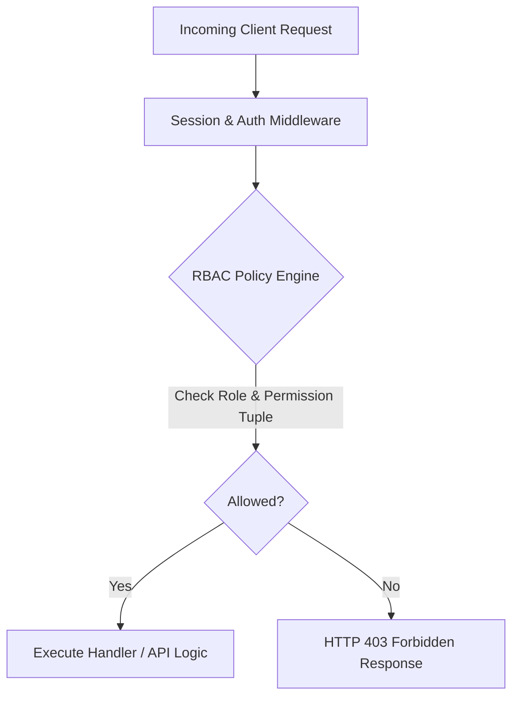
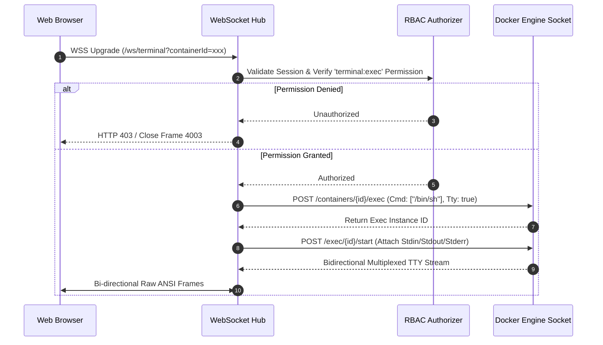

# 06. Security Architecture, RBAC & Cryptography

This document specifies the security controls, authentication mechanisms, role-based authorization matrix, cryptographic standards, and terminal sandboxing guarantees for the PaaS.

---

## 1. The Zero-Shelling Security Guarantee

```mermaid
graph TD
    subgraph Traditional PaaS: High Attack Surface
        CLI_INPUT[User Input: appName = 'app; rm -rf /'] --> SHELL_CMD["sh -c 'docker ps --filter name=^' + appName"]
        SHELL_CMD --> BASH[Host Bash Shell]
        BASH -->|RCE EXPLOITATION| HOST_ROOT[Host Compromised]
    end

    subgraph Clean PaaS: Zero-Shell Guarantee
        API_INPUT[User Input: appName] --> ZOD_VALIDATE[Strict Zod Regex Validation]
        ZOD_VALIDATE --> DOCKER_SDK[Docker Engine Socket SDK]
        DOCKER_SDK -->|JSON / Binary Structs| UNIX_SOCK[(/var/run/docker.sock)]
        UNIX_SOCK --> RUNC[runc / containerd Isolation]
    end
```

### Why Direct Socket Integration Eliminates 100% of Command Injections:
- Operating systems execute programs via the `execve()` system call, which accepts an array of strings (`argv = ["docker", "ps"]`).
- Command injection only occurs when programs pass raw strings to a command interpreter shell (`/bin/sh`, `/bin/bash`).
- By eliminating `sh -c` entirely and using direct socket REST calls, user inputs are transmitted strictly as typed JSON properties (`{"filters": {"name": ["^my-app$"]}}`), mathematically preventing shell interpolation.

---

## 2. Authentication & Identity Architecture

### A. Authentication Protocols:
1. **Passkeys & WebAuthn (FIDO2)**: Native passwordless authentication using browser hardware security modules (Touch ID, Face ID, YubiKeys).
2. **Time-Based One-Time Password (TOTP / 2FA)**: Standard RFC 6238 compliant authenticator app support.
3. **Enterprise Single Sign-On (SSO)**: OIDC (OpenID Connect) and SAML 2.0 integrations (Google Workspace, Okta, Azure AD, GitHub Enterprise).
4. **API Keys**: Scoped, non-reversible hashed tokens (`sha256(apiKey)`) with prefix metadata (`paas_live_...`).

### B. Session Management Security:
- **Cookie Security Flags**: `HttpOnly; Secure; SameSite=Lax; Path=/`.
- **Async Password Hashing**: Passwords hashed using **Argon2id** (memory-hard, resistant to GPU/ASIC cracking) executed in worker threads or via async crypto APIs, completely preventing Node.js event-loop starvation.
- **Session Revocation**: Stored sessions include a `version` counter or token hash; changing a user password invalidates all active sessions atomically.

---

## 3. Granular Role-Based Access Control (RBAC)

The authorization model evaluates permissions across three tiers:
1. **System Level**: Superadmin (Instance Owner) vs Standard User.
2. **Organization / Team Level**: Owner, Admin, Developer, Viewer.
3. **Project / Resource Level**: Granular resource permissions (`project:read`, `service:deploy`, `database:backup`, `terminal:exec`).

### RBAC Permission Matrix

| Role | View Metrics & Logs | Trigger Deployments | Modify Env Vars / Configs | Delete Projects / Databases | Open Host Terminal |
| :--- | :---: | :---: | :---: | :---: | :---: |
| **Owner** | Yes | Yes | Yes | Yes | Yes |
| **Admin** | Yes | Yes | Yes | Yes | No (Configurable) |
| **Developer** | Yes | Yes | Yes | No | No |
| **Viewer** | Yes | No | No | No | No |

---

## 4. Cryptography & Secret Management at Rest

### A. Master Key & Key Derivation (KDF)
- The system derives database encryption keys from a master environment secret (`PAAS_SECRET_KEY`) using **Scrypt** (recommended parameters: `N=32768, r=8, p=1, keyLen=32`).

### B. Field-Level Encryption: AES-256-GCM
All sensitive database fields (Git tokens, S3 access keys, custom environment variables, webhook signing secrets) are encrypted before insertion into the database:
- **Cipher**: `AES-256-GCM` (Galois/Counter Mode provides authenticated encryption with integrity verification).
- **IV / Nonce**: 96-bit cryptographically secure random Initialization Vector generated freshly per field (`crypto.randomBytes(12)`). Static IVs are strictly prohibited.
- **Ciphertext Format**: `v1:base64(iv):base64(authTag):base64(ciphertext)`.

---

## 5. Web Terminal & Container PTY Sandboxing

Opening a real-time web terminal presents high security risks if not isolated:

### Terminal Security Invariants:
1. **Container Isolation Only**: Web terminals attach strictly to user container instances via `docker exec`. Host root shell access is disabled by default and restricted exclusively to instance owners with 2FA verification.
2. **WebSocket Authentication**: The initial HTTP upgrade handshake validates session cookies and explicitly verifies container ownership against tenant RBAC policies before opening the Docker stream.

---

## 6. Security Edge Cases & Vulnerability Defenses

| Security Threat | Attack Vector | Architectural Defense |
| :--- | :--- | :--- |
| **Server-Side Request Forgery (SSRF)** | Attacker configures webhook URL pointing to `http://169.254.169.254` (cloud metadata) or `http://127.0.0.1`. | Custom outbound HTTP transport that resolves DNS and strictly rejects private RFC1918 subnets (`10.0.0.0/8`, `172.16.0.0/12`, `192.168.0.0/16`), loopbacks (`127.0.0.0/8`), and link-local ranges. |
| **Timing Attacks on Tokens** | Attacker compares API key hashes byte-by-byte using response latency differences. | Token verification uses constant-time string comparison (`crypto.timingSafeEqual`). |
| **Log Injection / ANSI Escapes** | Malicious container outputs deceptive ANSI terminal escape codes (e.g. cursor hide, erase screen). | Frontend log viewer sanitizes raw ANSI escapes before rendering and uses strict text nodes. |
| **Secret Leakage in Build Logs** | Environment variables printed during `npm run build` or compilation. | Control plane maintains a secret masking pipeline that redacts all registered environment variable values with `[REDACTED]` before broadcasting logs. |
