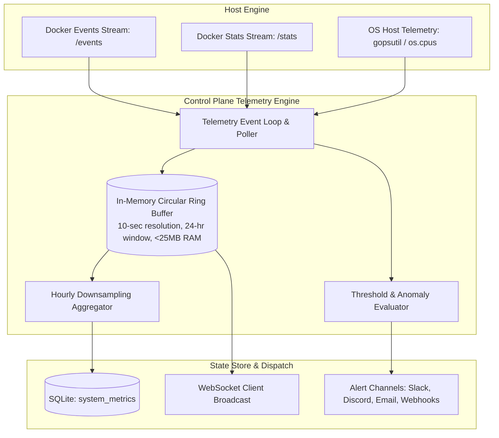
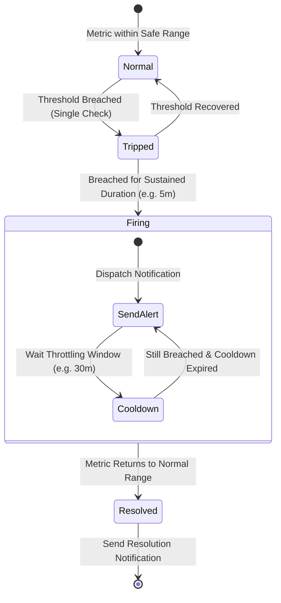

# 07. Telemetry, Server Health & Alerting Engine

This document specifies the telemetry collection architecture, real-time in-memory metric ring buffering, historical downsampling, and SSRF-safe alerting systems.

---

## 1. Unified Telemetry Architecture (Zero-Daemon Design)

Rather than running an external Go monitoring daemon writing duplicate data to SQLite, the control plane hosts an embedded telemetry collector directly within its core runtime.



---

## 2. In-Memory Ring Buffer vs Heavy Database Writes

### The Problem with Naive Metrics Storage:
Writing 1-second or 10-second container telemetry points directly to disk generates massive write amplification, SQLite database locks, and storage fragmentation.

### The Solution: 24-Hour Circular Ring Buffer
1. **Real-Time Buffer**: High-frequency metrics (CPU %, Memory Bytes, Network Rx/Tx, Block IO) are inserted into a pre-allocated fixed-size circular ring buffer in memory.
   - Size: `(24 hours * 60 min * 6 intervals/min) = 8,640 points per container`.
   - Memory footprint: `~180 KB` per active container.
2. **Instantaneous UI Streaming**: Live dashboard graphs pull points directly from RAM with zero database query latency.
3. **Hourly Downsampling to Disk**: Every hour, an internal worker computes `AVG`, `MIN`, `MAX`, `P95` aggregates for each container and writes a single summary record to SQLite for long-term 90-day retention.

---

## 3. Threshold Evaluation & Alerting Engine

The alerting engine evaluates rules periodically (every 60 seconds) across host metrics and individual application containers:

### Rule Types:
- **Host Resource Threshold**: Host CPU > 90% for 5 minutes; Host Disk Usage > 85%.
- **Container Health Failures**: Container restart loops (`RestartCount > 3 in 10m`), OOM kills (`ExitCode: 137`).
- **Ingress Uptime / HTTP Failures**: 5xx error rate > 5% over 2 minutes.



---

## 4. SSRF-Safe Notification Webhook Dispatcher

All outbound webhook dispatchers (Discord, Slack, Telegram, Custom HTTP Webhooks) run through a hardened HTTP transport:

```mermaid
graph TD
    ALERT[Alert Triggered] --> PARSE_URL[Parse Destination Webhook URL]
    PARSE_URL --> RESOLVE_IP[Perform Secure DNS Resolution]
    
    RESOLVE_IP --> CHECK_IP{Is Target IP Private or Loopback?}
    CHECK_IP -->|Matches 127.0.0.1, 10.0.0.0/8, 169.254.169.254, ::1| DROP[BLOCK REQUEST: Log SSRF Attempt]
    CHECK_IP -->|Public IPv4 / IPv6 Range| DISPATCH[Execute HTTP POST with 10s Timeout]
    
    DISPATCH --> STATUS{HTTP 200 OK?}
    STATUS -->|Yes| DONE[Alert Delivered]
    STATUS -->|No / Timeout| RETRY[Exponential Backoff Retry (Max 3)]
```

---

## 5. Telemetry Edge Cases & Resiliency Matrix

| Edge Case | Failure Mechanism | Architectural Solution |
| :--- | :--- | :--- |
| **Docker Stats Stream Deadlock** | Docker engine hangs on `GET /containers/{id}/stats` stream without sending data. | Reader wraps a deadline timer (`SetReadDeadline`); if no byte is received within 15 seconds, the connection is reset and re-dialed. |
| **Rapid Container Churn (Deployments)** | Rapid container creation generating thousands of dead container ID entries in the ring buffer. | Ring buffer tracks container metrics by logical `ServiceId` rather than ephemeral `ContainerId`, retaining metric continuity across zero-downtime redeployments. |
| **Notification Storm / Alert Flooding** | A flapping service sends 5,000 webhook alerts per minute. | Strict alert throttling: Maximum 1 alert per rule per 30-minute cooldown window; batch digest support. |
| **Disk Space Starvation on Long Retention** | Database growing uncontrollably from metrics history. | Automatic retention pruning cron: `DELETE FROM system_metrics WHERE created_at < NOW() - INTERVAL '30 days'`. |
