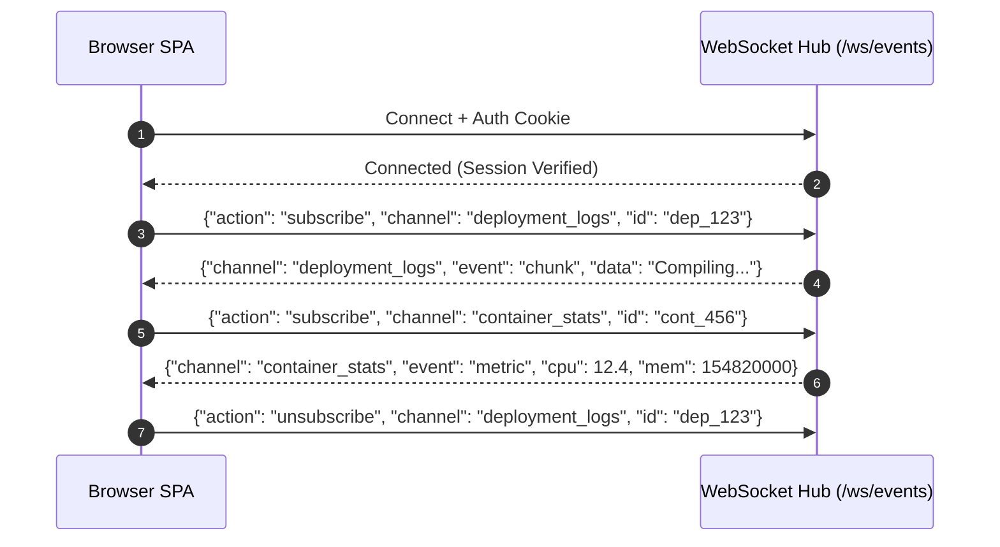
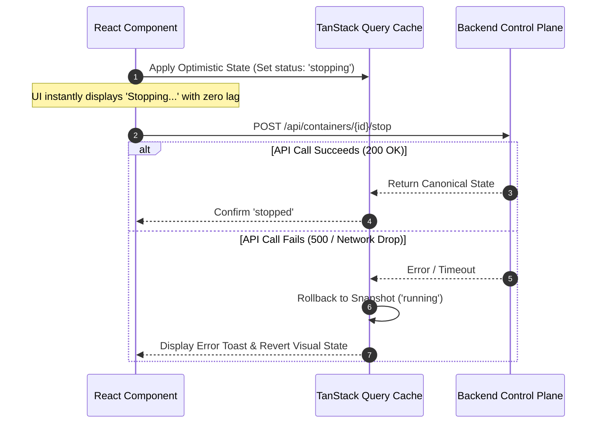

# 08. Frontend UI, Real-Time Streams & Client Architecture

This document specifies the frontend Single Page Application (SPA) architecture, virtualized terminal rendering engine, multiplexed WebSocket client protocol, and optimistic state mutation design.

---

## 1. Client Architecture & Technology Choices

### Core Stack:
- **Framework**: **React 19** / **Svelte 5** / **SolidJS** SPA (packaged as static assets and served directly by the control plane).
- **Data Fetching & Cache**: **TanStack Query v5** (declarative caching, deduplication, automatic background revalidation).
- **Routing**: **TanStack Router** (fully type-safe routes with search parameter validation).
- **Virtualization Engine**: **`@tanstack/react-virtual`** (virtualized windowing for large data tables and container log feeds).
- **Terminal Emulator**: **Xterm.js** with WebGL addon for interactive container shells.

---

## 2. Virtualized Log Viewer Engine

### The Problem with Naive DOM Rendering (Dokploy):
Mapping over 5,000+ raw `<div>` log elements with ANSI string parsing causes heavy layout recalculation, hundreds of megabytes of browser DOM memory usage, and UI thread freezes.

### The Solution: Virtualized Viewport Rendering
Only the visible lines inside the user's viewport (~30 to 50 DOM nodes) are rendered in the DOM at any instant:

```mermaid
graph TD
    subgraph Client State [Memory Array]
        LOG_ARRAY["100,000 Log Lines in RAM (~8 MB)"]
    end

    subgraph Virtual Windowing Engine [@tanstack/react-virtual]
        CALC[Calculate Viewport Scroll Offset & Dynamic Line Heights]
    end

    subgraph Browser DOM Viewport
        V_CONTAINER[Fixed-Height Container: 600px]
        DOM_NODES["Render ONLY 35 Active Visible DOM Nodes (Line 4,520 - 4,555)"]
    end

    LOG_ARRAY --> CALC
    CALC --> V_CONTAINER
    V_CONTAINER --> DOM_NODES
```

### Key UI Features:
1. **Auto-Scroll Locking**: If user is at the bottom, auto-scroll stays pinned to the newest incoming log line. If user scrolls up to inspect history, auto-scrolling pauses automatically.
2. **Instant Full-Text Search**: In-memory regex filtering across 100k lines in `<5ms` using web workers.
3. **ANSI Color Rendering**: Pre-parsed tokens using `ansi-to-react` with hardware-accelerated dark mode styling.

---

## 3. Multiplexed WebSocket Protocol

Rather than opening separate WebSocket connections for build logs, container stats, system notifications, and terminal shells, the frontend communicates over a **single authenticated multiplexed WebSocket**:



---

## 4. Optimistic State Updates with Rollback

When triggering actions with predictable outcomes (e.g. stopping a container, toggling an environment variable, modifying an ingress domain):



---

## 5. Frontend Edge Cases & Resiliency Matrix

| Edge Case | Failure Mechanism | Architectural Solution |
| :--- | :--- | :--- |
| **Network Drop During Long Build** | User's WiFi disconnects while watching a 10-minute deployment. | Reconnecting WebSocket automatically resumes stream from the last received line index (`since_line: 450`) stored in client memory. |
| **Browser Tab Memory Leak on 24/7 Monitor** | Dashboard left open on a wall monitor accumulating millions of data points. | Client logs and metrics maintain strict maximum retention windows in memory (capped at last 5,000 log lines); older points are pruned from client RAM. |
| **Clipboard Selection on Virtualized Text** | Copying text in a virtualized container only captures visible viewport lines. | Dedicated "Copy Entire Log" button that extracts the complete raw log buffer from memory into the system clipboard. |
| **Sudden Session Expiration** | User submits a large form edit after session cookie expires. | Form state is preserved in local session storage; user is prompted with an in-place re-authentication modal without losing uncommitted input. |
