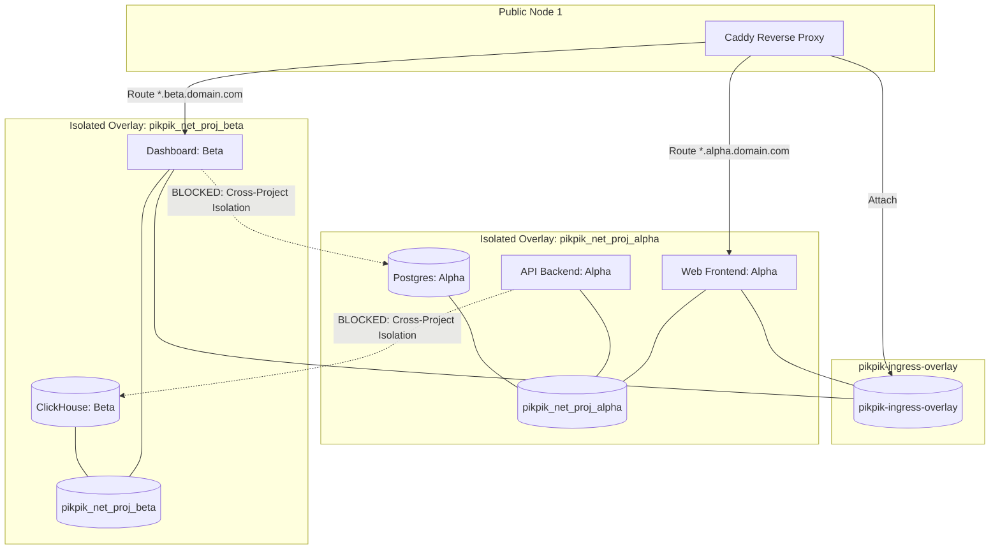
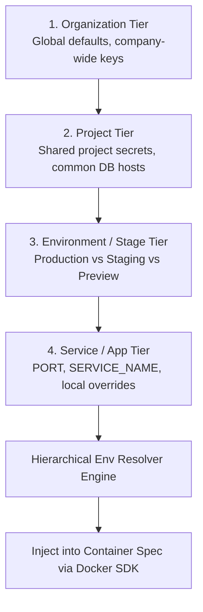

# 10. Volumes, Network Topology & Hierarchical Environment Management

This document details the automated slugging, naming schemes, and lifecycle management for Docker Volumes and Networks, alongside the 4-tier Hierarchical Environment Variable Engine for `pikpik`.

---

## 1. Automated Volume & Mount Management

`pikpik` manages three distinct mount types, automatically assigning deterministic slugs and managing storage lifecycles.

```mermaid
graph TD
    SVC[Application / Database Service] --> MOUNT_MGR[Volume & Mount Engine]
    
    MOUNT_MGR -->|Type: Named Volume| V_NAMED[1. Named Persistent Volume<br/>Slug: pikpik_vol_{projectId}_{serviceSlug}_{name}]
    MOUNT_MGR -->|Type: Host Bind| V_BIND[2. Host Path Bind Mount<br/>/opt/pikpik/data/... -> /container/path]
    MOUNT_MGR -->|Type: File Mount| V_FILE[3. In-Memory / Config File Mount<br/>/etc/pikpik/mounts/{serviceId}/{filename} -> /container/path]

    V_NAMED --> DOCKER_VOL[(Docker Volume Engine)]
    V_BIND --> HOST_FS[(Host Filesystem)]
    V_FILE --> CONFIG_STORE[(Encrypted Config File Store)]
```

### A. Mount Types & Naming Conventions

| Mount Type | Slug / Naming Convention | Lifecycle & Persistence | Primary Use Case |
| :--- | :--- | :--- | :--- |
| **Named Volume** | `pikpik_vol_<projectSlug>_<serviceSlug>_<mountName>` | Persists across container recreations, image upgrades, and Swarm service rolling updates. | Database data directories (`/var/lib/postgresql/data`), persistent uploads (`/uploads`). |
| **Host Bind Mount** | Host Path -> Container Path (e.g. `/data/cache:/app/cache`) | Tied to specific host filesystem paths. Validated for path traversal safety. | Shared host caches, GPU drivers, host devices (`/dev/fuse`). |
| **Config / File Mount** | `/etc/pikpik/mounts/<serviceId>/<filename>` | Managed as text/blob in database, written atomically with `0600` permissions prior to container start. | Nginx configs, `.env` files, SSH keys, SSL certs, `redis.conf`, custom JSON configs. |

---

## 2. Automated Network Topology & Overlay Slugging

In a multi-node Swarm setup (like `pikpik`'s 3-node cluster), network isolation and routing require automated network slugging and attachment.



### Network Slugging Rules:
1. **Global Ingress Overlay (`pikpik-ingress-overlay`)**:
   - Scope: Swarm `overlay` with VXLAN encryption (`--opt encrypted=true`).
   - Attached to Caddy and public-facing frontend services only.
2. **Project-Level Network (`pikpik_net_proj_<projectSlug>`)**:
   - Scope: Swarm `overlay` (or local `bridge` for single-node).
   - Allows all services, background workers, and databases within the same project to discover and communicate with each other via internal DNS (e.g. `http://api:8080`, `postgres:5432`).
   - **Cross-Project Isolation**: Services in `Project Alpha` cannot resolve or reach databases in `Project Beta`.

---

## 3. Hierarchical Environment Variable Management

`pikpik` implements a 4-tier cascading inheritance model with deterministic precedence:



### A. Precedence & Override Hierarchy

$$\text{Service Level} > \text{Environment/Stage Level} > \text{Project Level} > \text{Organization Level}$$

1. **Organization Level**: Global environment variables shared across all projects within an organization (e.g. `SENTRY_DSN`, `COMPANY_DOMAIN`, `GLOBAL_REGISTRY_URL`).
2. **Project Level**: Variables shared across all services in a specific project (e.g. `APP_ENV=production`, `PUBLIC_API_URL`).
3. **Environment / Stage Level**: Variables specific to a deployment stage (e.g. `Production`, `Staging`, `PR-Preview`).
4. **Service Level**: Service-specific variables (`PORT=3000`, `WORKER_CONCURRENCY=5`). Overrides any upstream duplicate key.

---

## 4. Dynamic Variable Interpolation & Reference Resolution

`pikpik` supports cross-service and cross-tier variable expansion:

```bash
# Defined at Project Level:
POSTGRES_USER=admin
POSTGRES_PASSWORD=supersecret
POSTGRES_HOST=postgres-service
POSTGRES_PORT=5432
POSTGRES_DB=main_app

# Resolved at Service Level (Automatic Expansion):
DATABASE_URL=postgres://${POSTGRES_USER}:${POSTGRES_PASSWORD}@${POSTGRES_HOST}:${POSTGRES_PORT}/${POSTGRES_DB}
```

### Expansion Rules & Invariants:
1. **DAG Dependency Resolution**: The environment resolver constructs a Directed Acyclic Graph (DAG) of variable references to resolve dependencies in topological order.
2. **Circular Dependency Detection**: If variable `A` references `B` and `B` references `A`, the resolver halts with a validation error (`Circular variable dependency: A -> B -> A`), preventing runtime infinite loops.
3. **Escaping & Literals**: `$$` escapes literal dollar signs (e.g. `PRICE=$$100` -> `PRICE=$100`).
4. **Secret Masking & Zeroization**: All resolved secrets are encrypted at rest with `AES-256-GCM` and masked in deployment logs (`[REDACTED]`).

---

## 5. Summary Matrix: Slugging & Environment Schema

| Concept | Structure / Format | Example |
| :--- | :--- | :--- |
| **Project Slug** | `^[a-z0-9-]+$` | `e-commerce-prod` |
| **Service Slug** | `^[a-z0-9-]+$` | `auth-api` |
| **Overlay Network** | `pikpik_net_proj_<projectSlug>` | `pikpik_net_proj_e-commerce-prod` |
| **Named Volume** | `pikpik_vol_<projectSlug>_<serviceSlug>_<name>` | `pikpik_vol_e-commerce-prod_auth-api_redis-data` |
| **Config File Mount** | `/etc/pikpik/mounts/<serviceId>/<filename>` | `/etc/pikpik/mounts/svc_98a7b/nginx.conf` |
| **Hierarchical Env** | Cascading `Org -> Project -> Stage -> Service` | `Service` overrides `Stage` overrides `Project` overrides `Org` |
