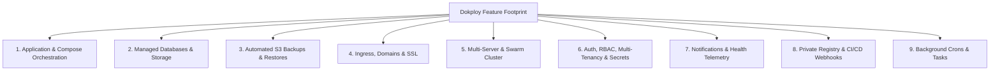

# 11. Dokploy Feature Catalog & `pikpik` Parity Matrix

This document provides a comprehensive extraction and breakdown of all core features in Dokploy (mined across 50+ tRPC routers, server services, and UI components), paired with the clean architectural reimplementation plan for `pikpik`.

---

## 1. Executive Feature Taxonomy

---

## 2. Comprehensive Feature Parity Matrix

### Category 1: Application & Compose Orchestration

| Dokploy Feature | Dokploy Implementation & Flaws | `pikpik` Clean Reimplementation | Priority |
| :--- | :--- | :--- | :---: |
| **Git Source Builds** | Clones repo; shells out to `nixpacks` or `docker build` using unquoted strings. | Isolated BuildKit / Nixpacks runner using typed array execution (`execFile`). | **P0** |
| **Pre-built OCI Images** | Pulls from Docker Hub, GHCR, or private registry; deploys via Swarm/Docker. | Direct Docker Engine socket pull & deploy with native credential helper. | **P0** |
| **Docker Compose Stacks** | Multi-container definitions with raw YAML editor and custom env files. | Native Compose V2 integration with internal network bridging and volume mounts. | **P0** |
| **Preview Deployments** | Automatic ephemeral staging environments per Pull Request. | Ephemeral Swarm service + dynamic subdomain (`pr-123.app.domain.com`) auto-pruned on PR close. | **P1** |
| **Rolling Zero-Downtime Updates** | Swarm rolling updates or `execAsync("docker restart ...")`. | Native Docker Swarm `UpdateConfig: { Order: "start-first", Parallelism: 1 }`. | **P0** |
| **Deployment History & Rollbacks** | Stores build logs in DB; rolls back to previous image tag. | Immutable deployment log files + instant image tag rollback via Swarm Service API. | **P0** |
| **Real-time Webhook Auto-Deploy** | GitHub, GitLab, Bitbucket, Gitea webhook listeners. | Authenticated webhook receivers + secret token validation for Git push events. | **P0** |

---

### Category 2: Ingress, Custom Domains & SSL

| Dokploy Feature | Dokploy Implementation & Flaws | `pikpik` Clean Reimplementation | Priority |
| :--- | :--- | :--- | :---: |
| **Auto-Domain Routing** | Maps `domain -> container:port` via Traefik dynamic YAML files. | **Caddy Admin REST API**: In-memory `<15ms` dynamic routing without host port exposure. | **P0** |
| **Cloudflare Wildcard SSL** | Uploading custom certs or Traefik ACME DNS-01. | **Native Cloudflare Wildcard Support**: Origin certs + Cloudflare DNS-01 ACME fallback. | **P0** |
| **Automated Let's Encrypt / ZeroSSL** | Traefik ACME HTTP-01 / TLS-ALPN challenges. | Caddy auto-HTTPS with on-demand TLS whitelist to prevent rate limit exhaustion. | **P1** |
| **Custom Path & Middleware Routing** | Path prefix matching, strip prefix, basic auth, rate limits. | Caddy declarative route handlers and middleware chains. | **P1** |
| **HTTPS Redirection & HSTS** | Traefik entrypoint middleware. | Native Caddy automatic HTTP->HTTPS 308 redirect + HSTS headers. | **P0** |

---

### Category 3: Managed Databases (One-Click Provisioning)

| Dokploy Feature | Dokploy Implementation & Flaws | `pikpik` Clean Reimplementation | Priority |
| :--- | :--- | :--- | :---: |
| **PostgreSQL Engine** | `postgres:16`, internal credentials, optional external port. | `postgres:17-alpine`, named persistent volume, isolated project overlay network. | **P0** |
| **MySQL / MariaDB Engine** | `mysql:8` / `mariadb:11`, volume data persistence. | `mysql:8.4` / `mariadb:11.4`, `--single-transaction` safe dump compatibility. | **P0** |
| **MongoDB Engine** | `mongo:7`, volume data persistence. | `mongo:7.0`, pure stream archive dump without `/tmp` disk extraction. | **P0** |
| **Redis Engine** | `redis:7`, optional password auth. | `redis:7.4-alpine`, in-memory cache / persistent AOF volume. | **P0** |
| **LibSQL / Turso** | `sqld` container for distributed SQLite. | Embedded or containerized LibSQL engine. | **P2** |

---

### Category 4: Automated S3 Backups & Restores

| Dokploy Feature | Dokploy Implementation & Flaws | `pikpik` Clean Reimplementation | Priority |
| :--- | :--- | :--- | :---: |
| **S3 Storage Destinations** | AWS S3, Cloudflare R2, MinIO, Backblaze B2, Wasabi. | Universal S3-compatible client with SigV4 authentication. | **P0** |
| **Automated Database Backups** | Cron schedules; shells out `rclone` with string interpolation. | **Pure Stream Pipes**: `pg_dump | gzip | s3.Upload()` (`<32MB` RAM, 0MB disk). | **P0** |
| **Volume Backups** | Rclone snapshotting of `/var/lib/docker/volumes`. | Piped tar/zstd stream snapshotting directly to S3 bucket. | **P1** |
| **One-Click Restore** | Downloads archive to `/tmp` disk before restoring. | **Pure Streaming Restore**: `s3.GetObject() | gunzip | db_restore_stdin`. | **P0** |
| **Retention Policies** | Keeps last N backups; prone to string sort errors. | Epoch timestamp parsing with automated daily/weekly/monthly retention pruning. | **P0** |

---

### Category 5: Multi-Server & Docker Swarm Operations

| Dokploy Feature | Dokploy Implementation & Flaws | `pikpik` Clean Reimplementation | Priority |
| :--- | :--- | :--- | :---: |
| **Docker Swarm Overlay Routing** | Traefik on leader routes across `dokploy-network` overlay. | Ingress on Leader routes across `pikpik-overlay` to private worker nodes. | **P0** |
| **Multi-Server Management** | Remote server SSH keys; runs ad-hoc SSH bash scripts. | Native Swarm Node API (`NodeList`, `NodeInspect`) with health tracking. | **P0** |
| **Container Log Viewer** | Unvirtualized DOM list; crashes browser on >1k lines. | **Virtualized Log Windowing (`@tanstack/react-virtual`)**: 100k+ lines @ 60 FPS. | **P0** |
| **Web Terminal (PTY Shell)** | Connects via SSH to local host; risk of root breakout. | **Docker Exec Multiplexed TTY**: Sandboxed inside container; zero host SSH keys. | **P0** |
| **Docker Disk Cleanup / Prune** | Manual / scheduled bash script running `docker system prune`. | Scheduled background task invoking Docker Engine API `POST /system/prune`. | **P0** |

---

### Category 6: Hierarchical Environment & Volumes

| Dokploy Feature | Dokploy Implementation & Flaws | `pikpik` Clean Reimplementation | Priority |
| :--- | :--- | :--- | :---: |
| **4-Tier Env Hierarchy** | Org -> Project -> Environment -> Application. | Cascading DAG resolver with topological sorting and circular dependency detection. | **P0** |
| **Secret Encryption at Rest** | Single-iteration HMAC derivation in `encryption.ts`. | Hardened **AES-256-GCM** with **Scrypt KDF** and unique 96-bit IVs. | **P0** |
| **Automated Volume Slugs** | Named volumes, host binds, config file mounts. | Deterministic `pikpik_vol_<project>_<service>_<name>` slugging engine. | **P0** |
| **Config / File Mounts** | Writes files to host `/etc/dokploy/mounts/...`. | Encrypted database blob store written atomically with `0600` permissions. | **P0** |

---

### Category 7: Auth, Multi-Tenancy & Security

| Dokploy Feature | Dokploy Implementation & Flaws | `pikpik` Clean Reimplementation | Priority |
| :--- | :--- | :--- | :---: |
| **Multi-Organization Tenancy** | Organization switching, project partitioning. | Strict tenant context isolation in database queries and API procedures. | **P0** |
| **Role-Based Access Control (RBAC)**| Owner, Admin, Member, granular permissions. | Declarative `(User, Org, Resource, Action)` permission gateway. | **P0** |
| **2FA (TOTP) & Passkeys** | Better-Auth 2FA; synchronous `bcrypt` DoS risk. | Async **Argon2id** password hashing + native WebAuthn / Passkeys. | **P0** |
| **SSO Integrations** | SAML / OIDC login (Google, GitHub, Okta). | Standardized OpenID Connect & SAML 2.0 provider integration. | **P1** |
| **API Keys** | Bearer tokens for external automation. | Scoped `sha256(key)` hashed tokens with prefix metadata (`pik_live_...`). | **P0** |

---

### Category 8: Notifications, Telemetry & Background Crons

| Dokploy Feature | Dokploy Implementation & Flaws | `pikpik` Clean Reimplementation | Priority |
| :--- | :--- | :--- | :---: |
| **Multi-Channel Notifications** | Discord, Telegram, Slack, Email, Webhooks (SSRF risk). | **SSRF-Hardened Webhook Dispatcher**: Blocks private subnets (`127.0.0.1`, metadata). | **P0** |
| **Server Health Monitoring** | Scrapes via ad-hoc SSH bash script; Go daemon disconnected. | **Embedded Telemetry Collector**: Docker stats stream + 24-hr RAM ring buffer. | **P0** |
| **System & Custom Crons** | Background cron jobs via BullMQ / Redis. | Transactional database-backed task scheduler (zero Redis requirement). | **P0** |
| **Private OCI Registry** | Separate manual container setup. | **Embedded `registry:2` Service** with automated CI deployment credentials. | **P0** |
