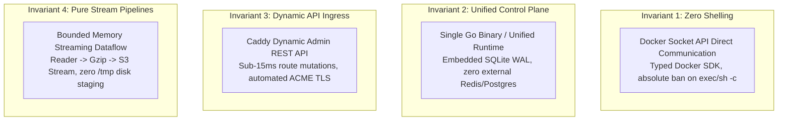

# AGENTS.md — `pikpik` Engineering Specification & Agent Guidelines

> **`pikpik`** is a minimalist, high-reliability open-source self-hosted PaaS (an engineered alternative to Vercel, Netlify, Dokploy, and Heroku).  
> *Architecture at the Boundary, Ruthless Minimalism in the Core.*

---

## 1. System Architecture & Domain Model

`pikpik` compiles into 3 standalone, static Go binaries and an embedded React SPA frontend:

| Binary / Component | Path | Role & Runtime Footprint |
| :--- | :--- | :--- |
| **`pikpik`** | [`cmd/pikpik`](cmd/pikpik) | Unified Control Plane Server (`~14MB`). SQLite WAL, REST API, WebSocket hub, Caddy reconciler, Backup scheduler, Telemetry aggregator. |
| **`pikpik-agent`** | [`cmd/pikpik-agent`](cmd/pikpik-agent) | Lightweight Worker Agent (`~6.2MB`). `/proc` metrics exporter + Outbound mTLS/WSS Docker Socket proxy. |
| **`pikpik-cli`** | [`cmd/pikpik-cli`](cmd/pikpik-cli) | Operator Terminal CLI (`~11MB`). Scriptable CLI with POSIX flags for full management. |
| **`web/`** | [`web/`](web) | React 18 + Vite SPA Dashboard. Tailwind CSS, TanStack Query, Xterm.js PTY, Recharts. Served directly by `pikpik`. |

### Domain Model Hierarchy
```
Organization
   └── Project
        └── Service (App / Database / Worker)  [Optional Stage metadata: prod / staging]
```
- **Organization (`org_`)**: Multi-tenant or team ownership boundary. Default: `org_default`.
- **Project (`prj_`)**: Workspace namespace grouping related services, domain bindings, and environment variables. Default: `prj_default`.
- **Service (`app_` / `srv_` / `db_`)**: Standalone or Swarm containerized workload.
- **Stage (Optional & Nonbinding)**: Loose environment labeling (e.g. `prod`, `staging`, `preview`). Services belong directly to a Project and can optionally be tagged with a stage without enforcing rigid sequential pipeline locks.
- **Tags (`tags`)**: Key-value pairs (`team:billing`, `env:prod`) and flat labels (`ecommerce`, `frontend`) for live multi-dimensional filtering across API, CLI, and Web UI.

---

## 2. The 4 Non-Negotiable Invariants

All development on `pikpik` MUST strictly uphold these 4 core invariants:



1. **Invariant 1 — Zero Shelling (API-First Engine)**:
   - **NEVER** use `exec.Command("sh", "-c", ...)` or `exec.Command("bash", ...)` with interpolated strings.
   - All container lifecycles, network attachments, exec PTYs, builds, and metrics MUST communicate directly through the typed Docker SDK (`/var/run/docker.sock`).
2. **Invariant 2 — Single Unified Runtime**:
   - Zero external daemon dependencies (no external Redis, Celery, or Postgres required for control plane operation).
   - SQLite in Write-Ahead Logging (`WAL`) mode with `PRAGMA busy_timeout=5000` and `PRAGMA foreign_keys=ON` serves as the sole source of truth.
   - In-memory workers, cron schedulers, and circular ring buffers run inside the primary process.
3. **Invariant 3 — Dynamic API Ingress Reconciler**:
   - Route and TLS configurations are dispatched directly to **Caddy's dynamic Admin API** (`http://127.0.0.1:2019/load`) over in-memory HTTP REST in `<15ms`.
   - **NEVER** write Caddyfiles to disk or trigger process reloads/signals (`kill -HUP`).
4. **Invariant 4 — Pure Streaming Pipelines**:
   - Builds, logs, and database backups are streaming dataflows (`io.Pipe` -> `gzip` -> S3 multipart; `StdCopy` -> WebSocket/SSE).
   - Peak memory usage is bounded to `<32MB` with **zero temporary staging files on `/tmp`**.

---

## 3. The 4-Stage Development Lifecycle (CLI-First Approach)

When developing any new feature, refinement, or architectural addition in `pikpik`, you MUST follow this strict 4-stage pipeline:

```
[ Stage 1: Storage & Engine Core ]
                 ↓
[ Stage 2: REST & WebSocket API ]
                 ↓
[ Stage 3: Operator CLI First ]     <-- (MUST be fully functional & test-verified)
                 ↓
[ Stage 4: Frontend UI Clothing ]   <-- (Web UI wraps the headless API)
```

### Stage 1: Storage & Engine Core
- Write SQLite migrations in [`pkg/store/migrations/`](pkg/store/migrations/) with forward idempotency (`IF NOT EXISTS`).
- Update domain models in [`pkg/store/models.go`](pkg/store/models.go) and interface contracts in [`pkg/store/store.go`](pkg/store/store.go).
- Implement storage access in `pkg/store/<domain>.go`.
- Validate with store unit tests: `go test -v -count=1 ./pkg/store/...`.

### Stage 2: REST & WebSocket API Gateway
- Define request/response DTOs in [`pkg/api/types.go`](pkg/api/types.go).
- Update the `Controller` interface and `DefaultController` in [`pkg/api/controller.go`](pkg/api/controller.go).
- Register routes with strict RBAC wrappers (`authWrap(RoleViewer|RoleDeveloper|RoleAdmin, ...)`), query parameter parsing, and RFC-compliant error handling in [`pkg/api/routes.go`](pkg/api/routes.go).
- Validate with API tests: `go test -v -count=1 ./pkg/api/...`.

### Stage 3: Operator CLI First (Terminal Verification)
- Add or update the typed client methods in [`cmd/pikpik-cli/client.go`](cmd/pikpik-cli/client.go).
- Implement the subcommand and flags in [`cmd/pikpik-cli/main.go`](cmd/pikpik-cli/main.go).
- Verify POSIX compliance, table formatting, JSON flag output, and non-zero exit codes on failure.
- **Rule**: Every capability must be completely usable, scriptable, and testable from the terminal before touching frontend code.

### Stage 4: Frontend UI Clothing (React SPA)
- Update TypeScript interface definitions in [`web/src/lib/types.ts`](web/src/lib/types.ts).
- Add endpoint calls to the API client in [`web/src/lib/api.ts`](web/src/lib/api.ts).
- Implement UI components in [`web/src/views/`](web/src/views/) using TanStack Query hooks, Tailwind CSS, and headless feedback toast/modals.
- The web UI acts strictly as a "clothing" layer that consumes the standard headless REST/WS API without backend custom hacks.
- Compile bundle: `cd web && npm run build`.

---

## 4. Engineering & Ponytail Coding Principles

### Core Principles
- **Architecture at the Boundary, Ponytail in the Core**: Public API contracts, DTOs, and DB boundaries are strictly validated; internal logic follows ruthless minimalism.
- **Parse at the Boundary, Trust in the Core**: Validate inputs (empty strings, valid slugs, ports) at API handlers and CLI flags; avoid redundant defensive checks throughout internal helpers.
- **Functional Core, Imperative Shell**: Keep core calculations (metric downsampling, DAG cycles, traffic weighting) deterministic `(State, Input) -> (State, Output)` for zero-mock testing.
- **Locality over Layering (LoB & AHA)**: Co-locate data, types, and logic in single-purpose packages; avoid premature abstraction. Extract shared helpers only on the 3rd identical occurrence.

### Ponytail Lazy Dev Rungs
Before writing new code, stop at the first rung that holds:
1. **YAGNI**: Does this need to be built at all?
2. **Reuse**: Does an existing helper or store method solve this?
3. **Stdlib**: Does Go standard library (`strings`, `net/http`, `crypto/tls`, `sync`) cover it?
4. **Platform**: Does native Linux/Docker socket functionality handle it?
5. **Installed Dependency**: Does an existing package in `go.mod` solve it?
6. **One-Liner**: Can this be expressed cleanly in one readable line?
7. **Minimal Diff**: Only then write the smallest working implementation.

### Complexity Limits
- **Cyclomatic Complexity**: $\le 10$ per function.
- **Nesting Depth**: $\le 3$ levels. Use early returns and guard clauses.
- **Deliberate Shortcuts**: Mark intentional simplifications with ceilings as:  
  `# ponytail: <what> <- <ceiling> -> <upgrade trigger>`

---

## 5. Project Memory, Navigation & Verification (`mimori`)

When working in this codebase or launching subagents:

### 5.1 Zero-Pollution Tree Traversal & Precision Slicing (MUST)
Never pull whole files >100 lines into context to extract facts. Follow the 4-step tree traversal protocol:
1. **Canopy (Orientation & Ranking)**:
   - Run `mimori dump --file [--focus "<target>"]` for instant warmup.
   - Inspect ranked architecture and in-degree entry points via `mimori map --stdout [--scope "<dir>"] --focus "<target>"`.
2. **Contract Inspection**:
   - Inspect public types, structs, interfaces, and boundary DTOs (`pkg/store/models.go`, `pkg/api/types.go`, `pkg/orchestration/types.go`).
3. **Precision 1-Hop Slicing**:
   - Run `mimori slice <file>[:<symbol>] [--lines <N>]` to inspect exact call hierarchies, callers (ancestors), dependencies, and code slices.
   - *Rule*: Whole-file reads >100 lines are strictly banned when `mimori slice` provides the targeted symbol.
4. **Leaf Execution**:
   - Apply edits strictly to the targeted coordinates (`file.go#L40-L75`).

### 5.2 Subagent Delegation Protocol
When spawning subagents for features, refactors, or audits:
- **Mandatory Briefing**: Subagent prompts must instruct the agent to run `mimori dump --file` for session warmup and use `mimori slice <file>[:<sym>]` for targeted inspection.
- **Contract Boundary Passing**: Pass explicit symbol coordinates and contract constraints in subagent task descriptions rather than whole files.
- **Completion Accounting**: Require subagents to log changes via `mimori log` and update tasks via `mimori todo`.

### 5.3 Activity & Debt Tracking
- Reconcile `# ponytail:` comments: `mimori debt sync`
- Verify debt ledger health: `mimori debt check` (must exit 0)
- Log completed changes:  
  `mimori log --action "<feat|fix|refactor>" --summary "<caveman summary>" --files "<f1,f2>"`

### 5.4 Machine-Verifiable Test Commands
```bash
# Run all tests across the entire repository
export PATH=$PATH:/usr/local/go/bin:/home/devhax/go/bin
go test -race -count=1 ./pkg/... ./cmd/...

# Build all Go binaries
go build -ldflags="-s -w" -o bin/pikpik ./cmd/pikpik
go build -ldflags="-s -w" -o bin/pikpik-cli ./cmd/pikpik-cli
go build -ldflags="-s -w" -o bin/pikpik-agent ./cmd/pikpik-agent

# Build React Web SPA
cd web && npm run build
```

