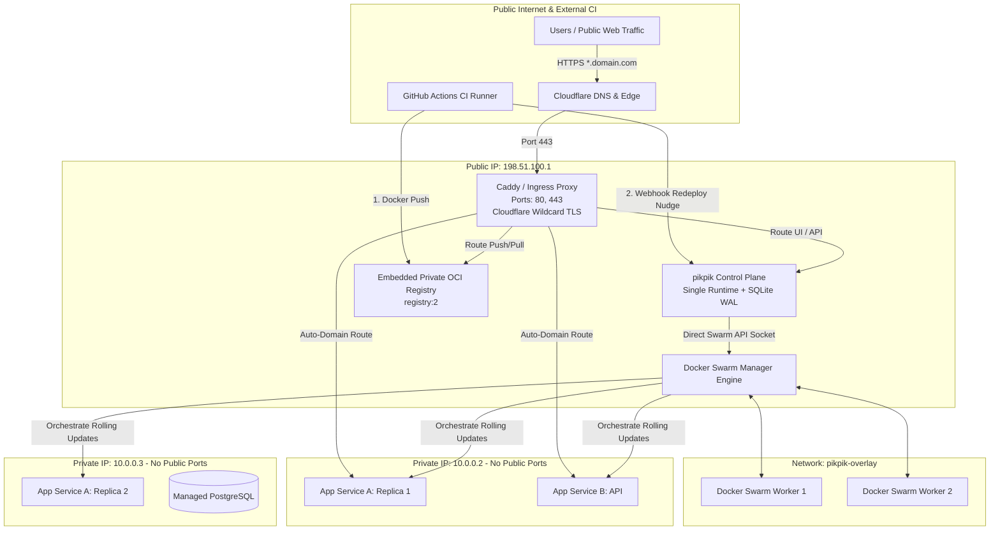
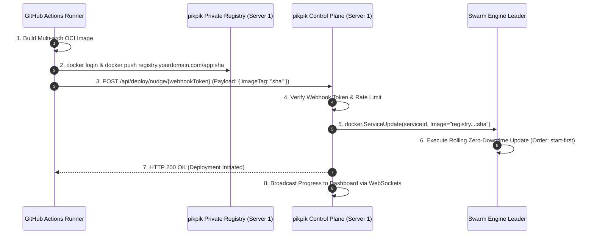

# Project PIKPIK: Architectural Blueprint

**Project Name**: `pikpik`  
**System Purpose**: Minimalist, High-Reliability Multi-Node PaaS with Docker Swarm Ingress Overlay, Embedded Private Registry, Cloudflare Wildcard TLS, and GitHub Actions CI/CD Integration.

---

## 1. System Topology & Operational Architecture



---

## 2. The 5 Core Workflows of PIKPIK

### Workflow 1: Multi-Server Mesh & Overlay Routing (1 Public, 2 Private)
- **Zero Public Exposure for Workers**: Server 2 and Server 3 have 0 open firewall ports facing the internet. They reside in a private VPC/subnet (`10.0.0.0/24`) or WireGuard mesh.
- **Swarm Overlay Network (`pikpik-overlay`)**:
  - Swarm's built-in overlay network with VXLAN encryption (`--opt encrypted=true`) connects all three nodes.
  - Ingress proxy (on Server 1) routes directly to internal service DNS names (e.g. `http://service_backend:3000`) over the overlay.
  - **Zero Host Port Mapping**: Containers do NOT expose `-p 3000:3000` on the host. Routing occurs strictly across container IPs inside `pikpik-overlay`.

### Workflow 2: Ingress & Cloudflare Wildcard TLS
- **Cloudflare Wildcard Certificates (`*.yourdomain.com` + `yourdomain.com`)**:
  - **Primary Mode (Pre-issued Cert)**: pikpik allows one-click upload or volume mount of Cloudflare Origin Certificates (`fullchain.pem`, `privkey.pem`).
  - **Automated Fallback (DNS-01 ACME)**: Built-in Cloudflare DNS API provider integration (`CLOUDFLARE_DNS_API_TOKEN`) allowing Caddy to auto-renew wildcard certificates seamlessly via DNS challenges.
- **Instant Auto-Domain Binding**:
  - Assigning `api.yourdomain.com` to an application pushes a 15ms dynamic route to Caddy's in-memory table. No proxy restart or file lock required.

### Workflow 3: Embedded Private Docker Registry
- **Built-in Registry Service**: A dedicated `registry:2` instance running on Server 1, routed via `registry.yourdomain.com`.
- **Token / Basic Authentication**: pikpik generates immutable deployment robot credentials (`username: pikpik-ci`, `password: <token>`) for CI systems.
- **Storage Backend**: Registry images are stored on a local persistent volume on Server 1 or streamed directly to Cloudflare R2 / S3 storage.

### Workflow 4: GitHub Actions CI/CD & Deployment "Nudge"
The user builds on GitHub Actions (leveraging GitHub's free runners and layer caching) and triggers pikpik via an authenticated webhook:



#### GitHub Actions Workflow Example (`.github/workflows/deploy.yml`):
```yaml
name: Build & Deploy to Pikpik
on:
  push:
    branches: [main]

jobs:
  build-and-deploy:
    runs-on: ubuntu-latest
    steps:
      - name: Checkout Code
        uses: actions/checkout@v4

      - name: Set up Docker Buildx
        uses: docker/setup-buildx-action@v3

      - name: Log in to pikpik Registry
        uses: docker/login-action@v3
        with:
          registry: registry.yourdomain.com
          username: ${{ secrets.PIKPIK_REGISTRY_USER }}
          password: ${{ secrets.PIKPIK_REGISTRY_PASSWORD }}

      - name: Build and Push
        uses: docker/build-push-action@v6
        with:
          context: .
          push: true
          tags: registry.yourdomain.com/apps/web:${{ github.sha }}
          cache-from: type=gha
          cache-to: type=gha,mode=max

      - name: Nudge pikpik for Rolling Deployment
        run: |
          curl -X POST "https://pikpik.yourdomain.com/api/deploy/nudge/${{ secrets.PIKPIK_DEPLOY_TOKEN }}" \
            -H "Content-Type: application/json" \
            -d '{"image": "registry.yourdomain.com/apps/web:${{ github.sha }}"}'
```

### Workflow 5: Real-time Multi-Node Telemetry & Virtualized Log Streams
- **Swarm-Aware Log Streaming**: pikpik streams stdout/stderr directly from Swarm task replicas over Docker's multiplexed socket stream.
- **Zero UI Freezes**: Frontend integrates `@tanstack/react-virtual`, rendering logs in a virtual window that easily handles 100,000+ log lines without memory leaks or UI thrashing.
- **Deployment Progress Timeline**: Tracks rolling task states (`PREPARING` -> `STARTING` -> `RUNNING` -> `HEALTHY` -> `OLD_SHUTDOWN`).

---

## 3. How PIKPIK Solves Dokploy's Specific Bugs in this Topology

| Dokploy Pain Point / Bug | Root Cause in Dokploy | pikpik Clean Solution |
| :--- | :--- | :--- |
| **Shell Injection in Container Queries** | Concatenating `appNameOrId` directly into raw bash strings (`docker ps --filter ...`). | **Direct Swarm API via Unix Socket**: Zero bash execution; pure typed JSON requests to Docker Engine. |
| **Orchestration Seam Disconnect** | Separate Go daemon ignored by server health checks; BullMQ workers colliding on `backupQueue`. | **Single Unified Binary / Runtime**: API, Swarm reconciler, metrics collector, and webhook handlers run in one unified process. |
| **Traefik Config Reload Race Conditions** | Writing static YAML files to disk on Server 1 causes reload delays and syntax crashes. | **Caddy Dynamic Admin API**: Atomic in-memory route updates in `<15ms` over loopback HTTP. |
| **Browser Freezes on Container Logs** | Rendering thousands of unvirtualized DOM nodes with ANSI regex parsers. | **Virtualized Log Windowing (`@tanstack/react-virtual`)**: Renders only the 35 visible lines in the viewport. |
| **Worker Node Disconnects & Polling Timeouts** | Remote health checks execute ad-hoc SSH bash scripts sequentially. | **Native Swarm Node Status API**: Polls Docker Swarm node state (`NodeList` API) natively with non-blocking timeouts. |

---

## 4. Minimum Working Slice (MVP) Architecture for PIKPIK

To build `pikpik` rapidly using the "Layered Growth" principle:

1. **Slice 1 (The Swarm Gateway & Ingress)**:
   - Control plane daemon running on Server 1 (Swarm Manager).
   - Direct connection to `/var/run/docker.sock`.
   - Caddy reverse proxy on Server 1 connected to `pikpik-overlay` network.
   - Support for custom wildcard certificate loading (`/etc/caddy/certs/wildcard.pem`).
2. **Slice 2 (The Embedded Registry & Nudge Webhook)**:
   - `registry:2` container attached to `pikpik-overlay` and exposed via Caddy at `registry.domain.com`.
   - Webhook endpoint `/api/deploy/nudge/{token}` that calls `docker.ServiceUpdate(image)`.
3. **Slice 3 (The Unified Dashboard & Virtualized Logs)**:
   - Dashboard displaying all 3 Swarm nodes, active stacks, and service replica health.
   - Real-time virtualized log viewer streaming from Swarm services over a single WebSocket.
