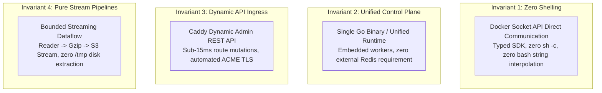

# `pikpik` 🚀

> **A Minimalist, High-Reliability Open-Source Self-Hosted Alternative to Vercel, Netlify, and Heroku.**  
> *Architecture at the Boundary, Ruthless Minimalism in the Core.*

[](go.mod)
[](LICENSE)
[](README.md)
[](cmd/pikpik)

---

> [!CAUTION]
> ### ⚠️ EXPERIMENTAL PRE-ALPHA NOTICE (WORK IN PROGRESS)
> **`pikpik` is currently an active research and early development project and is NOT EVEN IN ALPHA STATE.**  
> Public API contracts, wire protocols, storage schemas, and CLI commands are subject to rapid, breaking changes without deprecation cycles or backward-compatibility shims. **DO NOT run in mission-critical production environments yet.**

---

## 1. Vision & Architectural Philosophy

Self-hosting modern web applications, APIs, background workers, and managed databases should not require fragile polyglot daemons, slow file-watcher config reloads, or hazardous shell script string interpolation (`exec("docker ...")`).

`pikpik` is an engineered rewrite of modern self-hosted PaaS platforms (such as Dokploy, Coolify, and CapRover) designed around **4 Non-Negotiable Invariants**:



1. **Invariant 1 — Zero Shelling (API-First Engine)**: The control plane and remote agents **NEVER** invoke `sh -c`, `bash -c`, or unescaped string interpolation. All container operations, stats, events, and execs communicate strictly through the typed Docker Engine socket (`/var/run/docker.sock`).
2. **Invariant 2 — Single Unified Runtime**: All control plane duties (HTTP REST gateway, WebSocket multiplexer, task queue, container telemetry collector, and cron downsampler) compile into a single static Go binary (`pikpik`). No external Redis, Postgres, or worker daemons required.
3. **Invariant 3 — Dynamic API-Driven Ingress**: Reverse proxy routing rules are applied instantaneously in memory over HTTP REST to **Caddy's dynamic Admin API** (`http://127.0.0.1:2019`), eliminating file watchers, reload race conditions, and syntax crashes.
4. **Invariant 4 — Pure Streaming Pipelines**: Builds, container logs, and database backup archives are handled strictly as streaming pipes (`io.Pipe` -> `gzip` -> S3 multipart), bounding memory footprint to `<32MB` with **zero temporary disk extraction** on `/tmp`.

---

## 2. Core Capabilities

- 🌐 **Dual-Mode Orchestration**: Manage standalone Docker hosts or distributed Docker Swarm clusters with native placement constraints (`node.role`, `node.labels`, `node.hostname`).
- 🤖 **Lightweight Remote Agent (`pikpik-agent`)**: A single `<10MB` static binary installed on worker nodes using **outbound encrypted mTLS/WSS connections** (Zero SSH keys stored on server; zero inbound open ports on workers).
- 🔒 **Zero-Trust Secret Vault**: AES-256-GCM field encryption with Scrypt KDF, 96-bit unique IVs, and automatic log masking.
- 🌳 **4-Tier Cascading Environment Hierarchy**: Seamless variable inheritance (`Org -> Project -> Stage -> Service`) with 3-color DAG cycle detection.
- 📦 **Embedded OCI Registry (`registry:2`) & CI Nudge**: Built-in private registry with automated robot credentials and authenticated deployment webhook redeploys (`POST /api/deploy/nudge/{token}`).
- 🗄️ **Pure Streaming S3 Database Backups**: Stream live PostgreSQL backups directly to AWS S3, Cloudflare R2, MinIO, or Backblaze B2 (`pg_dump | gzip | S3`) without writing a single byte to disk.
- 📊 **Real-time Telemetry & Host Metrics**: Direct Linux `/proc` scraper (`/proc/stat`, `/proc/meminfo`, `/proc/diskstats`, `/proc/net/dev`) with in-memory 24-hour circular ring buffers.
- 💻 **Standalone Developer CLI (`pikpik-cli`)**: Full terminal management suite with standard POSIX/GNU flags for nodes, deployments, interactive Docker Exec PTY sessions, live log streams, and database backups.

---

## 3. Binaries & Repository Layout

`pikpik` produces 3 standalone static Go binaries:

| Binary | Source | Target Footprint | Role & Description |
| :--- | :--- | :---: | :--- |
| **`pikpik`** | [`cmd/pikpik`](cmd/pikpik) | `~14 MB` | Unified Control Plane Server (REST API, Ingress Reconciler, SQLite WAL Store, Backup Engine) |
| **`pikpik-agent`** | [`cmd/pikpik-agent`](cmd/pikpik-agent) | `~6.2 MB` | Lightweight Worker Node Agent (Host `/proc` Exporter + Local Docker Socket Proxy) |
| **`pikpik-cli`** | [`cmd/pikpik-cli`](cmd/pikpik-cli) | `~11 MB` | Operator Terminal CLI (`init`, `login`, `nodes`, `deploy`, `logs`, `stats`, `db`, `exec`) |

---

## 4. Documentation & Engineering Handbook

### Engineering Handbook & Architecture Blueprints
| Document | Topic & Focus Area |
| :--- | :--- |
| **[`docs/handbook/PIKPIK-BLUEPRINT.md`](docs/handbook/PIKPIK-BLUEPRINT.md)** | Production multi-server Swarm deployment topology & Cloudflare TLS. |
| **[`docs/handbook/01-SYSTEM-TOPOLOGY.md`](docs/handbook/01-SYSTEM-TOPOLOGY.md)** | End-to-end architecture, component layout, and protocols. |
| **[`docs/handbook/02-INGRESS-AND-ROUTING.md`](docs/handbook/02-INGRESS-AND-ROUTING.md)** | Caddy dynamic Admin API, automated Let's Encrypt TLS, and wildcard certificates. |
| **[`docs/handbook/03-ORCHESTRATION-AND-RUNTIME.md`](docs/handbook/03-ORCHESTRATION-AND-RUNTIME.md)** | Docker Socket engine, rolling zero-downtime restarts, and network isolation. |
| **[`docs/handbook/04-BUILD-PIPELINES.md`](docs/handbook/04-BUILD-PIPELINES.md)** | Streaming logs, secret injection, and image cache management. |
| **[`docs/handbook/05-STORAGE-AND-BACKUPS.md`](docs/handbook/05-STORAGE-AND-BACKUPS.md)** | SQLite WAL + Litestream state, and pure streaming S3 database backups. |
| **[`docs/handbook/06-SECURITY-AND-RBAC.md`](docs/handbook/06-SECURITY-AND-RBAC.md)** | Eliminating command injection, AES-256-GCM vault, and PTY terminal security. |
| **[`docs/handbook/07-TELEMETRY-AND-HEALTH.md`](docs/handbook/07-TELEMETRY-AND-HEALTH.md)** | Linux `/proc` scraper, 24h circular ring buffer, and SSRF-safe webhooks. |
| **[`docs/handbook/08-FRONTEND-AND-CLIENTS.md`](docs/handbook/08-FRONTEND-AND-CLIENTS.md)** | Headless API, multiplexed WebSockets, and terminal client interfaces. |
| **[`docs/handbook/09-DECISION-RECORDS-ADRS.md`](docs/handbook/09-DECISION-RECORDS-ADRS.md)** | Formal Architectural Decision Records ADR-001 through ADR-007. |
| **[`docs/handbook/10-VOLUMES-NETWORKS-AND-ENV-HIERARCHY.md`](docs/handbook/10-VOLUMES-NETWORKS-AND-ENV-HIERARCHY.md)** | Volume slugging, Swarm overlays, and 4-tier DAG variable hierarchy. |
| **[`docs/handbook/11-DOKPLOY-FEATURE-CATALOG-AND-PARITY-MATRIX.md`](docs/handbook/11-DOKPLOY-FEATURE-CATALOG-AND-PARITY-MATRIX.md)** | Exhaustive feature catalog and clean reimplementation matrix. |
| **[`docs/LAUNCH-AND-DISTRIBUTION-GUIDE.md`](docs/LAUNCH-AND-DISTRIBUTION-GUIDE.md)** | Positioning, Product Hunt launch, Hacker News strategy, and community registry. |

### Formal Package Specifications
- **[`specs/01-CORE-AND-STORE-SPEC.md`](specs/01-CORE-AND-STORE-SPEC.md)**: SQLite WAL, Litestream, Argon2id, API Tokens, AES-256-GCM Vault, and 4-tier DAG.
- **[`specs/02-ORCHESTRATION-AND-SWARM-SPEC.md`](specs/02-ORCHESTRATION-AND-SWARM-SPEC.md)**: Docker Socket API, Dual-Mode Engine, Placement Grammar Parser, and StdCopy demux.
- **[`specs/03-INGRESS-AND-CADDY-SPEC.md`](specs/03-INGRESS-AND-CADDY-SPEC.md)**: Caddy Admin REST API (<15ms), Cloudflare Wildcards, and On-Demand TLS security ask.
- **[`specs/04-AGENT-AND-TELEMETRY-SPEC.md`](specs/04-AGENT-AND-TELEMETRY-SPEC.md)**: `pikpik-agent` (<10MB), Inverted mTLS/WSS connection, `/proc` scraper, and 24h Ring Buffer.
- **[`specs/05-REGISTRY-AND-STREAMING-BACKUPS-SPEC.md`](specs/05-REGISTRY-AND-STREAMING-BACKUPS-SPEC.md)**: Embedded Registry:2, GHA Redeploy Webhook, and Pure Streaming S3 Pipelines (<32MB RAM).
- **[`specs/06-API-AND-CLI-SPEC.md`](specs/06-API-AND-CLI-SPEC.md)**: HTTP REST routes, WebSocket Multiplexer, PTY terminal bridge, and `pikpik-cli`.

---

## 5. Quickstart & Development

### Prerequisites
- Go 1.24+
- Docker Engine with local socket `/var/run/docker.sock`

### Building Binaries
```bash
# Build all 3 stripped static binaries
go build -ldflags="-s -w" -o bin/pikpik ./cmd/pikpik
go build -ldflags="-s -w" -o bin/pikpik-cli ./cmd/pikpik-cli
go build -ldflags="-s -w" -o bin/pikpik-agent ./cmd/pikpik-agent
```

### Running Test Suite (100% Race-Free)
```bash
go test -count=1 -race ./...
```

### Starting pikpik Control Plane (POSIX/GNU Flags)
```bash
./bin/pikpik --listen :8080 --data-dir ./data --admin-email admin@example.com --admin-password supersecretpassword
```

---

## License

MIT License. See [LICENSE](LICENSE) for details.
