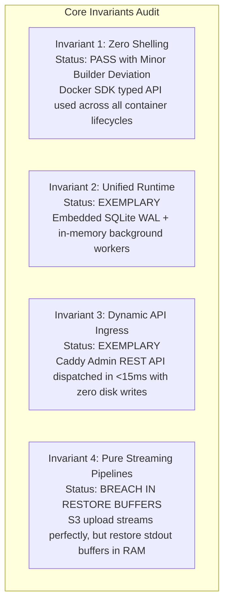

# Master Architectural Audit Report: `pikpik` Codebase

**Date:** 2026-08-31  
**Audit Protocol:** [`boundary-review`](file:///home/devhax/.gemini/config/skills/boundary-review/SKILL.md)  
**Overall System Health Score:** **8.3 / 10.0 (Moderate / Robust Foundation with Targeted High-Impact Fixes)**

---

## 1. Executive Scorecard

| Scope | Subsystem Domain | Auditor | Score | Status | Invariant Breaches | Primary Finding |
| :--- | :--- | :--- | :---: | :---: | :---: | :--- |
| **Scope 1** | Storage & Security Core | Scope 1 | **9.6** | Exemplary | None | Zero SQLi, Scrypt/Argon2id, SQLite WAL with direct DSN pragmas |
| **Scope 2** | Orchestration & Ingress | Scope 2 | **8.2** | Moderate | Minor | Volume bind mount host directory escape vulnerability in Compose parser |
| **Scope 3** | Streaming & Telemetry | Scope 3 | **7.2** | Moderate | Critical | Unbounded `strings.Builder` memory during DB restores; unencrypted S3 backups |
| **Scope 4** | API Gateway & Server | Scope 4 | **8.8** | Exemplary | None | Rate limiter nested inside auth middleware exposing DB to token guessing DoS |
| **Scope 5** | Operator CLI & Web SPA | Scope 5 | **8.8** | Minor | None | Join tokens printed without `--show-secrets`; PTY token expiration unhandled |
| **Scope 6** | Cross-Boundary Seams | Scope 6 | **7.2** | Moderate | None | Backup schedule DTO drift (`s3_destination_id` vs flat S3 credentials) |

---

## 2. Invariant Compliance Matrix

1. **Invariant 1 — Zero Shelling (API-First Engine)**:  
   - **Status**: **PASS (Minor Builder Deviation)**. All container lifecycles, network attachments, and exec PTYs communicate directly through the typed Docker SDK (`/var/run/docker.sock`). Minor deviation: `git clone` and `nixpacks` invoke host binaries via typed `exec.CommandContext` rather than transient builder containers.
2. **Invariant 2 — Single Unified Runtime**:  
   - **Status**: **EXEMPLARY (10/10)**. Zero external daemons required. SQLite WAL mode (`PRAGMA busy_timeout=5000; PRAGMA foreign_keys=ON`) encoded into DSN string so all connection pool workers inherit settings. In-memory workers and circular ring buffers handle pub/sub and metrics internally.
3. **Invariant 3 — Dynamic API Ingress Reconciler**:  
   - **Status**: **EXEMPLARY (10/10)**. Caddy dynamic Admin REST API (`PUT /id/{id}` and `POST /load`) called directly in `<15ms`. Zero Caddyfile disk writes, zero process reload signals (`kill -HUP`).
4. **Invariant 4 — Pure Streaming Pipelines**:  
   - **Status**: **BREACH IN RESTORE ENGINE**. S3 multipart upload streaming (`s3/client.go`) is exemplary with bounded 5MB chunk slicing and zero `/tmp` files. However, `pkg/backup/engine.go:60-61` captures container stdout/stderr into unbounded `strings.Builder` buffers during database restores, risking host OOM on multi-gigabyte verbose restores.

---

## 3. Four-Dimensional Codebase Evaluation

### A. Correctness & Architecture
- **Topological Sorting**: [pkg/orchestration/compose.go](file:///home/devhax/projects/fusuycorp/pikpik/pkg/orchestration/compose.go) deterministically resolves service deployment DAGs using Kahn's algorithm and reliably detects dependency cycles.
- **Transactional Atomicity**: Store operations leverage SQLite transactions with consistent error wrapping and rollback guarantees.
- **DTO Seam Drift**: [pkg/api/types.go](file:///home/devhax/projects/fusuycorp/pikpik/pkg/api/types.go) and [web/src/lib/types.ts](file:///home/devhax/projects/fusuycorp/pikpik/web/src/lib/types.ts) diverge on backup schedules (`s3_destination_id`), webhook secrets, and user timestamp metadata.

### B. Robustness & Fault Tolerance
- **Slow Consumer Isolation**: [pkg/telemetry/ws_hub.go](file:///home/devhax/projects/fusuycorp/pikpik/pkg/telemetry/ws_hub.go) and [pkg/api/sse.go](file:///home/devhax/projects/fusuycorp/pikpik/pkg/api/sse.go) use non-blocking channel selects with `default: return` to drop stale metric frames without lagging or deadlocking core dispatch loops.
- **Panic Boundaries**: [pkg/api/gateway.go](file:///home/devhax/projects/fusuycorp/pikpik/pkg/api/gateway.go) implements recovery middleware returning RFC-7807 problem envelopes for all unhandled panics.
- **WebSocket Timeout Sensitivity**: [pkg/telemetry/ws_hub.go:278](file:///home/devhax/projects/fusuycorp/pikpik/pkg/telemetry/ws_hub.go#L278) hardcodes a 60s read timeout on application-level pings, causing premature disconnects on network jitter.

### C. Performance & Resource Footprint
- **S3 Streaming Bounded Memory**: [pkg/backup/s3/client.go](file:///home/devhax/projects/fusuycorp/pikpik/pkg/backup/s3/client.go) bounds RAM to `<32MB` using concurrent 5MB chunk buffers and pipe multiplexing.
- **Cache Normalization**: [pkg/telemetry/docker_collector.go](file:///home/devhax/projects/fusuycorp/pikpik/pkg/telemetry/docker_collector.go) subtracts `inactive_file` page cache from container memory stats across both cgroups v1 and v2, preventing false-positive OOM alarms.
- **TanStack Query Invalidation**: Web SPA invalidates query caches precisely on mutation completions, avoiding stale data or unnecessary refetch polling.

### D. Security & Cryptography
- **Vault AEAD & Scrypt**: [pkg/crypto/aes_vault.go](file:///home/devhax/projects/fusuycorp/pikpik/pkg/crypto/aes_vault.go) implements AES-256-GCM authenticated encryption with 96-bit random IVs and Scrypt key derivation (`N=32768, r=8, p=1`).
- **Timing Defense**: Passwords (Argon2id), Webhook HMACs (`X-Hub-Signature-256`), and PAT tokens are validated with `subtle.ConstantTimeCompare`.
- **IP Spoofing Defense**: [pkg/api/auth.go](file:///home/devhax/projects/fusuycorp/pikpik/pkg/api/auth.go) explicitly ignores spoofable `X-Forwarded-For` and `X-Real-IP` headers when computing client rate-limit buckets.

---

## 4. Prioritized Remediation Roadmap

### 🔴 Priority 1: Critical Security, Memory OOM & Seam Breakages
1. **Sanitize Volume Mount Sources (Host Escape Prevention)**  
   * **Target**: [`pkg/orchestration/compose.go`](file:///home/devhax/projects/fusuycorp/pikpik/pkg/orchestration/compose.go) and [`pkg/orchestration/containers.go`](file:///home/devhax/projects/fusuycorp/pikpik/pkg/orchestration/containers.go)  
   * **Fix**: Reject host bind mounts to `/proc`, `/sys`, `/etc`, `/var/run/docker.sock`, and `/` root unless explicitly permitted by an admin override.
2. **Eliminate Unbounded Restore Buffers (Invariant 4 OOM Fix)**  
   * **Target**: [`pkg/backup/engine.go:60-61, 109-110`](file:///home/devhax/projects/fusuycorp/pikpik/pkg/backup/engine.go#L60)  
   * **Fix**: Replace unbounded `strings.Builder` with bounded rolling buffers (`io.LimitReader` + 64KB capped writer) or `io.Discard` for database restore standard streams.
3. **Add Streaming AES-256-GCM Encryption to Database Backups**  
   * **Target**: [`pkg/backup/multi_db.go:291-295`](file:///home/devhax/projects/fusuycorp/pikpik/pkg/backup/multi_db.go#L291)  
   * **Fix**: Inject AES-GCM streaming encryption between `gzip.Writer` and `io.PipeWriter` using the vault key before dispatching chunks to S3.
4. **Align Backup Schedule DTO & Integration Resolution**  
   * **Target**: [`pkg/api/types.go`](file:///home/devhax/projects/fusuycorp/pikpik/pkg/api/types.go) and [`pkg/api/controller.go`](file:///home/devhax/projects/fusuycorp/pikpik/pkg/api/controller.go)  
   * **Fix**: Add `s3_destination_id` to `CreateBackupScheduleRequest` DTO, and resolve the underlying S3 credentials from the `Integration` store dynamically.
5. **Sanitize Sensitive Credentials in Event Notifications**  
   * **Target**: [`pkg/notifications/dispatcher.go:191-209`](file:///home/devhax/projects/fusuycorp/pikpik/pkg/notifications/dispatcher.go#L191)  
   * **Fix**: Scrub keys matching `(?i)(password|secret|token|uri|key)` before rendering Slack, Discord, Telegram, or Webhook notifications.

---

### 🟡 Priority 2: Robustness, Rate Limiting & DTO Drift
1. **Reorder Rate Limiting & Auth Middleware (DoS Mitigation)**  
   * **Target**: [`pkg/api/routes.go:88-100`](file:///home/devhax/projects/fusuycorp/pikpik/pkg/api/routes.go#L88)  
   * **Fix**: Evaluate `rateLimiter.Allow()` *before* invoking `AuthMiddleware` to ensure brute-force token attempts consume rate-limit tokens rather than slamming SQLite with queries.
2. **Restrict URL Query Parameter Token Extraction**  
   * **Target**: [`pkg/api/auth.go:95-97`](file:///home/devhax/projects/fusuycorp/pikpik/pkg/api/auth.go#L95)  
   * **Fix**: Only allow `?token=` extraction for WebSocket (`/ws/`) and SSE (`/stream`) paths, blocking token leaks on general REST endpoints.
3. **Map App Webhook Secret & Deploy Token**  
   * **Target**: [`pkg/api/types.go`](file:///home/devhax/projects/fusuycorp/pikpik/pkg/api/types.go) & [`pkg/api/controller.go`](file:///home/devhax/projects/fusuycorp/pikpik/pkg/api/controller.go)  
   * **Fix**: Expose `webhook_secret` in `CreateAppRequest` and `App` response DTOs, mapping it cleanly to the underlying `DeployTokenHash`.
4. **WebSocket PTY Auth Reconnect & Expiration Handling**  
   * **Target**: [`web/src/hooks/usePTY.ts:79`](file:///home/devhax/projects/fusuycorp/pikpik/web/src/hooks/usePTY.ts#L79)  
   * **Fix**: Add clear visual feedback on auth expiration and handle reconnect token refreshes.

---

### 🟢 Priority 3: Polish, Debt & Hardening
1. **Require `--show-secrets` for CLI Swarm Join Tokens**  
   * **Target**: [`cmd/pikpik-cli/main.go:606`](file:///home/devhax/projects/fusuycorp/pikpik/cmd/pikpik-cli/main.go#L606)  
   * **Fix**: Mask join tokens by default (`****`) unless `--show-secrets` is explicitly passed.
2. **Accurate Timestamp Deltas for Telemetry Downsampling**  
   * **Target**: [`pkg/telemetry/ring_buffer.go:128`](file:///home/devhax/projects/fusuycorp/pikpik/pkg/telemetry/ring_buffer.go#L128)  
   * **Fix**: Calculate volume byte integration using exact timestamp deltas instead of assuming a constant 10s step.
3. **Add `totp_enabled` and `updated_at` to Web `User` Interface**  
   * **Target**: [`web/src/lib/types.ts`](file:///home/devhax/projects/fusuycorp/pikpik/web/src/lib/types.ts)  
   * **Fix**: Update TypeScript `User` type to include full security and timestamp attributes returned by the backend.

---

## 5. References to Detailed Scope Reports
- [reviews/scope_1_store_security.md](file:///home/devhax/projects/fusuycorp/pikpik/reviews/scope_1_store_security.md)
- [reviews/scope_2_orchestration_ingress.md](file:///home/devhax/projects/fusuycorp/pikpik/reviews/scope_2_orchestration_ingress.md)
- [reviews/scope_3_streaming_telemetry_agent.md](file:///home/devhax/projects/fusuycorp/pikpik/reviews/scope_3_streaming_telemetry_agent.md)
- [reviews/scope_4_api_gateway.md](file:///home/devhax/projects/fusuycorp/pikpik/reviews/scope_4_api_gateway.md)
- [reviews/scope_5_cli_frontend.md](file:///home/devhax/projects/fusuycorp/pikpik/reviews/scope_5_cli_frontend.md)
- [reviews/scope_6_seams.md](file:///home/devhax/projects/fusuycorp/pikpik/reviews/scope_6_seams.md)
