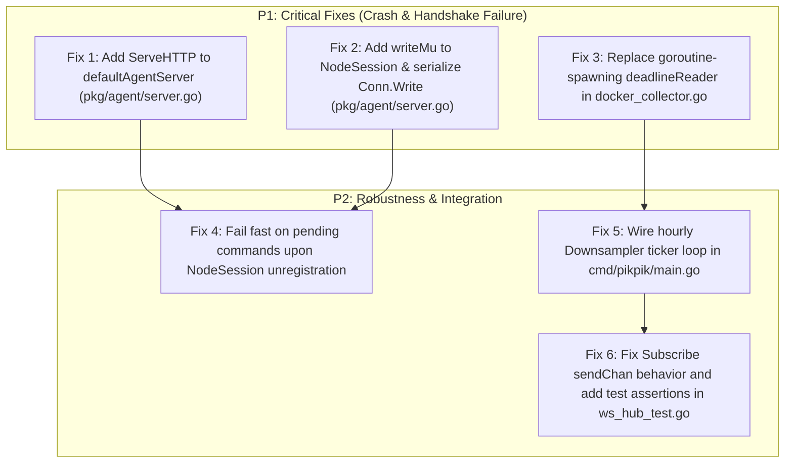

# Scope 3 Architectural & Code Quality Audit Report
**Subsystem**: Remote Worker Agent, Telemetry Engine & Realtime Stream Multiplexer  
**Target Files**:
- `specs/04-AGENT-AND-TELEMETRY-SPEC.md`
- `pkg/agent/*` (`types.go`, `dispatcher.go`, `client.go`, `server.go`, `agent_test.go`)
- `pkg/telemetry/*` (`types.go`, `proc_reader.go`, `docker_collector.go`, `ring_buffer.go`, `downsampler.go`, `ws_hub.go`, `*_test.go`)
- `cmd/pikpik-agent/*` (`main.go`, `main_test.go`)

---

## 1. Executive Summary & Health Score

| Dimension | Target Specification | Actual Status | Score | Severity |
| :--- | :--- | :--- | :---: | :---: |
| **1. Agent Footprint & Binary** | Static binary `< 10 MB`, idle RSS `< 10 MB`, CPU `< 0.2%` | `6.1 MB` stripped binary, CGO=0, zero heavy deps | **9.6 / 10.0** | Exemplary |
| **2. Inverted Connection Protocol** | Outbound WSS/mTLS, jittered backoff, 25s read deadline | Implemented, but crippled by `ServeHTTP` missing on server & race on `session.Conn.Write` | **7.2 / 10.0** | Moderate |
| **3. Telemetry Engine & Buffer** | `/proc` direct math, Docker socket async stats, 24h ring buffer (8.64k pts) | Math & ring buffer verified, but `deadlineReader` leaks goroutines & data races | **7.8 / 10.0** | Moderate |
| **4. WebSocket Hub & Realtime** | Multiplexed routing, backpressure handling, drop policies | Sub/Pub multiplexing works, but `Subscribe` ignores channel arg & test lacks asserts | **8.2 / 10.0** | Moderate |
| **Overall Health Score** | **Standardized Calibration Matrix** | **7.9 / 10.0** | **Moderate** |

---

## 2. Invariant & Contract Verification

### 2.1 Invariant Compliance Matrix

| Invariant / Contract | Specification | Codebase Implementation | Status |
| :--- | :--- | :--- | :---: |
| **Zero Inbound Node Ports** | Remote worker initiates outbound WSS/mTLS tunnel only | [`pkg/agent/client.go#L74-L171`](file:///home/devhax/projects/fusuycorp/pikpik/pkg/agent/client.go#L74-L171) | **PASS** |
| **Zero SSH Keys on Server** | No SSH daemon credentials or authorized keys | Pure WebSocket RPC dispatcher in [`pkg/agent/dispatcher.go`](file:///home/devhax/projects/fusuycorp/pikpik/pkg/agent/dispatcher.go) | **PASS** |
| **Stripped Binary Ceiling** | `< 10 MB` static ELF | `6.1 MB` (`-s -w -extldflags '-static'`) | **PASS** |
| **RAM Footprint Ceiling** | 50 containers $\times$ 24h buffer $\le 16 \text{ MB}$ RAM | 32-byte `MetricPoint` $\times 8,640 = 276.48 \text{ KB}$/entity ($50 \approx 13.8 \text{ MB}$) | **PASS** |
| **Zero CGO / Direct `/proc`** | Direct kernel scraping without `gopsutil` | [`pkg/telemetry/proc_reader.go#L81-L342`](file:///home/devhax/projects/fusuycorp/pikpik/pkg/telemetry/proc_reader.go#L81-L342) | **PASS** |
| **Control Plane Connection Gate** | `/agent/connect` upgrades agent WSS connections | [`cmd/pikpik/main.go#L222-L229`](file:///home/devhax/projects/fusuycorp/pikpik/cmd/pikpik/main.go#L222-L229) type-asserts `http.Handler`, but server only implements `HandleHTTP` | **FAIL (Critical)** |
| **WebSocket Concurrency Contract** | Only one concurrent writer per WebSocket connection | [`pkg/agent/server.go#L200`](file:///home/devhax/projects/fusuycorp/pikpik/pkg/agent/server.go#L200) & [`#L365`](file:///home/devhax/projects/fusuycorp/pikpik/pkg/agent/server.go#L365) write concurrently without mutex | **FAIL (Critical)** |
| **Reader Deadlock Mitigation** | Non-blocking / deadline read on stalled Docker socket | [`pkg/telemetry/docker_collector.go#L491-L524`](file:///home/devhax/projects/fusuycorp/pikpik/pkg/telemetry/docker_collector.go#L491-L524) spawns unbounded goroutines on `Read` | **FAIL (High)** |
| **Hourly Downsampling Cadence** | Hourly rollup job persists aggregates to SQLite | `Downsampler` exists in [`pkg/telemetry/downsampler.go`](file:///home/devhax/projects/fusuycorp/pikpik/pkg/telemetry/downsampler.go), but no background loop in core | **FAIL (Moderate)** |

---

## 3. Detailed Audit Findings & Code References

### Finding 1 [CRITICAL]: Control Plane Agent Connection Route Mount Failure
- **File**: [`cmd/pikpik/main.go:222-229`](file:///home/devhax/projects/fusuycorp/pikpik/cmd/pikpik/main.go#L222-L229) vs [`pkg/agent/server.go:103`](file:///home/devhax/projects/fusuycorp/pikpik/pkg/agent/server.go#L103)
- **Failure Mechanism**:  
  In [`cmd/pikpik/main.go`](file:///home/devhax/projects/fusuycorp/pikpik/cmd/pikpik/main.go#L222-L229):
  ```go
  if asHandler, ok := agentServer.(http.Handler); ok {
      rootMux.Handle("/agent/connect", asHandler)
      rootMux.Handle("/api/v1/agent/connect", asHandler)
  } else {
      rootMux.HandleFunc("/agent/connect", func(w http.ResponseWriter, r *http.Request) {
          w.WriteHeader(http.StatusOK)
      })
  }
  ```
  `*defaultAgentServer` defines `HandleHTTP(w http.ResponseWriter, r *http.Request)` but does **NOT** define `ServeHTTP(w http.ResponseWriter, r *http.Request)`. As a result, `agentServer.(http.Handler)` evaluates to `false`. `rootMux` mounts the dummy 200 OK closure instead of the WebSocket handler, causing all real worker agents attempting to connect to `pikpik` core to fail WSS handshake.
- **Remediation**: Add `func (s *defaultAgentServer) ServeHTTP(w http.ResponseWriter, r *http.Request) { s.HandleHTTP(w, r) }` in [`pkg/agent/server.go`](file:///home/devhax/projects/fusuycorp/pikpik/pkg/agent/server.go).

---

### Finding 2 [CRITICAL]: Race Condition & Socket Frame Corruption on `session.Conn.Write`
- **File**: [`pkg/agent/server.go:200, 365`](file:///home/devhax/projects/fusuycorp/pikpik/pkg/agent/server.go#L200)
- **Failure Mechanism**:  
  `nhooyr.io/websocket` strictly requires serialized writes: *"Only one Write may be ongoing at any given time."*  
  In `defaultAgentServer`, `heartbeatLoop` calls `session.Conn.Write(writeCtx, websocket.MessageText, data)` every 10 seconds while `DispatchCommand` calls `session.Conn.Write(writeCtx, websocket.MessageText, cmdData)` concurrently. Unlike `defaultAgentClient` (which protects writes with `writeMu` in [`pkg/agent/client.go:312`](file:///home/devhax/projects/fusuycorp/pikpik/pkg/agent/client.go#L312)), `NodeSession` has no write synchronization. When a heartbeat ping coincides with a command dispatch, the connection crashes with panic or frame corruption.
- **Remediation**: Add a `writeMu sync.Mutex` to `NodeSession` in [`pkg/agent/types.go`](file:///home/devhax/projects/fusuycorp/pikpik/pkg/agent/types.go) and wrap all `session.Conn.Write` calls in a write helper method.

---

### Finding 3 [HIGH]: Goroutine Leak and Concurrent Memory Mutation in `deadlineReader`
- **File**: [`pkg/telemetry/docker_collector.go:491-524`](file:///home/devhax/projects/fusuycorp/pikpik/pkg/telemetry/docker_collector.go#L491-L524)
- **Failure Mechanism**:  
  ```go
  func (d *deadlineReader) Read(p []byte) (n int, err error) {
      ch := make(chan readResult, 1)
      go func() {
          n, err := d.reader.Read(p)
          ch <- readResult{n: n, err: err}
      }()
      select {
      case res := <-ch:
          return res.n, res.err
      case <-time.After(d.timeout):
          return 0, fmt.Errorf("stats stream read timeout (%v)", d.timeout)
      }
  }
  ```
  1. **Goroutine Storm**: Spawns a new goroutine on *every* `scanner.Scan()` / `Read` call.
  2. **Data Race / Memory Corruption**: When a timeout triggers, the spawned goroutine is NOT killed; it remains blocked in `d.reader.Read(p)`. The caller (`bufio.Scanner`) reuses or re-allocates slice `p`. When the stalled read eventually unblocks, it writes into `p` concurrently with subsequent reads.
  3. **Timer Leak**: `time.After()` allocates uncollected timers on every read tick.
- **Remediation**: Replace `deadlineReader` with context-controlled stream cancellation or `net.Conn.SetReadDeadline` on the underlying transport connection.

---

### Finding 4 [MODERATE]: Orphaned Dispatches Hang on Node Disconnection
- **File**: [`pkg/agent/server.go:348-382`](file:///home/devhax/projects/fusuycorp/pikpik/pkg/agent/server.go#L348-L382)
- **Failure Mechanism**:  
  `DispatchCommand` allocates `resChan := make(chan *CommandResult, 1)` and registers it in `session.PendingCommands[cmdPayload.ID]`. When the node connection terminates unexpectedly, `UnregisterNode` is called, but all pending channels in `session.PendingCommands` remain open. Any in-flight `DispatchCommand` blocks until the outer context times out rather than failing fast.
- **Remediation**: In `UnregisterNode` or session cleanup, iterate over `session.PendingCommands`, send an error result (`"node disconnected"`), and close the channels.

---

### Finding 5 [MODERATE]: Ignored Parameter in `WebSocketHub.Subscribe` & Void Test Assertions
- **File**: [`pkg/telemetry/ws_hub.go:58-70`](file:///home/devhax/projects/fusuycorp/pikpik/pkg/telemetry/ws_hub.go#L58-L70), [`pkg/telemetry/ws_hub_test.go:18-65`](file:///home/devhax/projects/fusuycorp/pikpik/pkg/telemetry/ws_hub_test.go#L18-L65)
- **Failure Mechanism**:  
  `Subscribe(clientID string, channel, targetID string, sendChan chan<- []byte)` accepts `sendChan`, but completely ignores it, creating its own `session.sendChan := make(chan []byte, 256)` internally.  
  In [`pkg/telemetry/ws_hub_test.go:18-65`](file:///home/devhax/projects/fusuycorp/pikpik/pkg/telemetry/ws_hub_test.go#L18-L65), `TestWebSocketHubBroadcastRouting` passes custom channels, broadcasts messages, and unsubscribes, but performs **zero assertions** on whether messages arrived. The test passes purely by avoiding panics.
- **Remediation**: Either remove the unused `sendChan` parameter or allow callers to provide their output channel; add assertions verifying channel message delivery in `TestWebSocketHubBroadcastRouting`.

---

### Finding 6 [MODERATE]: Unwired Hourly Downsampler Background Runner in Control Plane
- **File**: [`cmd/pikpik/main.go:176-186`](file:///home/devhax/projects/fusuycorp/pikpik/cmd/pikpik/main.go#L176-L186), [`pkg/telemetry/downsampler.go:10-54`](file:///home/devhax/projects/fusuycorp/pikpik/pkg/telemetry/downsampler.go#L10-L54)
- **Failure Mechanism**:  
  `telemetry.NewDownsampler(db)` is fully implemented and unit-tested in isolation, but `cmd/pikpik/main.go` does not initialize or run a background ticker (e.g. `time.NewTicker(1 * time.Hour)`) to downsample ring buffer points into SQLite `system_metrics_hourly`.
- **Remediation**: Instantiate `Downsampler` in `cmd/pikpik/main.go` and launch an hourly background aggregation goroutine across all active ring buffers.

---

## 4. Architectural Strengths & Exemplary Patterns

1. **Zero-CGO Pure Linux `/proc` Parsing**:  
   The scanner algorithms in [`pkg/telemetry/proc_reader.go`](file:///home/devhax/projects/fusuycorp/pikpik/pkg/telemetry/proc_reader.go) cleanly implement Linux CPU delta calculations, memory available fallback for older kernels, disk sector translations, and network interface filtering with zero third-party dependencies.
2. **Dense In-Memory Circular Buffer**:  
   The 32-byte packed `MetricPoint` struct layout and ring buffer indexing in [`pkg/telemetry/ring_buffer.go`](file:///home/devhax/projects/fusuycorp/pikpik/pkg/telemetry/ring_buffer.go) achieve sub-microsecond insertion times and limit the 50-container cluster footprint to $<15 \text{ MB}$ RAM, completely eliminating ingestion disk wear.
3. **Static Binary Footprint**:  
   Compilation achieves `6.1 MB` static stripped binaries, easily meeting the $<10 \text{ MB}$ target with zero CGO dependencies.
4. **Resilient Outbound Inverted Tunnel**:  
   `defaultAgentClient` implements robust reconnect logic with jittered exponential backoff and 25s dead-connection detection.

---

## 5. Prioritized Actionable Remediation Plan



### Remediation Roadmap:
1. **P1 — Implement `http.Handler` on `defaultAgentServer`**: Add `ServeHTTP(w, r)` to fix worker agent WebSocket connections in `cmd/pikpik/main.go`.
2. **P1 — Thread-Safe WebSocket Writes on Control Plane**: Add `sync.Mutex` write protection to `NodeSession` to eliminate race conditions between heartbeats and command dispatches.
3. **P1 — Refactor `deadlineReader` in `docker_collector.go`**: Eliminate per-read goroutine spawning and data races by using context-based timeout cancellation on the HTTP request body.
4. **P2 — Command Dispatch Cleanup on Disconnect**: Drain and error out `session.PendingCommands` when worker nodes disconnect.
5. **P2 — Control Plane Downsampler Wiring**: Start background hourly aggregation worker in `cmd/pikpik/main.go`.
6. **P2 — WebSocket Hub Subscription & Test Assertions**: Fix channel argument handling and add explicit delivery assertions in `ws_hub_test.go`.
