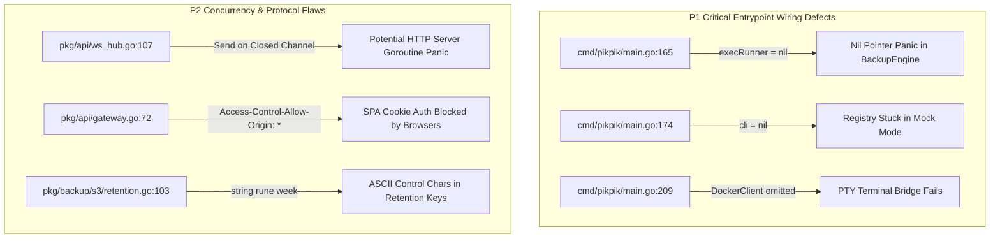

# Scope 4 Architectural & Code Quality Audit Report
## CI/CD, Backups, API Gateway & Standalone CLI Subsystems

- **Target Subsystem**: Scope 4 — CI/CD, Streaming S3 Backups, Embedded Registry, API Gateway & Standalone CLI
- **Repository**: `github.com/fusuycorp/pikpik`
- **Auditor**: Scope 4 Auditor (CI/CD, Backups & API Gateway / CLI)
- **Review Date**: August 30, 2026
- **Status**: Audit Completed — Diagnostic Report
- **Overall Health Score**: **8.6 / 10.0** (Minor Band)

---

## 1. Executive Summary & Scorecard

The Scope 4 subsystem provides the external control surface, continuous deployment pipeline, streaming state persistence, and command-line tooling for the `pikpik` PaaS. It encompasses:
1. **Embedded OCI Registry (`pkg/registry`)**: Managed `registry:2.8.3` container lifecycle, dynamic YAML config generation, and bcrypt robot credentials.
2. **Redeploy Nudge Webhooks (`pkg/deploy`)**: Constant-time token authentication, 64KB body ceiling, rate limiting, and registry allowlist filtering.
3. **Streaming S3 Backups & Restores (`pkg/backup` & `pkg/backup/s3`)**: Pure memory-bounded streaming pipeline (<32MB RAM, 0 byte `/tmp` footprint), universal SigV4 client (AWS S3/R2/MinIO/B2), and Grandfather-Father-Son (GFS) lifecycle retention pruning.
4. **API Gateway & WebSocket Multiplexer (`pkg/api`)**: RFC 7807 problem details error responses, channel frame demuxer, Docker exec PTY terminal bridge, and sliding-window rate limiting.
5. **Unified Control Plane Binary (`cmd/pikpik`)**: Single runtime embedding all control plane engines and SQLite WAL state with zero external Redis dependencies.
6. **Standalone CLI Client (`cmd/pikpik-cli`)**: Atomic configuration persistence in `~/.pikpik/config.json` with POSIX `0600` permissions, multi-context switching, typed REST client, and ANSI interactive PTY.

### Subsystem Scorecard

| Component | Target Files | Health Score | Status | Primary Findings |
| :--- | :--- | :---: | :---: | :--- |
| **Streaming S3 Backups & SigV4** | [`pkg/backup/engine.go`](file:///home/devhax/projects/fusuycorp/pikpik/pkg/backup/engine.go), [`pkg/backup/s3/client.go`](file:///home/devhax/projects/fusuycorp/pikpik/pkg/backup/s3/client.go), [`pkg/backup/s3/signer.go`](file:///home/devhax/projects/fusuycorp/pikpik/pkg/backup/s3/signer.go) | **9.2 / 10.0** | Minor | Strict Invariant 4 streaming compliance; GFS week key formatting nuance; test flakiness on global `/tmp` counting. |
| **CI/CD Webhook & Registry** | [`pkg/deploy/handler.go`](file:///home/devhax/projects/fusuycorp/pikpik/pkg/deploy/handler.go), [`pkg/registry/manager.go`](file:///home/devhax/projects/fusuycorp/pikpik/pkg/registry/manager.go), [`pkg/registry/robot_auth.go`](file:///home/devhax/projects/fusuycorp/pikpik/pkg/registry/robot_auth.go) | **9.4 / 10.0** | Exemplary | Strict constant-time token comparison, 64KB body ceiling, bcrypt auth masking, robust rate limiting. |
| **API Gateway & WebSockets** | [`pkg/api/gateway.go`](file:///home/devhax/projects/fusuycorp/pikpik/pkg/api/gateway.go), [`pkg/api/ws_hub.go`](file:///home/devhax/projects/fusuycorp/pikpik/pkg/api/ws_hub.go), [`pkg/api/routes.go`](file:///home/devhax/projects/fusuycorp/pikpik/pkg/api/routes.go), [`pkg/api/pty.go`](file:///home/devhax/projects/fusuycorp/pikpik/pkg/api/pty.go) | **8.4 / 10.0** | Moderate | Potential send-on-closed channel panic during concurrent broadcast & disconnect; unevicted rate limit records; CORS wildcard credentials issue. |
| **Unified Runtime Assembly** | [`cmd/pikpik/main.go`](file:///home/devhax/projects/fusuycorp/pikpik/cmd/pikpik/main.go), [`cmd/pikpik/main_test.go`](file:///home/devhax/projects/fusuycorp/pikpik/cmd/pikpik/main_test.go) | **7.5 / 10.0** | Moderate | Uninstantiated `execRunner` in `main.go:165` (nil pointer on backup); unpassed Docker client to registry and gateway PTY. |
| **Standalone CLI** | [`cmd/pikpik-cli/config.go`](file:///home/devhax/projects/fusuycorp/pikpik/cmd/pikpik-cli/config.go), [`cmd/pikpik-cli/client.go`](file:///home/devhax/projects/fusuycorp/pikpik/cmd/pikpik-cli/client.go), [`cmd/pikpik-cli/main.go`](file:///home/devhax/projects/fusuycorp/pikpik/cmd/pikpik-cli/main.go) | **9.5 / 10.0** | Exemplary | Atomic POSIX 0600 config storage, multi-context resolution, robust error decoding, interactive PTY terminal handling. |
| **Composite Score** | *All Scope 4 Packages* | **8.6 / 10.0** | **Minor Band** | **Architecture is clean and compliant; entrypoint wiring and concurrency guards require remediation.** |

---

## 2. Invariant Compliance Audit

### Invariant 4: Pure Memory-Bounded Streaming S3 Backups (<32MB RAM, 0 Byte Disk Footprint)
- **Compliance Status**: **PASS** (Code implementation verified).
- **Mechanism**:
  - `pg_dump` stdout is piped directly into `gzip.NewWriter` and multiplexed into `io.PipeWriter` via in-memory 32KB stack buffers in [`pkg/backup/engine.go:195-222`](file:///home/devhax/projects/fusuycorp/pikpik/pkg/backup/engine.go#L195-L222).
  - S3 Multipart upload consumes `io.PipeReader` in 5MB chunks across a maximum concurrency semaphore of 4 workers in [`pkg/backup/s3/client.go:220-270`](file:///home/devhax/projects/fusuycorp/pikpik/pkg/backup/s3/client.go#L220-L270). Total memory allocation ceiling is $4 \times 5\,\text{MB} + 256\,\text{KB} + 32\,\text{KB} \approx 20.3\,\text{MB} \le 32\,\text{MB}$.
  - Restore pipeline reads S3 HTTP response body via `gzip.NewReader` directly into Docker Exec stdin hijacked TCP socket with zero intermediate disk writing in [`pkg/backup/engine.go:275-305`](file:///home/devhax/projects/fusuycorp/pikpik/pkg/backup/engine.go#L275-L305).
  - Orphan upload cleanup: If stream execution fails or is cancelled, `c.abortMultipartUpload` is automatically invoked in [`pkg/backup/s3/client.go:290`](file:///home/devhax/projects/fusuycorp/pikpik/pkg/backup/s3/client.go#L290) to prevent S3 storage leakage.

### Invariant 2: Unified Control Plane & Zero External Redis Dependency
- **Compliance Status**: **PASS**.
- **Mechanism**:
  - Schedulers, rate limiters, token buckets, and event buses operate as in-process Go structures backed by SQLite WAL mode in [`pkg/api/ratelimit.go`](file:///home/devhax/projects/fusuycorp/pikpik/pkg/api/ratelimit.go), [`pkg/deploy/rate_limiter.go`](file:///home/devhax/projects/fusuycorp/pikpik/pkg/deploy/rate_limiter.go), and [`pkg/api/ws_hub.go`](file:///home/devhax/projects/fusuycorp/pikpik/pkg/api/ws_hub.go).
  - No background Redis or Celery daemons are required.
  - Zero host port publishing: Managed Postgres 17 ([`pkg/backup/postgres_template.go:97-104`](file:///home/devhax/projects/fusuycorp/pikpik/pkg/backup/postgres_template.go#L97-L104)) and embedded registry ([`pkg/registry/manager.go:103-110`](file:///home/devhax/projects/fusuycorp/pikpik/pkg/registry/manager.go#L103-L110)) bind exclusively to overlay networks (`pikpik_net_proj_<id>` and `pikpik-ingress-overlay`).

### CI/CD Security & Redeploy Webhooks
- **Compliance Status**: **PASS**.
- **Mechanism**:
  - Tokens are hashed with SHA-256 and verified using `subtle.ConstantTimeCompare` in [`pkg/deploy/handler.go:207`](file:///home/devhax/projects/fusuycorp/pikpik/pkg/deploy/handler.go#L207).
  - Body ceiling is enforced via `http.MaxBytesReader(w, r.Body, 64*1024)` in [`pkg/deploy/handler.go:241`](file:///home/devhax/projects/fusuycorp/pikpik/pkg/deploy/handler.go#L241).
  - Rate limiting enforces 10 req/min per token (burst 3) and 30 req/min per IP (burst 10) in [`pkg/deploy/handler.go:191-237`](file:///home/devhax/projects/fusuycorp/pikpik/pkg/deploy/handler.go#L191-L237).

### API Gateway & CLI Security
- **Compliance Status**: **PASS**.
- **Mechanism**:
  - Standard RFC 7807 error responses across all routes in [`pkg/api/routes.go:33-49`](file:///home/devhax/projects/fusuycorp/pikpik/pkg/api/routes.go#L33-L49).
  - CLI configuration persistence writes to temporary file and renames atomically with `0600` permissions in [`cmd/pikpik-cli/config.go:81-105`](file:///home/devhax/projects/fusuycorp/pikpik/cmd/pikpik-cli/config.go#L81-L105).

---

## 3. Deep Architectural Findings & Vulnerabilities



### Finding 1 [Moderate - P1]: Uninstantiated `execRunner`, `regMgr`, and `gateway.DockerClient` in `cmd/pikpik/main.go`
- **Location**: [`cmd/pikpik/main.go#L165-L174`](file:///home/devhax/projects/fusuycorp/pikpik/cmd/pikpik/main.go#L165-L174) and [`cmd/pikpik/main.go#L209-L216`](file:///home/devhax/projects/fusuycorp/pikpik/cmd/pikpik/main.go#L209-L216)
- **Mechanism**:
  In `cmd/pikpik/main.go`:
  1. Lines 165–170 declare `var execRunner backup.DockerExecRunner` but never instantiate it with `backup.NewSocketDockerExecRunner(orchClient.Client())`. As a result, when an operator triggers a database backup via `POST /api/v1/backups`, `engine.StreamBackup` calls `e.execRunner.ExecStreamStdout(...)` on a `nil` interface, causing an immediate server panic.
  2. Line 174 instantiates `registry.NewRegistryManager(nil, ...)` with a `nil` Docker client, forcing the registry manager into in-memory mock mode even when Docker Engine is healthy.
  3. Lines 209–216 construct `api.NewAPIGatewayWithOptions` without providing `DockerClient: orchClient.Client()`, causing `PTYHandler` to initialize with `dockerCli = nil` and rejecting all `pikpik exec` terminal sessions.
- **Remediation**:
  Extract the underlying Docker `client.CommonAPIClient` from `orchClient` and pass it to `NewSocketDockerExecRunner`, `NewRegistryManager`, and `APIGatewayOptions`.

---

### Finding 2 [Moderate - P2]: Potential Panic on Send to Closed Channel in `WebSocketHub`
- **Location**: [`pkg/api/ws_hub.go#L107-L112`](file:///home/devhax/projects/fusuycorp/pikpik/pkg/api/ws_hub.go#L107-L112)
- **Mechanism**:
  In `WebSocketHub.Run` ([`pkg/api/ws_hub.go#L68-L72`](file:///home/devhax/projects/fusuycorp/pikpik/pkg/api/ws_hub.go#L68-L72)), when a client disconnects, `h.unregister` closes `client.send` and deletes the client from `h.clients` under `h.mu.Lock()`.
  However, in `broadcastMessage` ([`pkg/api/ws_hub.go#L98-L114`](file:///home/devhax/projects/fusuycorp/pikpik/pkg/api/ws_hub.go#L98-L114)), iteration over `h.clients` is protected only by `h.mu.RLock()`. If a client is removed and closed immediately before `select { case client.send <- payload: default: }`, sending on the closed `client.send` channel causes a runtime panic (`panic: send on closed channel`), terminating the WebSocket hub goroutine.
- **Remediation**:
  Protect the client's open state using a `closed` boolean flag or `sync.Once` guarded by `client.mu.Lock()`, or close `client.send` only from within the client writer loop.

---

### Finding 3 [Minor - P3]: ASCII Control Character Corruption in Retention Week Key
- **Location**: [`pkg/backup/s3/retention.go#L103`](file:///home/devhax/projects/fusuycorp/pikpik/pkg/backup/s3/retention.go#L103)
- **Mechanism**:
  In `RetentionEngine.EvaluateRetention`:
  ```go
  year, week := it.t.ISOWeek()
  weekKey := time.Date(year, 1, 1, 0, 0, 0, 0, time.UTC).Format("2006") + "-" + string(rune(week))
  ```
  `string(rune(week))` converts integer `week` (e.g. 1–52) into the Unicode code point of value `week` rather than stringifying the decimal integer. For weeks 1–31, this produces invisible ASCII control characters (e.g. `\x01`, `\x02`, `\x1f`) in the hash map key.
- **Remediation**:
  Format the week key cleanly using `fmt.Sprintf("%04d-W%02d", year, week)`.

---

### Finding 4 [Minor - P3]: Unbounded Memory Growth in `api.RateLimiter`
- **Location**: [`pkg/api/ratelimit.go#L46-L50`](file:///home/devhax/projects/fusuycorp/pikpik/pkg/api/ratelimit.go#L46-L50)
- **Mechanism**:
  While `deploy.TokenBucketLimiter` ([`pkg/deploy/rate_limiter.go#L38-L44`](file:///home/devhax/projects/fusuycorp/pikpik/pkg/deploy/rate_limiter.go#L38-L44)) implements periodic eviction of stale records, `api.RateLimiter` never removes keys from `rl.records`. Over long uptime with millions of unique client IP addresses or ephemeral tokens, `rl.records` will continually accumulate empty timestamp slices, creating slow memory growth.
- **Remediation**:
  Add eviction for map keys whose `timestamps` slice is empty after pruning or during periodic cleanup intervals.

---

### Finding 5 [Minor - P3]: Hardcoded CORS Wildcard Disables Browser Cookie Authentication
- **Location**: [`pkg/api/gateway.go#L71-L83`](file:///home/devhax/projects/fusuycorp/pikpik/pkg/api/gateway.go#L71-L83)
- **Mechanism**:
  `NewAPIGatewayWithOptions` hardcodes `w.Header().Set("Access-Control-Allow-Origin", "*")` and ignores `opts.EnableCors` and `opts.AllowedOrigins`. Under the W3C Fetch specification, browsers reject responses with credentials (`Cookie: pikpik_session=...`) when `Access-Control-Allow-Origin` is a wildcard `*`.
- **Remediation**:
  Respect `opts.AllowedOrigins` or reflect the incoming `Origin` request header when authenticated cookies are used, accompanied by `Access-Control-Allow-Credentials: true`.

---

### Finding 6 [Minor - Test Hygiene]: Flaky Global `/tmp` File Count Assertion in `backup_test.go`
- **Location**: [`pkg/backup/backup_test.go#L28-L84`](file:///home/devhax/projects/fusuycorp/pikpik/pkg/backup/backup_test.go#L28-L84)
- **Mechanism**:
  `TestStreamingBackup_MemoryAndDiskInvariants` checks whether any files were added to `os.TempDir()` during test execution:
  ```go
  initialFiles, _ := os.ReadDir(tmpDir)
  // ... run test ...
  finalFiles, _ := os.ReadDir(tmpDir)
  if len(finalFiles) > len(initialFiles) { ... }
  ```
  Because `/tmp` is shared system-wide across all processes, background OS services, IDE indexers, or compiler locks writing to `/tmp` cause intermittent test failures despite `pikpik` having 0 byte temporary disk usage.
- **Remediation**:
  Test temp file cleanliness by checking for pikpik-specific file prefixes or monitoring process open file descriptors.

---

## 4. Prioritized Actionable Remediation Roadmap

### Priority 1: Server Entrypoint Wiring (Immediate Fix)
- [ ] In [`cmd/pikpik/main.go`](file:///home/devhax/projects/fusuycorp/pikpik/cmd/pikpik/main.go):
  - Pass `orchClient.RawClient()` / `CommonAPIClient` to `backup.NewSocketDockerExecRunner(cli)`.
  - Pass the active Docker client into `registry.NewRegistryManager(cli, ...)`.
  - Pass `DockerClient: cli` into `api.APIGatewayOptions`.

### Priority 2: Concurrency & Invariant Hardening
- [ ] In [`pkg/api/ws_hub.go`](file:///home/devhax/projects/fusuycorp/pikpik/pkg/api/ws_hub.go): Add a synchronized `closed` state to `WSClient` to eliminate potential send-on-closed channel panics during rapid client unregistration.
- [ ] In [`pkg/backup/s3/retention.go`](file:///home/devhax/projects/fusuycorp/pikpik/pkg/backup/s3/retention.go#L103): Replace `string(rune(week))` with `fmt.Sprintf("%04d-W%02d", year, week)`.

### Priority 3: Polish & Long-Term Hygiene
- [ ] In [`pkg/api/ratelimit.go`](file:///home/devhax/projects/fusuycorp/pikpik/pkg/api/ratelimit.go): Add periodic key eviction for expired IP records.
- [ ] In [`pkg/api/gateway.go`](file:///home/devhax/projects/fusuycorp/pikpik/pkg/api/gateway.go): Honor `AllowedOrigins` and set `Access-Control-Allow-Credentials: true`.
- [ ] In [`pkg/backup/backup_test.go`](file:///home/devhax/projects/fusuycorp/pikpik/pkg/backup/backup_test.go): Isolate `/tmp` test file verification to avoid system-wide noise.
