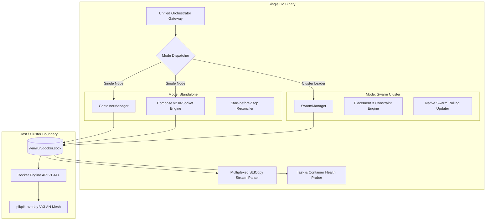
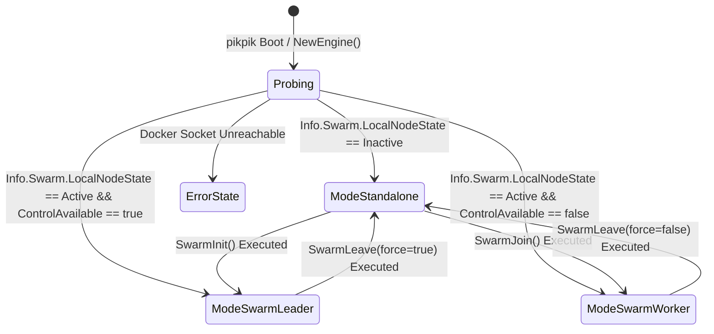
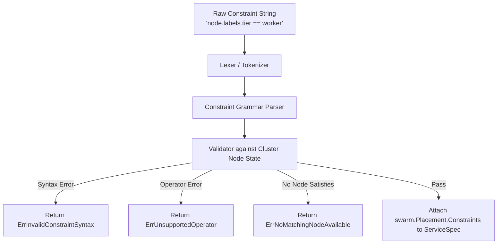
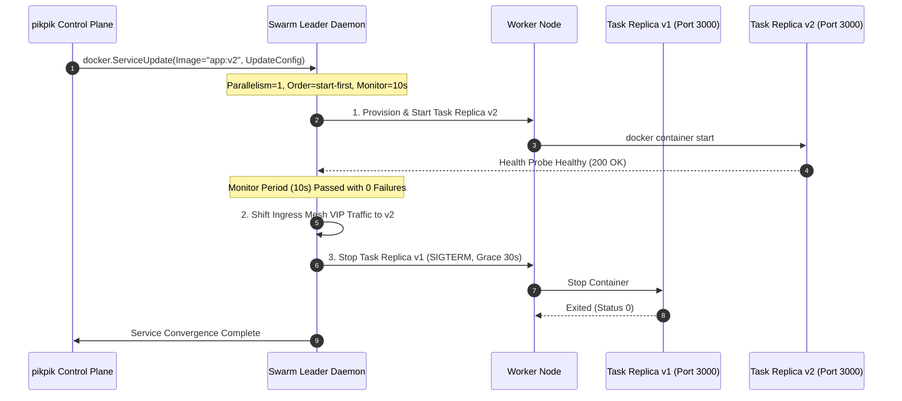
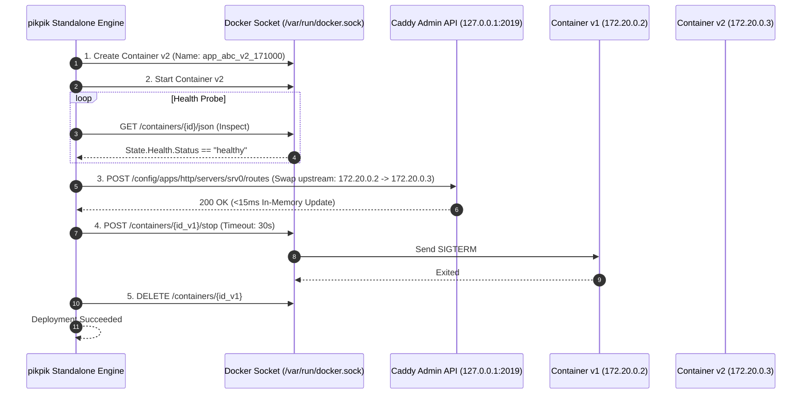
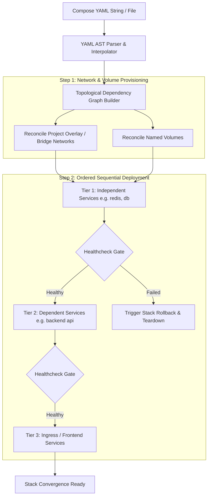

# 02. Orchestration & Swarm Engine Specification

**Document Identifier**: `PIKPIK-SPEC-02`  
**Scope**: 2 — Orchestration, Docker Engine Socket & Swarm Cluster Engine  
**Module Path**: `github.com/fusuycorp/pikpik/pkg/orchestrator`  
**Status**: Target Engineering Specification  
**Compatibility**: Go 1.23+, Docker Engine API v1.44+ (`github.com/docker/docker/client`)

---

## 1. Executive Architecture & Invariant 1

The `pikpik` Orchestration Engine is a high-performance, single-binary container and cluster orchestrator built in Go. It operates directly against the Docker Engine daemon over a local Unix domain socket (`/var/run/docker.sock`) or secure mutual-TLS TCP socket.



### Architectural Invariants

1. **Invariant 1 — Zero Bash Shelling**:
   - Strictly no invocations of `os/exec.Command("docker", ...)` or `sh -c`.
   - 100% of container, service, stack, volume, network, secret, and configuration lifecycle events are executed via official typed Go SDK calls: `github.com/docker/docker/client`.
   - Eliminates command injection (RCE), subprocess spawning overhead, parsing fragility, and zombie child processes.
2. **Deterministic Context Cancellation**:
   - Every engine interaction takes a mandatory `context.Context` parameter with bounded deadlines (`context.WithTimeout`).
   - Network hangs, locked socket connections, or daemon stalls fail fast without leaking goroutines.
3. **Layered Decoupling**:
   - High-level control plane callers interact with the abstract `Orchestrator` interface.
   - Low-level implementations (`ContainerManager`, `SwarmManager`) remain isolated, interchangeable, and independently unit-testable against mock Docker client interfaces.

---

## 2. Dual-Mode Engine Architecture

The orchestrator operates in two mutually exclusive runtime modes determined by host cluster state:



### Mode Comparison Matrix

| Capability | Standalone Mode (`ModeStandalone`) | Swarm Cluster Mode (`ModeSwarm`) |
| :--- | :--- | :--- |
| **Target Scale** | Single VPS / Dev box (1 Node) | Multi-Node Mesh (e.g. 1 Gateway + 2 Private Workers) |
| **Workload Primitive** | Direct Docker Container (`types.Container`) | Swarm Service (`swarm.Service`) |
| **Multi-Container Apps** | Socket-native Compose v2 Runner | Swarm Distributed Stacks / Overlay Services |
| **Rolling Update Strategy** | Ephemeral start-before-stop + Caddy upstream swap | Native `swarm.UpdateConfig` (`start-first`) |
| **Networking** | Internal Bridge (`project_<id>_net`) | Encrypted Overlay (`pikpik-overlay`, VXLAN ESP) |
| **Host Port Bindings** | None (Caddy routes to internal container IP) | None (Caddy routes to overlay VIP or tasks) |
| **Placement Constraints** | No-op (Single local host) | Evaluated across `node.role`, `node.labels`, `node.hostname` |
| **Secret Management** | Environment / In-Memory File Mounts | Docker Swarm Secrets (`swarm.Secret`) & Configs |

---

## 3. Core Go Domain Interfaces & Structs

### 3.1 Interface Contracts

```go
package orchestrator

import (
	"context"
	"io"
	"time"

	"github.com/docker/docker/api/types/container"
	"github.com/docker/docker/api/types/filters"
	"github.com/docker/docker/api/types/network"
	"github.com/docker/docker/api/types/swarm"
	"github.com/docker/docker/api/types/volume"
)

// RuntimeMode defines the active operational mode of the orchestrator.
type RuntimeMode string

const (
	ModeStandalone   RuntimeMode = "standalone"
	ModeSwarmLeader  RuntimeMode = "swarm_leader"
	ModeSwarmWorker  RuntimeMode = "swarm_worker"
	ModeDisconnected RuntimeMode = "disconnected"
)

// Orchestrator provides a high-level, mode-agnostic abstraction for deploying and managing workloads.
type Orchestrator interface {
	Mode() RuntimeMode
	Ping(ctx context.Context) error
	Close() error

	// Sub-manager accessors
	Containers() ContainerManager
	Swarm() SwarmManager
	Stacks() StackManager
	Logs() LogStreamer
}

// ContainerManager handles standalone container lifecycle without shelling.
type ContainerManager interface {
	Create(ctx context.Context, spec ContainerSpec) (string, error)
	Start(ctx context.Context, containerID string) error
	Stop(ctx context.Context, containerID string, timeout time.Duration) error
	Restart(ctx context.Context, containerID string, timeout time.Duration) error
	Remove(ctx context.Context, containerID string, force bool, removeVolumes bool) error
	Inspect(ctx context.Context, containerID string) (*ContainerStatus, error)
	List(ctx context.Context, opts ListOptions) ([]ContainerStatus, error)
	DeployWithRollingUpdate(ctx context.Context, spec ContainerSpec, updateCfg RollingUpdateConfig) (*RollingUpdateResult, error)
}

// SwarmManager handles multi-node Docker Swarm services, nodes, and cluster lifecycle.
type SwarmManager interface {
	InitCluster(ctx context.Context, req SwarmInitRequest) (string, error)
	JoinCluster(ctx context.Context, req SwarmJoinRequest) error
	LeaveCluster(ctx context.Context, force bool) error
	GetClusterInfo(ctx context.Context) (*ClusterInfo, error)

	// Service lifecycle
	CreateService(ctx context.Context, spec ServiceSpec) (string, error)
	UpdateService(ctx context.Context, serviceID string, version uint64, spec ServiceSpec) error
	RemoveService(ctx context.Context, serviceID string) error
	InspectService(ctx context.Context, serviceID string) (*ServiceStatus, error)
	ListServices(ctx context.Context, opts ListOptions) ([]ServiceStatus, error)
	ScaleService(ctx context.Context, serviceID string, replicas uint64) error

	// Task & Node lifecycle
	ListTasks(ctx context.Context, opts ListOptions) ([]TaskStatus, error)
	ListNodes(ctx context.Context) ([]NodeStatus, error)
	UpdateNode(ctx context.Context, nodeID string, version uint64, spec NodeSpec) error
}

// StackManager handles Compose v2 multi-container stacks via direct socket integration.
type StackManager interface {
	DeployStack(ctx context.Context, spec ComposeStackSpec) (*StackDeploymentResult, error)
	RemoveStack(ctx context.Context, stackName string) error
	InspectStack(ctx context.Context, stackName string) (*StackStatus, error)
	ListStacks(ctx context.Context) ([]StackSummary, error)
}

// LogStreamer streams demultiplexed stdout/stderr from containers and swarm tasks.
type LogStreamer interface {
	StreamContainerLogs(ctx context.Context, containerID string, opts LogOptions) (io.ReadCloser, error)
	StreamServiceLogs(ctx context.Context, serviceID string, opts LogOptions) (io.ReadCloser, error)
	StreamDemux(ctx context.Context, containerID string, opts LogOptions, stdout, stderr io.Writer) error
}
```

### 3.2 Domain Data Models

```go
package orchestrator

import (
	"time"
)

// ResourceRequirements defines compute allocations.
type ResourceRequirements struct {
	CPULimit      int64 // In NanoCPUs (e.g. 1.0 CPU = 1e9)
	MemoryLimit   int64 // In bytes (e.g. 512MB = 512 * 1024 * 1024)
	CPUReserve    int64 // In NanoCPUs
	MemoryReserve int64 // In bytes
}

// HealthCheckConfig defines active container probing.
type HealthCheckConfig struct {
	Test        []string      // e.g. ["CMD-SHELL", "curl -f http://localhost:3000/health || exit 1"]
	Interval    time.Duration // e.g. 10s
	Timeout     time.Duration // e.g. 5s
	StartPeriod time.Duration // e.g. 15s
	Retries     int           // e.g. 3
}

// VolumeMountSpec defines filesystem bindings.
type VolumeMountSpec struct {
	Type     string // "volume", "bind", "tmpfs"
	Source   string // Volume name or host path
	Target   string // In-container destination path
	ReadOnly bool
}

// PortMappingSpec defines internal routing ports (No direct host binds for apps).
type PortMappingSpec struct {
	ContainerPort uint32
	Protocol      string // "tcp", "udp"
}

// PlacementConstraint represents a parsed Swarm scheduling rule.
type PlacementConstraint struct {
	Field    string // "node.role", "node.labels.<key>", "node.hostname", "node.id"
	Operator string // "==", "!="
	Value    string // "manager", "worker", "gpu-enabled", etc.
}

// RollingUpdateConfig configures zero-downtime rolling deploys.
type RollingUpdateConfig struct {
	Order           string        // "start-first" (default) or "stop-first"
	Parallelism     uint64        // Max simultaneous tasks updated (default: 1)
	Delay           time.Duration // Delay between updating task batches
	FailureAction   string        // "rollback", "pause", "continue"
	Monitor         time.Duration // Duration to monitor each updated task for health (e.g. 15s)
	MaxFailureRatio float32       // Failure rate tolerance (0.0 = zero tolerance)
}

// ServiceSpec specifies declarative Swarm service configuration.
type ServiceSpec struct {
	ID                   string
	Name                 string
	ProjectID            string
	Image                string
	Replicas             uint64
	Environment          map[string]string
	Secrets              []SecretAttachment
	Configs              []ConfigAttachment
	Mounts               []VolumeMountSpec
	Networks             []string
	Ports                []PortMappingSpec
	Resources            ResourceRequirements
	HealthCheck          *HealthCheckConfig
	Constraints          []string // Raw constraints: "node.role == worker", "node.labels.zone == us-east"
	ParsedConstraints    []PlacementConstraint
	UpdateConfig         RollingUpdateConfig
	RestartPolicy        RestartPolicySpec
	StopGracePeriod      time.Duration
	Labels               map[string]string
}

// ContainerSpec specifies standalone container configuration.
type ContainerSpec struct {
	ID              string
	Name            string
	ProjectID       string
	Image           string
	Environment     map[string]string
	Mounts          []VolumeMountSpec
	Networks        []string
	ExposedPorts    []PortMappingSpec
	Resources       ResourceRequirements
	HealthCheck     *HealthCheckConfig
	RestartPolicy   string // "no", "always", "on-failure", "unless-stopped"
	StopTimeout     time.Duration
	Labels          map[string]string
	User            string
	WorkingDir      string
	Command         []string
	Entrypoint      []string
}

// NodeStatus represents physical Swarm node state.
type NodeStatus struct {
	ID            string            `json:"id"`
	Hostname      string            `json:"hostname"`
	Role          string            `json:"role"` // "manager", "worker"
	State         string            `json:"state"` // "ready", "down", "disconnected"
	Availability  string            `json:"availability"` // "active", "pause", "drain"
	Reachability  string            `json:"reachability"` // "reachable", "unreachable"
	IPAddress     string            `json:"ipAddress"`
	EngineVersion string            `json:"engineVersion"`
	Labels        map[string]string `json:"labels"`
	NanoCPUs      int64             `json:"nanoCPUs"`
	MemoryBytes   int64             `json:"memoryBytes"`
}

// TaskStatus represents an individual replica task instance in Swarm.
type TaskStatus struct {
	ID           string    `json:"id"`
	ServiceID    string    `json:"serviceId"`
	NodeID       string    `json:"nodeId"`
	Slot         int       `json:"slot"`
	State        string    `json:"state"` // "running", "preparing", "starting", "failed", "shutdown"
	DesiredState string    `json:"desiredState"`
	Message      string    `json:"message"`
	Err          string    `json:"err,omitempty"`
	ContainerID  string    `json:"containerId,omitempty"`
	CreatedAt    time.Time `json:"createdAt"`
	UpdatedAt    time.Time `json:"updatedAt"`
}
```

---

## 4. Swarm Placement Constraints Parser & Validator

Swarm placement constraints allow services to target specific nodes (e.g. reserving Server 1 for Ingress/Registry and deploying worker tasks strictly to private nodes Server 2 and Server 3).



### 4.1 Constraint Grammar & Supported Tokens

The parser supports the following formal syntax:
$$\text{Constraint} \Coloneqq \text{Field} \;\; \text{Operator} \;\; \text{Value}$$

- **Operators**: `==` (equals), `!=` (does not equal).
- **Supported Fields**:
  1. `node.id`: Docker Engine Node ID (e.g., `node.id == 2ivku...`).
  2. `node.hostname`: Node machine hostname (e.g., `node.hostname != server1`).
  3. `node.role`: Swarm role: `manager` or `worker` (e.g., `node.role == worker`).
  4. `node.labels.<key>`: User-defined or topology node label (e.g., `node.labels.zone == us-east-1`, `node.labels.storage == nvme`).
  5. `engine.labels.<key>`: Docker daemon labels configured in `/etc/docker/daemon.json`.

### 4.2 Implementation: Pure Go Parser & Validator

```go
package orchestrator

import (
	"errors"
	"fmt"
	"strings"
)

var (
	ErrInvalidConstraintSyntax    = errors.New("orchestrator: invalid placement constraint syntax")
	ErrUnsupportedConstraintOp    = errors.New("orchestrator: unsupported constraint operator (only == and != supported)")
	ErrUnsupportedConstraintField = errors.New("orchestrator: unsupported constraint field prefix")
	ErrNoMatchingNodeAvailable    = errors.New("orchestrator: no active cluster nodes satisfy placement constraints")
	ErrResourceCapacityExceeded   = errors.New("orchestrator: cluster nodes have insufficient CPU or Memory capacity")
)

// ParseConstraint parses and normalizes a single constraint expression.
func ParseConstraint(raw string) (PlacementConstraint, error) {
	trimmed := strings.TrimSpace(raw)
	if trimmed == "" {
		return PlacementConstraint{}, ErrInvalidConstraintSyntax
	}

	var op string
	var parts []string

	if strings.Contains(trimmed, "==") {
		op = "=="
		parts = strings.SplitN(trimmed, "==", 2)
	} else if strings.Contains(trimmed, "!=") {
		op = "!="
		parts = strings.SplitN(trimmed, "!=", 2)
	} else {
		return PlacementConstraint{}, fmt.Errorf("%w: %s (must contain == or !=)", ErrUnsupportedConstraintOp, raw)
	}

	field := strings.TrimSpace(parts[0])
	val := strings.TrimSpace(parts[1])

	if field == "" || val == "" {
		return PlacementConstraint{}, fmt.Errorf("%w: empty field or value in '%s'", ErrInvalidConstraintSyntax, raw)
	}

	// Validate supported field patterns
	switch {
	case field == "node.id", field == "node.hostname", field == "node.role":
		if field == "node.role" && val != "manager" && val != "worker" {
			return PlacementConstraint{}, fmt.Errorf("%w: node.role must be 'manager' or 'worker', got '%s'", ErrInvalidConstraintSyntax, val)
		}
	case strings.HasPrefix(field, "node.labels."):
		labelKey := strings.TrimPrefix(field, "node.labels.")
		if labelKey == "" {
			return PlacementConstraint{}, fmt.Errorf("%w: missing label key in '%s'", ErrInvalidConstraintSyntax, field)
		}
	case strings.HasPrefix(field, "engine.labels."):
		labelKey := strings.TrimPrefix(field, "engine.labels.")
		if labelKey == "" {
			return PlacementConstraint{}, fmt.Errorf("%w: missing engine label key in '%s'", ErrInvalidConstraintSyntax, field)
		}
	default:
		return PlacementConstraint{}, fmt.Errorf("%w: '%s'", ErrUnsupportedConstraintField, field)
	}

	return PlacementConstraint{
		Field:    field,
		Operator: op,
		Value:    val,
	}, nil
}

// MatchesNode checks whether a given physical Node satisfies a placement constraint.
func (c PlacementConstraint) MatchesNode(node NodeStatus) bool {
	var actualValue string
	exists := false

	switch {
	case c.Field == "node.id":
		actualValue = node.ID
		exists = true
	case c.Field == "node.hostname":
		actualValue = node.Hostname
		exists = true
	case c.Field == "node.role":
		actualValue = node.Role
		exists = true
	case strings.HasPrefix(c.Field, "node.labels."):
		key := strings.TrimPrefix(c.Field, "node.labels.")
		if node.Labels != nil {
			actualValue, exists = node.Labels[key]
		}
	}

	if c.Operator == "==" {
		return exists && actualValue == c.Value
	} else if c.Operator == "!=" {
		return !exists || actualValue != c.Value
	}
	return false
}

// ValidateConstraintsAgainstNodes verifies that at least one active node in the cluster
// can schedule this service and satisfies requested resource reservations.
func ValidateConstraintsAgainstNodes(constraints []PlacementConstraint, req ResourceRequirements, nodes []NodeStatus) error {
	var candidateNodes []NodeStatus

	for _, node := range nodes {
		if node.State != "ready" || node.Availability != "active" {
			continue
		}

		allMatch := true
		for _, constraint := range constraints {
			if !constraint.MatchesNode(node) {
				allMatch = false
				break
			}
		}

		if allMatch {
			candidateNodes = append(candidateNodes, node)
		}
	}

	if len(candidateNodes) == 0 {
		return ErrNoMatchingNodeAvailable
	}

	// Verify at least one candidate node has sufficient capacity for reservations
	if req.MemoryReserve > 0 || req.CPUReserve > 0 {
		hasCapacity := false
		for _, node := range candidateNodes {
			if (req.MemoryReserve == 0 || node.MemoryBytes >= req.MemoryReserve) &&
				(req.CPUReserve == 0 || node.NanoCPUs >= req.CPUReserve) {
				hasCapacity = true
				break
			}
		}
		if !hasCapacity {
			return ErrResourceCapacityExceeded
		}
	}

	return nil
}
```

---

## 5. Rolling Zero-Downtime Update Configuration

`pikpik` guarantees zero-downtime updates across both Swarm and Standalone modes.

### 5.1 Swarm Engine Rolling Updates

In Swarm mode, `pikpik` maps the domain `ServiceSpec` directly to Docker Engine's `swarm.UpdateConfig` with `Order: "start-first"`.



#### Native SDK Transformation

```go
package orchestrator

import (
	"time"

	"github.com/docker/docker/api/types/swarm"
)

func BuildSwarmUpdateConfig(cfg RollingUpdateConfig) *swarm.UpdateConfig {
	order := "start-first"
	if cfg.Order == "stop-first" {
		order = "stop-first"
	}

	parallelism := cfg.Parallelism
	if parallelism == 0 {
		parallelism = 1
	}

	delay := cfg.Delay
	if delay == 0 {
		delay = 5 * time.Second
	}

	monitor := cfg.Monitor
	if monitor == 0 {
		monitor = 10 * time.Second
	}

	failureAction := "rollback"
	if cfg.FailureAction == "pause" || cfg.FailureAction == "continue" {
		failureAction = cfg.FailureAction
	}

	return &swarm.UpdateConfig{
		Parallelism:     parallelism,
		Delay:           delay,
		FailureAction:   failureAction,
		Monitor:         monitor,
		MaxFailureRatio: cfg.MaxFailureRatio,
		Order:           order,
	}
}
```

### 5.2 Standalone Engine Rolling Updates (Start-before-Stop with Dynamic Caddy)

For single-node standalone mode where Swarm services are not active:



---

## 6. Compose v2 Stack Deployment Lifecycle via Docker Socket

`pikpik` implements a socket-native Compose v2 engine that parses Compose YAML files, builds a Directed Acyclic Graph (DAG), and orchestrates services, networks, and volumes without depending on the `docker compose` binary.



### 6.1 Topological Sorting (Kahn's Algorithm)

```go
package orchestrator

import (
	"fmt"
)

type ComposeServiceDef struct {
	Name      string
	Image     string
	DependsOn []string
}

// ResolveDeploymentOrder performs topological sorting on Compose services based on DependsOn.
func ResolveDeploymentOrder(services map[string]ComposeServiceDef) ([]string, error) {
	inDegree := make(map[string]int)
	graph := make(map[string][]string)

	for name := range services {
		inDegree[name] = 0
		graph[name] = make([]string, 0)
	}

	for name, svc := range services {
		for _, dep := range svc.DependsOn {
			if _, exists := services[dep]; !exists {
				return nil, fmt.Errorf("service '%s' depends on unknown service '%s'", name, dep)
			}
			// dep must start before name -> edge: dep -> name
			graph[dep] = append(graph[dep], name)
			inDegree[name]++
		}
	}

	queue := make([]string, 0)
	for name, deg := range inDegree {
		if deg == 0 {
			queue = append(queue, name)
		}
	}

	order := make([]string, 0, len(services))
	for len(queue) > 0 {
		curr := queue[0]
		queue = queue[1:]
		order = append(order, curr)

		for _, neighbor := range graph[curr] {
			inDegree[neighbor]--
			if inDegree[neighbor] == 0 {
				queue = append(queue, neighbor)
			}
		}
	}

	if len(order) != len(services) {
		return nil, fmt.Errorf("cyclic dependency detected in compose services")
	}

	return order, nil
}
```

---

## 7. Binary Multiplexed Stdout/Stderr Stream Decoder

When attaching to containers or streaming logs over Docker Engine's socket without a TTY (`Tty: false`), Docker multiplexes `stdout` and `stderr` over a single raw TCP/Unix stream using an 8-byte frame header.

### 7.1 Docker Multiplexed Frame Specification

$$\begin{array}{|c|c|c|c|}
\hline
\textbf{Byte 0} & \textbf{Bytes 1–3} & \textbf{Bytes 4–7} & \textbf{Bytes 8 \dots (8 + N - 1)} \\
\hline
\text{Stream Type (0x01=stdout, 0x02=stderr, 0x00=stdin)} & \text{Padding: 0x00 0x00 0x00} & \text{Frame Length: BigEndian uint32 } (N) & \text{Payload Data (UTF-8 / Binary Bytes)} \\
\hline
\end{array}$$

```mermaid
graph LR
    subgraph Docker Socket Stream
        HDR[8-Byte Frame Header<br/>Type: 1 Byte | Padding: 3 Bytes | Length: 4 Bytes]
        PAYLOAD[Payload: N Bytes]
    end

    HDR --> DEMUX{StdCopy Stream Decoder}
    PAYLOAD --> DEMUX
    
    DEMUX -->|Type == 0x01 (Stdout)| OUT_CHAN[Stdout Writer / Ring Buffer]
    DEMUX -->|Type == 0x02 (Stderr)| ERR_CHAN[Stderr Writer / Ring Buffer]
    DEMUX -->|Corrupted Header| ERR_SIG[Return ErrCorruptFrameHeader]
```

### 7.2 Integration via `pkg/stdcopy` & Zero-Allocation Ring Buffer

```go
package orchestrator

import (
	"context"
	"errors"
	"fmt"
	"io"
	"sync"

	"github.com/docker/docker/pkg/stdcopy"
)

var (
	ErrInvalidStreamHeader = errors.New("orchestrator: invalid docker multiplexed stream header")
)

// LogFrameProcessor consumes raw socket streams and safely demuxes stdout and stderr.
type LogFrameProcessor struct {
	bufferPool sync.Pool
}

func NewLogFrameProcessor() *LogFrameProcessor {
	return &LogFrameProcessor{
		bufferPool: sync.Pool{
			New: func() interface{} {
				// Allocate 32KB chunk buffers for high-throughput streaming
				b := make([]byte, 32*1024)
				return &b
			},
		},
	}
}

// DecodeStream parses raw multiplexed reader into dedicated stdout and stderr writers.
// Uses official docker stdcopy.StdCopy to guarantee 100% binary wire compatibility.
func (p *LogFrameProcessor) DecodeStream(ctx context.Context, src io.Reader, stdout, stderr io.Writer) error {
	errCh := make(chan error, 1)

	go func() {
		_, err := stdcopy.StdCopy(stdout, stderr, src)
		errCh <- err
	}()

	select {
	case <-ctx.Done():
		return ctx.Err()
	case err := <-errCh:
		if err != nil && !errors.Is(err, io.EOF) {
			return fmt.Errorf("stdcopy decoding failed: %w", err)
		}
		return nil
	}
}
```

---

## 8. Concrete Docker Engine Socket Implementation

Below is the concrete implementation of `SwarmEngine` and `ContainerManager` using `github.com/docker/docker/client`.

### 8.1 Docker Engine Client Initialization

```go
package orchestrator

import (
	"context"
	"fmt"
	"net/http"
	"time"

	"github.com/docker/docker/client"
)

type EngineClient struct {
	cli  *client.Client
	mode RuntimeMode
}

// NewDockerEngineClient initializes the Unix socket client with API negotiation.
func NewDockerEngineClient(ctx context.Context, socketPath string) (*EngineClient, error) {
	if socketPath == "" {
		socketPath = "unix:///var/run/docker.sock"
	}

	cli, err := client.NewClientWithOpts(
		client.WithHost(socketPath),
		client.WithHTTPClient(&http.Client{
			Timeout: 60 * time.Second,
		}),
		client.WithAPIVersionNegotiation(),
	)
	if err != nil {
		return nil, fmt.Errorf("failed to create docker client: %w", err)
	}

	// Probe connection & negotiate mode
	info, err := cli.Info(ctx)
	if err != nil {
		_ = cli.Close()
		return nil, fmt.Errorf("failed to connect to docker daemon: %w", err)
	}

	mode := ModeStandalone
	if info.Swarm.LocalNodeState == "active" {
		if info.Swarm.ControlAvailable {
			mode = ModeSwarmLeader
		} else {
			mode = ModeSwarmWorker
		}
	}

	return &EngineClient{
		cli:  cli,
		mode: mode,
	}, nil
}

func (e *EngineClient) Mode() RuntimeMode {
	return e.mode
}

func (e *EngineClient) Close() error {
	return e.cli.Close()
}
```

### 8.2 Swarm Service Creation & Zero-Downtime Update

```go
package orchestrator

import (
	"context"
	"fmt"

	"github.com/docker/docker/api/types/container"
	"github.com/docker/docker/api/types/mount"
	"github.com/docker/docker/api/types/swarm"
	"github.com/docker/docker/client"
)

type SwarmEngine struct {
	cli client.CommonAPIClient
}

func NewSwarmEngine(cli client.CommonAPIClient) *SwarmEngine {
	return &SwarmEngine{cli: cli}
}

func (s *SwarmEngine) CreateService(ctx context.Context, spec ServiceSpec) (string, error) {
	swarmSpec := s.convertSpecToSwarm(spec)

	resp, err := s.cli.ServiceCreate(ctx, swarmSpec, swarm.ServiceCreateOptions{})
	if err != nil {
		return "", fmt.Errorf("failed to create swarm service: %w", err)
	}

	return resp.ID, nil
}

func (s *SwarmEngine) UpdateService(ctx context.Context, serviceID string, version uint64, spec ServiceSpec) error {
	swarmSpec := s.convertSpecToSwarm(spec)

	_, err := s.cli.ServiceUpdate(
		ctx,
		serviceID,
		swarm.Version{Index: version},
		swarmSpec,
		swarm.ServiceUpdateOptions{
			Rollback: "none",
		},
	)
	if err != nil {
		return fmt.Errorf("failed to update swarm service %s: %w", serviceID, err)
	}

	return nil
}

func (s *SwarmEngine) convertSpecToSwarm(spec ServiceSpec) swarm.ServiceSpec {
	// Replicas
	replicas := spec.Replicas
	if replicas == 0 {
		replicas = 1
	}

	// Environment
	envList := make([]string, 0, len(spec.Environment))
	for k, v := range spec.Environment {
		envList = append(envList, fmt.Sprintf("%s=%s", k, v))
	}

	// Mounts
	mounts := make([]mount.Mount, 0, len(spec.Mounts))
	for _, m := range spec.Mounts {
		mountType := mount.TypeVolume
		if m.Type == "bind" {
			mountType = mount.TypeBind
		} else if m.Type == "tmpfs" {
			mountType = mount.TypeTmpfs
		}

		mounts = append(mounts, mount.Mount{
			Type:     mountType,
			Source:   m.Source,
			Target:   m.Target,
			ReadOnly: m.ReadOnly,
		})
	}

	// Networks
	networks := make([]swarm.NetworkAttachmentConfig, 0, len(spec.Networks))
	for _, netName := range spec.Networks {
		networks = append(networks, swarm.NetworkAttachmentConfig{
			Target: netName,
		})
	}

	// Resource limits
	var resources *swarm.ResourceRequirements
	if spec.Resources.MemoryLimit > 0 || spec.Resources.CPULimit > 0 || spec.Resources.MemoryReserve > 0 || spec.Resources.CPUReserve > 0 {
		resources = &swarm.ResourceRequirements{
			Limits: &swarm.Limit{
				NanoCPUs:    spec.Resources.CPULimit,
				MemoryBytes: spec.Resources.MemoryLimit,
			},
			Reservations: &swarm.Resources{
				NanoCPUs:    spec.Resources.CPUReserve,
				MemoryBytes: spec.Resources.MemoryReserve,
			},
		}
	}

	// Healthcheck
	var healthConfig *container.HealthConfig
	if spec.HealthCheck != nil && len(spec.HealthCheck.Test) > 0 {
		healthConfig = &container.HealthConfig{
			Test:        spec.HealthCheck.Test,
			Interval:    spec.HealthCheck.Interval,
			Timeout:     spec.HealthCheck.Timeout,
			StartPeriod: spec.HealthCheck.StartPeriod,
			Retries:     spec.HealthCheck.Retries,
		}
	}

	// Placement Constraints
	var placement *swarm.Placement
	if len(spec.Constraints) > 0 {
		placement = &swarm.Placement{
			Constraints: spec.Constraints,
		}
	}

	return swarm.ServiceSpec{
		Annotations: swarm.Annotations{
			Name:   spec.Name,
			Labels: spec.Labels,
		},
		TaskTemplate: swarm.TaskSpec{
			ContainerSpec: &swarm.ContainerSpec{
				Image:           spec.Image,
				Env:             envList,
				Mounts:          mounts,
				Healthcheck:     healthConfig,
				StopGracePeriod: &spec.StopGracePeriod,
			},
			Networks:  networks,
			Resources: resources,
			Placement: placement,
			RestartPolicy: &swarm.RestartPolicy{
				Condition:   swarm.RestartPolicyConditionAny,
				MaxAttempts: &[]uint64{5}[0],
			},
		},
		Mode: swarm.ServiceMode{
			Replicated: &swarm.ReplicatedService{
				Replicas: &replicas,
			},
		},
		UpdateConfig: BuildSwarmUpdateConfig(spec.UpdateConfig),
	}
}
```

---

## 9. Error Handling Hierarchy & Error Codes

The orchestrator defines strongly typed sentinel errors to enable programmatic handling and telemetry mapping:

| Error Variable | HTTP / API Status | Description | Trigger Scenario |
| :--- | :---: | :--- | :--- |
| `ErrSocketUnreachable` | 503 | Docker daemon socket is disconnected or unresponsive | `/var/run/docker.sock` does not exist or daemon crashed |
| `ErrNotSwarmLeader` | 409 | Operation requires Swarm Manager Leader node | Executing cluster mutations on a worker or standalone node |
| `ErrInvalidConstraintSyntax` | 400 | Placement constraint expression parsing failed | Missing operator, bad field identifier |
| `ErrNoMatchingNodeAvailable`| 422 | No active cluster nodes satisfy placement rules | Requesting `node.labels.gpu == true` when 0 nodes match |
| `ErrResourceCapacityExceeded`| 422 | Requested CPU/RAM reservations exceed node capacity | Reserving 64GB RAM on an 8GB RAM worker node |
| `ErrContainerHealthTimeout` | 504 | Rolling update failed health probation window | Container failed healthcheck during `Monitor` period |
| `ErrServiceNotFound` | 404 | Swarm service does not exist in cluster | Deleting or updating a stale service ID |

---

## 10. Verification Test Suite & Assertions

The following test suites validate the placement parser, binary demux stream decoder, and service update builders.

```go
package orchestrator_test

import (
	"bytes"
	"context"
	"encoding/binary"
	"testing"
	"time"

	"github.com/fusuycorp/pikpik/pkg/orchestrator"
)

// TestPlacementConstraintParser tests the formal constraint parser.
func TestPlacementConstraintParser(t *testing.T) {
	tests := []struct {
		name        string
		input       string
		expected    orchestrator.PlacementConstraint
		expectError bool
	}{
		{
			name:  "valid node.role equality",
			input: "node.role == worker",
			expected: orchestrator.PlacementConstraint{
				Field:    "node.role",
				Operator: "==",
				Value:    "worker",
			},
			expectError: false,
		},
		{
			name:  "valid node.labels inequality",
			input: "node.labels.storage != hdd",
			expected: orchestrator.PlacementConstraint{
				Field:    "node.labels.storage",
				Operator: "!=",
				Value:    "hdd",
			},
			expectError: false,
		},
		{
			name:  "valid node.hostname equality",
			input: "node.hostname == server-alpha-02",
			expected: orchestrator.PlacementConstraint{
				Field:    "node.hostname",
				Operator: "==",
				Value:    "server-alpha-02",
			},
			expectError: false,
		},
		{
			name:        "invalid operator",
			input:       "node.role >= manager",
			expectError: true,
		},
		{
			name:        "invalid empty value",
			input:       "node.labels.zone ==",
			expectError: true,
		},
		{
			name:        "invalid role value",
			input:       "node.role == master",
			expectError: true,
		},
	}

	for _, tt := range tests {
		t.Run(tt.name, func(t *testing.T) {
			result, err := orchestrator.ParseConstraint(tt.input)
			if tt.expectError {
				if err == nil {
					t.Fatalf("expected error for input '%s', got nil", tt.input)
				}
				return
			}

			if err != nil {
				t.Fatalf("unexpected error for input '%s': %v", tt.input)
			}

			if result.Field != tt.expected.Field || result.Operator != tt.expected.Operator || result.Value != tt.expected.Value {
				t.Errorf("expected %+v, got %+v", tt.expected, result)
			}
		})
	}
}

// TestValidateConstraintsAgainstNodes validates multi-node cluster scheduling logic.
func TestValidateConstraintsAgainstNodes(t *testing.T) {
	nodes := []orchestrator.NodeStatus{
		{
			ID:           "node-1",
			Hostname:     "gateway-01",
			Role:         "manager",
			State:        "ready",
			Availability: "active",
			Labels:       map[string]string{"tier": "gateway"},
			NanoCPUs:     4 * 1e9,
			MemoryBytes:  8 * 1024 * 1024 * 1024,
		},
		{
			ID:           "node-2",
			Hostname:     "worker-01",
			Role:         "worker",
			State:        "ready",
			Availability: "active",
			Labels:       map[string]string{"tier": "compute", "zone": "us-east-1a"},
			NanoCPUs:     8 * 1e9,
			MemoryBytes:  16 * 1024 * 1024 * 1024,
		},
	}

	// Test 1: Worker constraint matches node-2
	c1, _ := orchestrator.ParseConstraint("node.role == worker")
	err := orchestrator.ValidateConstraintsAgainstNodes([]orchestrator.PlacementConstraint{c1}, orchestrator.ResourceRequirements{}, nodes)
	if err != nil {
		t.Fatalf("expected node-2 to match worker constraint, got: %v", err)
	}

	// Test 2: Unmatched label fails fast
	c2, _ := orchestrator.ParseConstraint("node.labels.zone == us-west-2b")
	err = orchestrator.ValidateConstraintsAgainstNodes([]orchestrator.PlacementConstraint{c2}, orchestrator.ResourceRequirements{}, nodes)
	if err != orchestrator.ErrNoMatchingNodeAvailable {
		t.Fatalf("expected ErrNoMatchingNodeAvailable, got: %v", err)
	}

	// Test 3: Resource reservation exceeding worker RAM
	req := orchestrator.ResourceRequirements{MemoryReserve: 32 * 1024 * 1024 * 1024} // 32GB requested, max node has 16GB
	err = orchestrator.ValidateConstraintsAgainstNodes([]orchestrator.PlacementConstraint{c1}, req, nodes)
	if err != orchestrator.ErrResourceCapacityExceeded {
		t.Fatalf("expected ErrResourceCapacityExceeded, got: %v", err)
	}
}

// TestBinaryStreamDecoder verifies the multiplexed Docker socket stream parser.
func TestBinaryStreamDecoder(t *testing.T) {
	// Construct a synthetic Docker multiplexed stream
	var rawStream bytes.Buffer

	// Frame 1: Stdout (0x01), "Hello Stdout\n"
	stdoutPayload := []byte("Hello Stdout\n")
	hdr1 := make([]byte, 8)
	hdr1[0] = 1 // Stdout
	binary.BigEndian.PutUint32(hdr1[4:8], uint32(len(stdoutPayload)))
	rawStream.Write(hdr1)
	rawStream.Write(stdoutPayload)

	// Frame 2: Stderr (0x02), "Error: Stderr Warning\n"
	stderrPayload := []byte("Error: Stderr Warning\n")
	hdr2 := make([]byte, 8)
	hdr2[0] = 2 // Stderr
	binary.BigEndian.PutUint32(hdr2[4:8], uint32(len(stderrPayload)))
	rawStream.Write(hdr2)
	rawStream.Write(stderrPayload)

	processor := orchestrator.NewLogFrameProcessor()
	var outBuf, errBuf bytes.Buffer

	ctx, cancel := context.WithTimeout(context.Background(), 2*time.Second)
	defer cancel()

	err := processor.DecodeStream(ctx, &rawStream, &outBuf, &errBuf)
	if err != nil {
		t.Fatalf("failed to decode stream: %v", err)
	}

	if outBuf.String() != "Hello Stdout\n" {
		t.Errorf("stdout mismatch: got '%s', want 'Hello Stdout\\n'", outBuf.String())
	}

	if errBuf.String() != "Error: Stderr Warning\n" {
		t.Errorf("stderr mismatch: got '%s', want 'Error: Stderr Warning\\n'", errBuf.String())
	}
}
