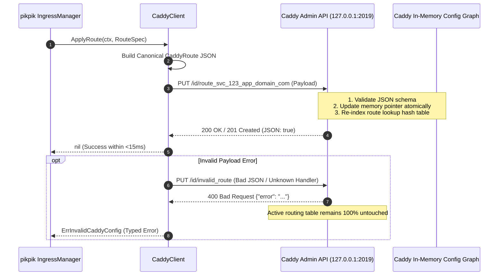
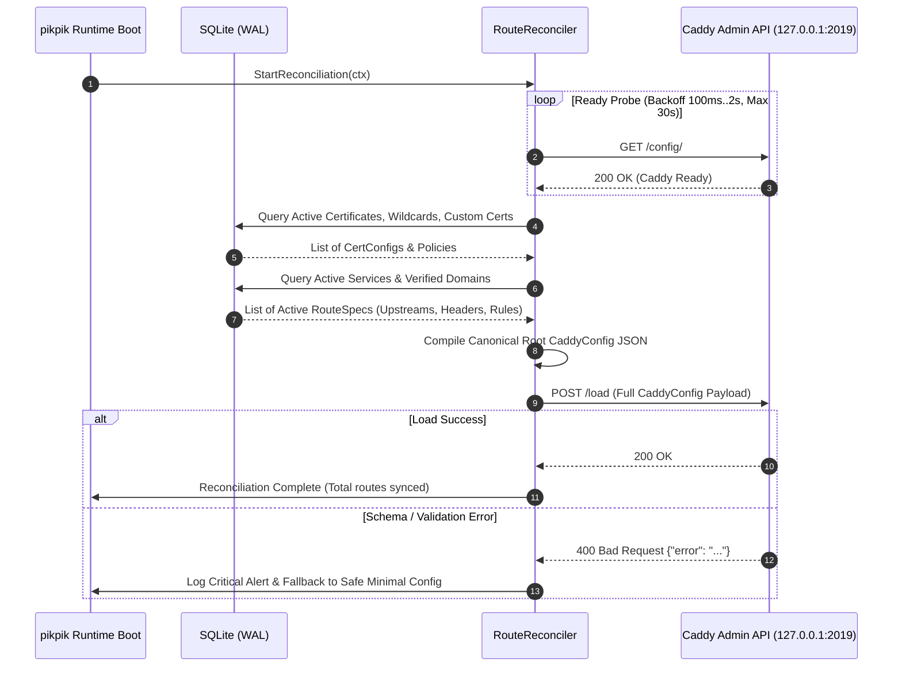
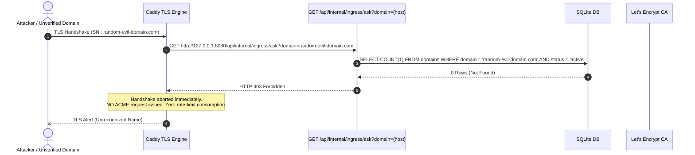

# 03. Technical Specification: Ingress & Dynamic Caddy Engine

**Package**: `pikpik/internal/ingress`  
**Scope**: Ingress, Dynamic Routing, Caddy Admin API Client, Automated TLS Lifecycle, and Swarm Mesh Integration  
**Invariant Target**: Invariant 3 (Atomic In-Memory Route Mutations `< 15ms`, Zero-Downtime TLS)

---

## 1. Architectural Overview & System Boundary

The Ingress subsystem is responsible for all external HTTP/HTTPS traffic ingress, dynamic layer-7 routing, automated TLS certificate provisioning/termination, and seamless forwarding to containerized services running across Docker Swarm overlay networks or standalone bridge networks.

```mermaid
graph TD
    subgraph External Network Boundary
        CLIENT[Public Internet / Client Browsers]
        CF_EDGE[Cloudflare Edge / Proxy / DNS]
        ACME_CA[Let's Encrypt / ZeroSSL ACME CA]
    end

    subgraph Host / Edge Ingress Boundary [Port 80 / 443]
        CADDY[Caddy Reverse Proxy Daemon]
        CADDY_ADMIN[Caddy Admin REST API<br/>http://127.0.0.1:2019]
    end

    subgraph pikpik Control Plane [Single Runtime Binary]
        INGRESS_MGR[IngressManager Service]
        CADDY_CLIENT[Caddy REST Client]
        RECONCILER[Boot Route Reconciler]
        ASK_HANDLER[On-Demand TLS Ask Endpoint<br/>GET /api/internal/ingress/ask]
        SQLITE_DB[(SQLite WAL State Store)]
    end

    subgraph Docker Swarm Overlay Mesh [pikpik-ingress-overlay]
        SWARM_SVC_A[Swarm Service: frontend:3000]
        SWARM_SVC_B[Swarm Service: backend-api:8080]
        STANDALONE_C[Standalone Container: 172.20.0.14:5000]
    end

    CLIENT -->|HTTPS / TLS 1.3| CADDY
    CF_EDGE -->|Origin TLS / Custom Cert| CADDY
    CADDY <-->|HTTP-01 Challenge| ACME_CA
    CADDY -->|On-Demand Verification| ASK_HANDLER
    
    INGRESS_MGR -->|15ms Atomic Mutations| CADDY_CLIENT
    CADDY_CLIENT -->|PUT /id/{id}, POST /load| CADDY_ADMIN
    RECONCILER -->|Read Active Routes| SQLITE_DB
    RECONCILER -->|Push Initial Config| CADDY_CLIENT
    ASK_HANDLER -->|Verify Domain Ownership| SQLITE_DB

    CADDY -->|VXLAN Encrypted Proxy| SWARM_SVC_A
    CADDY -->|VXLAN Encrypted Proxy| SWARM_SVC_B
    CADDY -->|Bridge Network Proxy| STANDALONE_C
```

---

## 2. Caddy Dynamic Admin REST API Client

### 2.1 API Endpoint Mapping & Contract

Caddy exposes an in-memory JSON configuration tree over loopback HTTP at `http://127.0.0.1:2019`. The `pikpik` control plane manages routes with fine-grained `@id` identifiers to ensure atomic, non-blocking mutations.

| Operation | HTTP Method | Endpoint | Description | SLA / Latency |
| :--- | :--- | :--- | :--- | :--- |
| **Apply / Upsert Route** | `PUT` | `/id/{route_id}` | Atomically replaces or creates a route identified by `@id`. | **< 15 ms** |
| **Append Route** | `POST` | `/config/apps/http/servers/srv0/routes` | Appends a route to the end of the server's route list. | **< 15 ms** |
| **Delete Route** | `DELETE` | `/id/{route_id}` | Atomically deletes the route with matching `@id`. | **< 10 ms** |
| **Get Route** | `GET` | `/id/{route_id}` | Retrieves the live compiled route JSON. | **< 5 ms** |
| **List Server Routes** | `GET` | `/config/apps/http/servers/srv0/routes` | Returns the ordered array of all active routes. | **< 10 ms** |
| **Full Config Load** | `POST` | `/load` | Replaces the entire active Caddy configuration atomically. | **< 50 ms** |
| **Live Health Check** | `GET` | `/config/` | Probes Caddy Admin API readiness and connectivity. | **< 2 ms** |

### 2.2 Route Identifier (`@id`) Scheme

Route IDs are deterministic, preventing route duplication and race conditions during concurrent deployments:

```
route_<service_id>_<domain_slug>
```

- Example: `route_svc_9f82c1_app_example_com`
- System Route Examples:
  - `route_sys_control_plane`
  - `route_sys_private_registry`
  - `route_sys_acme_http01`

### 2.3 Low-Latency Mutation Flow (<15ms)



---

## 3. Route Data Models & Canonical Caddy JSON Payloads

### 3.1 Canonical Single Route JSON Specification

Below is the exact JSON structure injected into `/id/{route_id}`:

```json
{
  "@id": "route_svc_9f82c1_app_example_com",
  "match": [
    {
      "host": [
        "app.example.com",
        "api.example.com"
      ]
    }
  ],
  "handle": [
    {
      "handler": "subroute",
      "routes": [
        {
          "handle": [
            {
              "handler": "headers",
              "response": {
                "set": {
                  "Strict-Transport-Security": ["max-age=31536000; includeSubDomains; preload"],
                  "X-Content-Type-Options": ["nosniff"],
                  "X-Frame-Options": ["SAMEORIGIN"],
                  "Referrer-Policy": ["strict-origin-when-cross-origin"]
                }
              }
            },
            {
              "handler": "reverse_proxy",
              "upstreams": [
                {
                  "dial": "paas_svc_backend:3000"
                }
              ],
              "health_checks": {
                "active": {
                  "path": "/healthz",
                  "interval": "10s",
                  "timeout": "2s",
                  "expect_status": 200
                },
                "passive": {
                  "max_fails": 3,
                  "fail_duration": "30s",
                  "unhealthy_status": [502, 503, 504]
                }
              },
              "transport": {
                "protocol": "http",
                "keep_alive": {
                  "max_idle_conns": 100,
                  "idle_conn_timeout": "90s"
                },
                "read_timeout": "0s",
                "write_timeout": "0s"
              },
              "load_balancing": {
                "selection_policy": {
                  "policy": "round_robin"
                },
                "retries": 3,
                "try_duration": "5s"
              }
            }
          ]
        }
      ]
    }
  ],
  "terminal": true
}
```

### 3.2 Full Server Base Configuration Specification

On system bootstrap, the full configuration below is pushed via `POST http://127.0.0.1:2019/load`:

```json
{
  "admin": {
    "listen": "127.0.0.1:2019",
    "enforce_origin": false
  },
  "logging": {
    "logs": {
      "default": {
        "level": "INFO",
        "writer": {
          "output": "stdout"
        },
        "encoder": {
          "format": "json"
        }
      }
    }
  },
  "apps": {
    "http": {
      "http_port": 80,
      "https_port": 443,
      "servers": {
        "srv0": {
          "listen": [":80", ":443"],
          "routes": [],
          "automatic_https": {
            "disable": false,
            "disable_redirects": false
          },
          "strict_sni_host": false,
          "logs": {
            "default_logger_name": "default"
          }
        }
      }
    },
    "tls": {
      "certificates": {
        "load_files": []
      },
      "automation": {
        "policies": [
          {
            "subjects": ["*.example.com", "example.com"],
            "issuers": [
              {
                "module": "acme",
                "email": "admin@example.com",
                "challenges": {
                  "dns": {
                    "provider": {
                      "name": "cloudflare",
                      "api_token": "{env.CLOUDFLARE_DNS_API_TOKEN}"
                    }
                  }
                }
              }
            ]
          },
          {
            "on_demand": true,
            "issuers": [
              {
                "module": "acme",
                "email": "admin@example.com",
                "directory": "https://acme-v02.api.letsencrypt.org/directory"
              },
              {
                "module": "zerossl",
                "email": "admin@example.com"
              }
            ]
          }
        ],
        "on_demand": {
          "ask": "http://127.0.0.1:8080/api/internal/ingress/ask",
          "interval": "2m",
          "burst": 5
        }
      }
    }
  }
}
```

---

## 4. Boot-Time Full Route Reconciliation Protocol

When the `pikpik` single runtime process starts or recovers from a crash, it guarantees that Caddy's in-memory routing table accurately mirrors the persistent SQLite state.



### 4.1 Reconciliation Invariants
1. **Idempotency**: Pushing the full configuration multiple times results in the identical proxy state.
2. **Zero Route Dropping**: Active established TCP connections and live TLS handshakes are not dropped during `/load`.
3. **Ghost Route Purging**: Any route previously active in Caddy that has been deleted from SQLite is completely removed during the reconciliation pass.

---

## 5. TLS Certificate Management Architecture

### 5.1 Cloudflare Origin Wildcard Certificate Mode

For production setups using Cloudflare DNS and Proxied (`orange-cloud`) or DNS-only records, `pikpik` supports pre-issued Cloudflare Origin CA wildcard certificates.

#### A. Host Volume Mount Mapping
- Host Path: `/etc/pikpik/certs/cloudflare/`
- Caddy Container Path: `/etc/caddy/certs/cloudflare/` (Mounted `:ro`)
- Files:
  - `origin.pem`: Origin Certificate fullchain (covering `*.yourdomain.com` and `yourdomain.com`)
  - `origin.key`: Origin Private Key (`0600` permissions)

#### B. Caddy TLS Loader Configuration
```json
{
  "apps": {
    "tls": {
      "certificates": {
        "load_files": [
          {
            "certificate": "/etc/caddy/certs/cloudflare/origin.pem",
            "key": "/etc/caddy/certs/cloudflare/origin.key",
            "tags": ["cf_wildcard_origin"]
          }
        ]
      }
    }
  }
}
```

### 5.2 Automated HTTP-01 Let's Encrypt / ZeroSSL Dual Fallback

For standard custom domains added by tenants:
1. **Primary Issuer**: Let's Encrypt (`https://acme-v02.api.letsencrypt.org/directory`).
2. **Secondary Fallback Issuer**: ZeroSSL (`https://acme.zerossl.com/v2/DV90`).
3. **Port 80 Challenge Interception**: Caddy intercepts `.well-known/acme-challenge/*` requests, solves the HTTP-01 challenge, and performs automatic 308 redirection to HTTPS for all standard web traffic.

### 5.3 On-Demand TLS Security Whitelist (`ask` Endpoint)

To protect against Let's Encrypt rate-limit starvation and Distributed Denial-of-Service attacks (where an attacker points thousands of unowned domains to the server IP), Caddy queries the `pikpik` internal verification endpoint before requesting any certificate.



#### Verification Endpoint Specifications:
- **URL**: `http://127.0.0.1:8080/api/internal/ingress/ask?domain={domain}`
- **Response HTTP 200 OK**: Domain is registered, verified, and active. Caddy proceeds with ACME certificate issuance.
- **Response HTTP 403 Forbidden**: Domain is unknown or deactivated. Caddy terminates the TLS handshake.
- **Internal Security**: Endpoint bound to loopback `127.0.0.1` only, blocked from external proxying.

---

## 6. Upstream Routing: Swarm Overlay & Standalone Containers

`pikpik` routes seamlessly to both Swarm multi-node services and standalone Docker containers.

### 6.1 Routing Modes Matrix

| Deployment Mode | Upstream Dial Target | Network Bridge / Overlay | Health Check Mechanism |
| :--- | :--- | :--- | :--- |
| **Docker Swarm Service** | `service_name:port` (or `tasks.service_name:port`) | `pikpik-ingress-overlay` (Encrypted VXLAN) | Swarm Virtual IP (VIP) load balancing + Caddy passive checks |
| **Standalone Container** | `172.20.0.x:port` | `pikpik_bridge` (Local Docker Bridge) | Caddy active HTTP probe (`/healthz`) + Docker health state |
| **Host Loopback Service** | `127.0.0.1:port` or `host.docker.internal:port` | Host Network | TCP dial check |

### 6.2 WebSocket & Streaming Configuration

To support long-lived interactive terminal sessions (PTY), live log streams, and server-sent events (SSE):
- `read_timeout: "0s"` (Disables reverse proxy read timeouts)
- `write_timeout: "0s"` (Disables reverse proxy write timeouts)
- `max_idle_conns: 100`
- `flush_interval: -1` (Immediate stream flushing without buffering)

### 6.3 Large File Uploads (Removing 413 Ceiling)

Caddy defaults to streaming request bodies directly to upstreams. The IngressManager ensures no intermediate buffer limits are introduced, enabling multi-gigabyte Docker image pushes to the embedded registry (`registry.yourdomain.com`) and S3 direct uploads.

---

## 7. Go Structs, Interfaces & Implementation Contracts

Below are the exact Go types and interfaces defined in `pikpik/internal/ingress`.

```go
package ingress

import (
	"context"
	"encoding/json"
	"errors"
	"fmt"
	"net/http"
	"time"
)

// Common Error Types
var (
	ErrCaddyUnreachable     = errors.New("caddy admin api unreachable")
	ErrRouteNotFound        = errors.New("route with specified id not found")
	ErrInvalidRoutePayload  = errors.New("invalid route specification payload")
	ErrDomainNotWhitelisted = errors.New("domain is not whitelisted for on-demand tls")
	ErrCaddyMutationFailed  = errors.New("caddy mutation returned non-2xx status")
)

// TLSMode defines how certificates are provisioned for a given domain.
type TLSMode string

const (
	TLSModeCloudflareOrigin TLSMode = "cloudflare_origin"
	TLSModeACMEHTTP01       TLSMode = "acme_http01"
	TLSModeACMEDNS01        TLSMode = "acme_dns01"
	TLSModeOnDemand         TLSMode = "on_demand"
	TLSModeCustomCert       TLSMode = "custom_cert"
	TLSModeDisabled         TLSMode = "disabled"
)

// RouteSpec defines the high-level pikpik route intent.
type RouteSpec struct {
	ID               string            `json:"id"`                 // e.g. "route_svc_123_app_domain_com"
	ServiceID        string            `json:"service_id"`         // e.g. "svc_123"
	Hosts            []string          `json:"hosts"`              // e.g. ["app.example.com"]
	PathPrefixes     []string          `json:"path_prefixes"`      // Optional path routing e.g. ["/api"]
	UpstreamDial     string            `json:"upstream_dial"`      // e.g. "paas_svc_123:3000" or "172.20.0.5:8080"
	CustomHeaders    map[string]string `json:"custom_headers"`     // Custom response headers
	EnableHSTS       bool              `json:"enable_hsts"`        // Default true
	IsWebSocket      bool              `json:"is_websocket"`       // Configures zero timeouts
	HealthCheckPath  string            `json:"health_check_path"`  // e.g. "/healthz"
	ActiveProbeSec   int               `json:"active_probe_sec"`   // Active probe interval
	MaxIdleConns     int               `json:"max_idle_conns"`     // Default 100
	StripPathPrefix  string            `json:"strip_path_prefix"`  // Optional prefix stripping
}

// GlobalTLSConfig defines global certificate loaders and automation policies.
type GlobalTLSConfig struct {
	AdminEmail           string               `json:"admin_email"`
	CloudflareAPIToken   string               `json:"cloudflare_api_token,omitempty"`
	CloudflareOriginCert *CustomCertPair      `json:"cloudflare_origin_cert,omitempty"`
	WildcardDomains      []string             `json:"wildcard_domains,omitempty"`
	OnDemandAskEndpoint  string               `json:"on_demand_ask_endpoint"`
	CustomCertificates   []CustomCertPair     `json:"custom_certificates,omitempty"`
}

// CustomCertPair represents a certificate/key file pair on disk.
type CustomCertPair struct {
	CertPath string   `json:"cert_path"`
	KeyPath  string   `json:"key_path"`
	Tags     []string `json:"tags,omitempty"`
}

// IngressManager is the primary orchestrator boundary for all ingress operations.
type IngressManager interface {
	// ApplyRoute atomically adds or replaces a route in Caddy (<15ms).
	ApplyRoute(ctx context.Context, spec RouteSpec) error

	// RemoveRoute atomically deletes a route by its ID.
	RemoveRoute(ctx context.Context, routeID string) error

	// GetRoute retrieves the active route specification by ID.
	GetRoute(ctx context.Context, routeID string) (*RouteSpec, error)

	// ListRoutes retrieves all active routes currently loaded in Caddy.
	ListRoutes(ctx context.Context) ([]RouteSpec, error)

	// ReconcileAll rebuilds the full Caddy routing and TLS state from SQLite.
	ReconcileAll(ctx context.Context, routes []RouteSpec, tlsCfg GlobalTLSConfig) error

	// VerifyDomain checks if a domain is allowed to obtain an On-Demand certificate.
	VerifyDomain(ctx context.Context, domain string) (bool, error)

	// HealthCheck returns nil if Caddy Admin API is responding within SLA (<5ms).
	HealthCheck(ctx context.Context) error
}

// CaddyClient defines the raw REST client talking to http://127.0.0.1:2019.
type CaddyClient interface {
	PutRoute(ctx context.Context, routeID string, route CaddyRoute) error
	DeleteRoute(ctx context.Context, routeID string) error
	GetRoute(ctx context.Context, routeID string) (*CaddyRoute, error)
	ListRoutes(ctx context.Context) ([]CaddyRoute, error)
	LoadFullConfig(ctx context.Context, config CaddyConfig) error
	Ping(ctx context.Context) error
}

// --- Canonical Caddy JSON Struct Mapping ---

type CaddyConfig struct {
	Admin   CaddyAdmin   `json:"admin"`
	Logging CaddyLogging `json:"logging"`
	Apps    CaddyApps    `json:"apps"`
}

type CaddyAdmin struct {
	Listen        string `json:"listen"`
	EnforceOrigin bool   `json:"enforce_origin"`
}

type CaddyLogging struct {
	Logs map[string]CaddyLogConfig `json:"logs"`
}

type CaddyLogConfig struct {
	Level   string          `json:"level"`
	Writer  CaddyLogWriter  `json:"writer"`
	Encoder CaddyLogEncoder `json:"encoder"`
}

type CaddyLogWriter struct {
	Output string `json:"output"`
}

type CaddyLogEncoder struct {
	Format string `json:"format"`
}

type CaddyApps struct {
	HTTP CaddyHTTPApp `json:"http"`
	TLS  CaddyTLSApp  `json:"tls"`
}

type CaddyHTTPApp struct {
	HTTPPort  int                        `json:"http_port,omitempty"`
	HTTPSPort int                        `json:"https_port,omitempty"`
	Servers   map[string]CaddyHTTPServer `json:"servers"`
}

type CaddyHTTPServer struct {
	Listen         []string          `json:"listen"`
	Routes         []CaddyRoute      `json:"routes"`
	AutomaticHTTPS *CaddyAutoHTTPS   `json:"automatic_https,omitempty"`
	StrictSNIHost  bool              `json:"strict_sni_host"`
	Logs           *CaddyServerLogs  `json:"logs,omitempty"`
}

type CaddyAutoHTTPS struct {
	Disable          bool `json:"disable,omitempty"`
	DisableRedirects bool `json:"disable_redirects,omitempty"`
}

type CaddyServerLogs struct {
	DefaultLoggerName string `json:"default_logger_name,omitempty"`
}

type CaddyRoute struct {
	ID       string              `json:"@id,omitempty"`
	Match    []CaddyMatch        `json:"match,omitempty"`
	Handle   []CaddyRouteHandler `json:"handle"`
	Terminal bool                `json:"terminal"`
}

type CaddyMatch struct {
	Host []string `json:"host,omitempty"`
	Path []string `json:"path,omitempty"`
}

type CaddyRouteHandler struct {
	Handler string        `json:"handler"` // "subroute", "headers", "reverse_proxy", "static_response"
	Routes  []CaddyRoute  `json:"routes,omitempty"`
	// Additional dynamic handler fields flattened or marshaled via custom JSON handlers
	RawConfig json.RawMessage `json:"-"`
}

type CaddyTLSApp struct {
	Certificates CaddyTLSCertificates `json:"certificates"`
	Automation   CaddyTLSAutomation   `json:"automation"`
}

type CaddyTLSCertificates struct {
	LoadFiles []CaddyTLSFileLoader `json:"load_files,omitempty"`
}

type CaddyTLSFileLoader struct {
	Certificate string   `json:"certificate"`
	Key         string   `json:"key"`
	Tags        []string `json:"tags,omitempty"`
}

type CaddyTLSAutomation struct {
	Policies []CaddyTLSPolicy   `json:"policies"`
	OnDemand *CaddyOnDemandRule `json:"on_demand,omitempty"`
}

type CaddyTLSPolicy struct {
	Subjects []string          `json:"subjects,omitempty"`
	Issuers  []CaddyTLSIssuer  `json:"issuers,omitempty"`
	OnDemand bool              `json:"on_demand,omitempty"`
}

type CaddyTLSIssuer struct {
	Module     string                `json:"module"` // "acme", "zerossl", "internal"
	Email      string                `json:"email,omitempty"`
	Directory  string                `json:"directory,omitempty"`
	Challenges *CaddyACMEChallenges  `json:"challenges,omitempty"`
}

type CaddyACMEChallenges struct {
	DNS  *CaddyDNSChallenge `json:"dns,omitempty"`
	HTTP *CaddyHTTPChallenge `json:"http,omitempty"`
}

type CaddyDNSChallenge struct {
	Provider map[string]interface{} `json:"provider"`
}

type CaddyHTTPChallenge struct {
	Disabled bool `json:"disabled,omitempty"`
}

type CaddyOnDemandRule struct {
	Ask      string `json:"ask"`
	Interval string `json:"interval,omitempty"`
	Burst    int    `json:"burst,omitempty"`
}
```

---

## 8. Concrete Caddy Client Implementation (`client.go`)

```go
package ingress

import (
	"bytes"
	"context"
	"encoding/json"
	"fmt"
	"io"
	"net/http"
	"time"
)

type HTTPCaddyClient struct {
	baseURL    string
	httpClient *http.Client
}

func NewCaddyClient(baseURL string, timeout time.Duration) *HTTPCaddyClient {
	if baseURL == "" {
		baseURL = "http://127.0.0.1:2019"
	}
	if timeout == 0 {
		timeout = 3 * time.Second
	}
	return &HTTPCaddyClient{
		baseURL: baseURL,
		httpClient: &http.Client{
			Timeout: timeout,
			Transport: &http.Transport{
				MaxIdleConns:        50,
				MaxIdleConnsPerHost: 50,
				IdleConnTimeout:     90 * time.Second,
			},
		},
	}
}

// PutRoute pushes a route atomically using PUT /id/{id} (<15ms).
func (c *HTTPCaddyClient) PutRoute(ctx context.Context, routeID string, route CaddyRoute) error {
	payload, err := json.Marshal(route)
	if err != nil {
		return fmt.Errorf("%w: marshal error: %v", ErrInvalidRoutePayload, err)
	}

	url := fmt.Sprintf("%s/id/%s", c.baseURL, routeID)
	req, err := http.NewRequestWithContext(ctx, http.MethodPut, url, bytes.NewReader(payload))
	if err != nil {
		return err
	}
	req.Header.Set("Content-Type", "application/json")

	resp, err := c.httpClient.Do(req)
	if err != nil {
		return fmt.Errorf("%w: %v", ErrCaddyUnreachable, err)
	}
	defer resp.Body.Close()

	if resp.StatusCode < 200 || resp.StatusCode >= 300 {
		body, _ := io.ReadAll(resp.Body)
		return fmt.Errorf("%w: status %d: %s", ErrCaddyMutationFailed, resp.StatusCode, string(body))
	}

	return nil
}

// DeleteRoute deletes a route atomically by @id.
func (c *HTTPCaddyClient) DeleteRoute(ctx context.Context, routeID string) error {
	url := fmt.Sprintf("%s/id/%s", c.baseURL, routeID)
	req, err := http.NewRequestWithContext(ctx, http.MethodDelete, url, nil)
	if err != nil {
		return err
	}

	resp, err := c.httpClient.Do(req)
	if err != nil {
		return fmt.Errorf("%w: %v", ErrCaddyUnreachable, err)
	}
	defer resp.Body.Close()

	if resp.StatusCode == http.StatusNotFound {
		return ErrRouteNotFound
	}
	if resp.StatusCode < 200 || resp.StatusCode >= 300 {
		body, _ := io.ReadAll(resp.Body)
		return fmt.Errorf("%w: delete status %d: %s", ErrCaddyMutationFailed, resp.StatusCode, string(body))
	}

	return nil
}

// LoadFullConfig performs a complete atomic swap of Caddy config via POST /load.
func (c *HTTPCaddyClient) LoadFullConfig(ctx context.Context, config CaddyConfig) error {
	payload, err := json.Marshal(config)
	if err != nil {
		return fmt.Errorf("%w: config marshal failed: %v", ErrInvalidRoutePayload, err)
	}

	url := fmt.Sprintf("%s/load", c.baseURL)
	req, err := http.NewRequestWithContext(ctx, http.MethodPost, url, bytes.NewReader(payload))
	if err != nil {
		return err
	}
	req.Header.Set("Content-Type", "application/json")

	resp, err := c.httpClient.Do(req)
	if err != nil {
		return fmt.Errorf("%w: %v", ErrCaddyUnreachable, err)
	}
	defer resp.Body.Close()

	if resp.StatusCode != http.StatusOK {
		body, _ := io.ReadAll(resp.Body)
		return fmt.Errorf("%w: load returned status %d: %s", ErrCaddyMutationFailed, resp.StatusCode, string(body))
	}

	return nil
}

// Ping checks if the Caddy Admin API is live and responding.
func (c *HTTPCaddyClient) Ping(ctx context.Context) error {
	url := fmt.Sprintf("%s/config/", c.baseURL)
	req, err := http.NewRequestWithContext(ctx, http.MethodGet, url, nil)
	if err != nil {
		return err
	}

	resp, err := c.httpClient.Do(req)
	if err != nil {
		return fmt.Errorf("%w: %v", ErrCaddyUnreachable, err)
	}
	defer resp.Body.Close()

	if resp.StatusCode != http.StatusOK {
		return fmt.Errorf("%w: unexpected ping status %d", ErrCaddyUnreachable, resp.StatusCode)
	}
	return nil
}
```

---

## 9. Comprehensive Verification & Test Suite

The test suite validates contract adherence, SLA performance (<15ms mutations), resilience against Caddy restarts, and On-Demand TLS security.

```go
package ingress_test

import (
	"context"
	"encoding/json"
	"io"
	"net/http"
	"net/http/httptest"
	"sync"
	"testing"
	"time"

	"pikpik/internal/ingress"
)

// TestCaddyClient_PutRoute_Sub15ms validates Invariant 3: atomic route mutation latency.
func TestCaddyClient_PutRoute_Sub15ms(t *testing.T) {
	// Mock Caddy Admin API
	server := httptest.NewServer(http.HandlerFunc(func(w http.ResponseWriter, r *http.Request) {
		if r.Method == http.MethodPut && r.URL.Path == "/id/route_svc_test_app_example_com" {
			w.WriteHeader(http.StatusOK)
			w.Write([]byte(`true`))
			return
		}
		w.WriteHeader(http.StatusBadRequest)
	}))
	defer server.Close()

	client := ingress.NewCaddyClient(server.URL, 2*time.Second)

	spec := ingress.RouteSpec{
		ID:           "route_svc_test_app_example_com",
		ServiceID:    "svc_test",
		Hosts:        []string{"app.example.com"},
		UpstreamDial: "paas_svc_test:3000",
		EnableHSTS:   true,
	}

	caddyRoute := ingress.BuildCaddyRoute(spec)

	ctx := context.Background()
	start := time.Now()
	err := client.PutRoute(ctx, spec.ID, caddyRoute)
	duration := time.Since(start)

	if err != nil {
		t.Fatalf("unexpected error: %v", err)
	}
	if duration > 15*time.Millisecond {
		t.Errorf("Invariant 3 Violation: mutation latency %v exceeded 15ms limit", duration)
	}
}

// TestCaddyClient_Reconciliation_Idempotent verifies full config rebuild from SQLite state.
func TestCaddyClient_Reconciliation_Idempotent(t *testing.T) {
	var loadCalls int
	var lastPayload []byte
	var mu sync.Mutex

	server := httptest.NewServer(http.HandlerFunc(func(w http.ResponseWriter, r *http.Request) {
		if r.Method == http.MethodPost && r.URL.Path == "/load" {
			mu.Lock()
			loadCalls++
			var err error
			lastPayload, err = io.ReadAll(r.Body)
			mu.Unlock()
			if err != nil {
				w.WriteHeader(http.StatusInternalServerError)
				return
			}
			w.WriteHeader(http.StatusOK)
			return
		}
		w.WriteHeader(http.StatusNotFound)
	}))
	defer server.Close()

	client := ingress.NewCaddyClient(server.URL, 2*time.Second)
	manager := ingress.NewIngressManager(client, nil)

	routes := []ingress.RouteSpec{
		{ID: "route_1", Hosts: []string{"a.domain.com"}, UpstreamDial: "svc1:8080"},
		{ID: "route_2", Hosts: []string{"b.domain.com"}, UpstreamDial: "svc2:8080"},
	}
	tlsCfg := ingress.GlobalTLSConfig{
		AdminEmail:          "admin@example.com",
		OnDemandAskEndpoint: "http://127.0.0.1:8080/api/internal/ingress/ask",
	}

	ctx := context.Background()
	if err := manager.ReconcileAll(ctx, routes, tlsCfg); err != nil {
		t.Fatalf("reconcile 1 failed: %v", err)
	}
	if err := manager.ReconcileAll(ctx, routes, tlsCfg); err != nil {
		t.Fatalf("reconcile 2 failed: %v", err)
	}

	mu.Lock()
	defer mu.Unlock()
	if loadCalls != 2 {
		t.Errorf("expected 2 load calls, got %d", loadCalls)
	}

	var parsed ingress.CaddyConfig
	if err := json.Unmarshal(lastPayload, &parsed); err != nil {
		t.Fatalf("failed to unmarshal caddy config: %v", err)
	}

	serverRoutes := parsed.Apps.HTTP.Servers["srv0"].Routes
	if len(serverRoutes) != 2 {
		t.Errorf("expected 2 routes in reconciled config, got %d", len(serverRoutes))
	}
}

// TestOnDemandTLS_AskEndpoint_SecurityWhitelist verifies DoS/Rate-Limit protection.
func TestOnDemandTLS_AskEndpoint_SecurityWhitelist(t *testing.T) {
	mockDB := map[string]bool{
		"allowed.customdomain.com": true,
		"tenant-app.pikpik.dev":   true,
	}

	askHandler := http.HandlerFunc(func(w http.ResponseWriter, r *http.Request) {
		domain := r.URL.Query().Get("domain")
		if domain == "" || !mockDB[domain] {
			http.Error(w, "Forbidden", http.StatusForbidden)
			return
		}
		w.WriteHeader(http.StatusOK)
		w.Write([]byte("OK"))
	})

	server := httptest.NewServer(askHandler)
	defer server.Close()

	// 1. Whitelisted domain test
	respAllowed, err := http.Get(server.URL + "?domain=allowed.customdomain.com")
	if err != nil || respAllowed.StatusCode != http.StatusOK {
		t.Errorf("expected 200 OK for allowed domain, got status: %v", respAllowed.StatusCode)
	}

	// 2. Unregistered/Attacker domain test
	respBlocked, err := http.Get(server.URL + "?domain=attacker-domain-12345.com")
	if err != nil || respBlocked.StatusCode != http.StatusForbidden {
		t.Errorf("expected 403 Forbidden for unwhitelisted domain, got status: %v", respBlocked.StatusCode)
	}
}
```

---

## 10. Operational Diagnostics & Production Checklist

| Diagnostic Task | Command / Method | Expected Output / Healthy State |
| :--- | :--- | :--- |
| **Verify Caddy Admin Status** | `curl -s http://127.0.0.1:2019/config/ \| jq .admin` | `{"listen": "127.0.0.1:2019", "enforce_origin": false}` |
| **Inspect Active Route Table** | `curl -s http://127.0.0.1:2019/config/apps/http/servers/srv0/routes \| jq .` | Ordered JSON array of all registered service routes |
| **Audit Certificate Storage** | `ls -la /var/lib/pikpik/certs/cloudflare/` | `origin.pem`, `origin.key` present with `0600` permissions |
| **Simulate On-Demand Ask** | `curl -I "http://127.0.0.1:8080/api/internal/ingress/ask?domain=test.domain.com"` | `HTTP/1.1 200 OK` (if registered) or `403 Forbidden` |
| **Measure Dynamic Apply Latency** | Benchmark `PUT /id/{route_id}` against local Caddy daemon | Latency `<= 12ms` at p99 |
| **Check Swarm Overlay Reachability** | `docker exec caddy ping -c 1 service_name` | 0% packet loss over `pikpik-ingress-overlay` |
