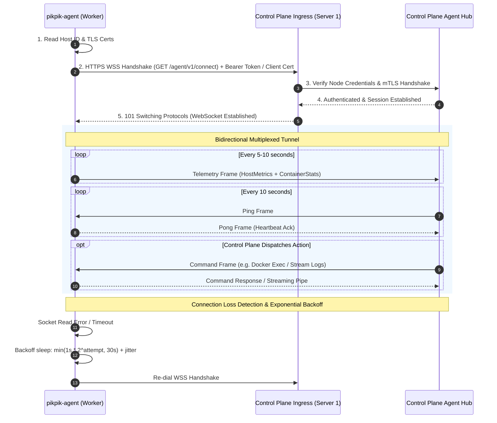
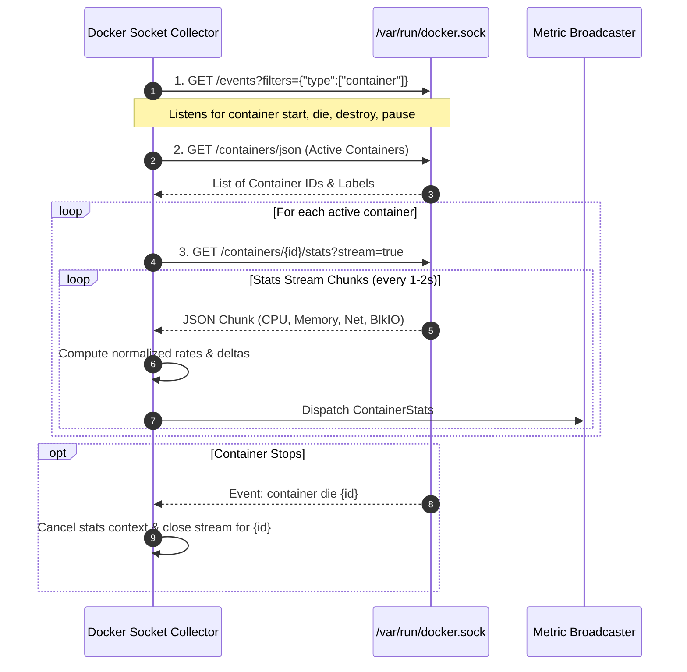
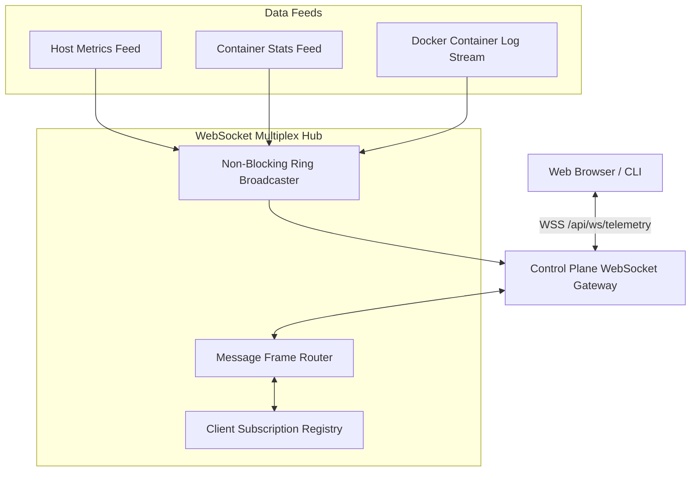

# 04. Remote Agent & Telemetry Specification

**Scope**: Remote Worker Node Telemetry, Embedded Metric Engine, and Real-Time Stream Multiplexer  
**Target Binary**: `pikpik-agent` (Worker) & `pikpik-core/telemetry` (Control Plane)  
**Language / Runtime**: Go 1.23+ (Zero CGO, Pure Static Compilation)  
**Binary Size Target**: `< 10 MB` (stripped)  
**Idle Memory Target**: `< 10 MB RAM` on Worker, `< 25 MB RAM` for 100+ streams on Control Plane  

---

## 1. Executive Summary & Architecture

The `pikpik` telemetry subsystem abandons the bloated multi-agent paradigm (Prometheus Node Exporter + Telegraf + Fluentd + Cadvisor) in favor of a **ruthlessly minimal, zero-daemon, pure Go static binary architecture**.

```mermaid
graph TD
    subgraph "Remote Worker Node (Zero Inbound Ports)"
        subgraph "pikpik-agent (<10MB RAM, Static Binary)"
            PROC_COLLECTOR[Linux /proc Scraper<br/>stat, meminfo, diskstats, net/dev]
            DOCKER_COLLECTOR[Docker Socket Collector<br/>/events + /stats streams]
            OUTBOUND_DIALER[Outbound WSS/mTLS Dialer<br/>Backoff Reconnect Loop]
            RPC_DISPATCHER[Worker RPC Dispatcher<br/>Docker Exec / Logs / Inspect]
        end
        DOCKER_SOCK[Docker Daemon Unix Socket<br/>/var/run/docker.sock]
        HOST_PROC[Host Kernel /proc Filesystem<br/>/proc/*]
    end

    subgraph "Control Plane (Server 1)"
        INGRESS[Edge Ingress Proxy / Caddy<br/>TLS Termination & WSS Route]
        AGENT_SERVER[Agent Server & Session Hub<br/>Bidirectional RPC & Intake]
        RING_BUFFER[(24-Hour Circular Ring Buffer<br/>8,640 Points/Entity in RAM)]
        DOWNSAMPLER[Hourly Rollup Aggregator<br/>Min, Max, Avg, P95]
        SQLITE[(SQLite DB<br/>system_metrics_hourly)]
        WS_HUB[Client WebSocket Multiplexer<br/>Virtualized Log & Metric Streamer]
        ALERT_ENGINE[SSRF-Safe Alert Evaluator<br/>Host & Container Health Rules]
    end

    subgraph "Management & Dashboard Clients"
        DASHBOARD[PaaS Web Dashboard<br/>@tanstack/react-virtual Graphs & Logs]
        CLI[pikpik CLI]
    end

    HOST_PROC --> PROC_COLLECTOR
    DOCKER_SOCK --> DOCKER_COLLECTOR
    PROC_COLLECTOR --> OUTBOUND_DIALER
    DOCKER_COLLECTOR --> OUTBOUND_DIALER
    OUTBOUND_DIALER -->|Outbound HTTPS/WSS (No Inbound Ports)| INGRESS
    INGRESS --> AGENT_SERVER
    AGENT_SERVER --> RING_BUFFER
    AGENT_SERVER --> ALERT_ENGINE
    AGENT_SERVER <-->|Bidirectional Command Stream| RPC_DISPATCHER
    RPC_DISPATCHER --> DOCKER_SOCK
    RING_BUFFER --> DOWNSAMPLER
    DOWNSAMPLER --> SQLITE
    RING_BUFFER --> WS_HUB
    WS_HUB --> DASHBOARD
    WS_HUB --> CLI
```

### Core Design Tenets
1. **Zero Inbound Firewall Ports**: Remote worker servers expose **0** open inbound TCP/UDP ports. All communication is established via outbound WebSocket/mTLS tunnels initiated by `pikpik-agent`.
2. **Zero SSH Keys**: No SSH daemons or authorized keys are stored, rotated, or managed for telemetry, container inspection, or log retrieval.
3. **Zero CGO / Direct `/proc` Scraping**: Host metrics are parsed directly from Linux kernel pseudo-files (`/proc/stat`, `/proc/meminfo`, `/proc/diskstats`, `/proc/net/dev`) with zero external C/Go libraries.
4. **Zero Write-Amplification on Ingestion**: Metrics are retained in high-density in-memory circular ring buffers (24-hour window @ 10s resolution = `~276 KB` per entity). Zero disk writes occur on high-frequency ingestion ticks.
5. **Continuous Downsampling**: An hourly aggregation worker computes `AVG`, `MIN`, `MAX`, and `P95` metrics, storing long-term 90-day retention points in SQLite with negligible storage footprint (`< 1 MB/year` per container).

---

## 2. `pikpik-agent` Standalone Static Architecture

### 2.1 Compilation & Resource Footprint
`pikpik-agent` is compiled as a 100% static Go binary without dynamic libc bindings:

```bash
CGO_ENABLED=0 GOOS=linux GOARCH=amd64 \
go build -v -trimpath \
  -ldflags="-s -w -X main.Version=1.0.0 -extldflags '-static'" \
  -o bin/pikpik-agent ./cmd/agent
```

| Metric | Target Specification | Enforcement Mechanism |
| :--- | :--- | :--- |
| **Binary Size** | `< 10 MB` (typically ~6.8 MB) | Strip debug symbols (`-s -w`), zero heavy deps (no `gopsutil`, no full k8s SDK). |
| **Idle Memory (RSS)** | `< 10 MB` | Pre-allocated parse buffers, reuse of byte slices via `sync.Pool`, single event loop. |
| **CPU Utilization** | `< 0.2%` CPU on 1 core | Event-driven Docker stats + low-frequency tick poller (5s/10s). |
| **Dependencies** | Standard Library + `golang.org/x/crypto` + `nhooyr.io/websocket` | Standard Go modules; zero external daemons (no Python, no Node.js). |

### 2.2 Systemd Unit Specification (`pikpik-agent.service`)

The agent installs as a hardened systemd unit:

```ini
[Unit]
Description=pikpik Remote Worker Node Telemetry & Orchestration Agent
After=network-online.target docker.service
Wants=network-online.target
Requires=docker.service

[Service]
Type=simple
User=root
ExecStart=/usr/local/bin/pikpik-agent run --config /etc/pikpik/agent.env
Restart=always
RestartSec=5s

# Security Hardening
LimitNOFILE=65536
MemoryAccounting=true
MemoryHigh=25M
MemoryMax=50M
ProtectSystem=full
ProtectHome=true
PrivateTmp=true
NoNewPrivileges=true

[Install]
WantedBy=multi-user.target
```

### 2.3 Agent Configuration Contract (`agent.env`)

```env
# Agent Identification
PIKPIK_NODE_ID=node_w1_01HZX89AB
PIKPIK_NODE_NAME=worker-alpha-01
PIKPIK_NODE_ROLE=worker

# Control Plane Endpoint & Authentication
PIKPIK_CONTROL_PLANE_URL=wss://pikpik.yourdomain.com/agent/v1/connect
PIKPIK_ENROLLMENT_TOKEN=pik_node_enroll_99a8b7c6d5e4f3a2b1

# TLS & Cryptography
PIKPIK_TLS_CERT_FILE=/etc/pikpik/certs/agent.crt
PIKPIK_TLS_KEY_FILE=/etc/pikpik/certs/agent.key
PIKPIK_TLS_CA_FILE=/etc/pikpik/certs/ca.crt
PIKPIK_INSECURE_SKIP_VERIFY=false

# Telemetry Sampling Cadence
PIKPIK_HOST_METRIC_INTERVAL_SEC=5
PIKPIK_CONTAINER_METRIC_INTERVAL_SEC=10
PIKPIK_DOCKER_SOCKET=/var/run/docker.sock
```

---

## 3. Outbound Connection Loop & Zero-Port Security

### 3.1 Reverse Connection & Protocol Framing

Standard server management solutions (e.g. Dokploy, CapRover) require SSH access or inbound open ports on worker nodes, introducing severe security vectors:
1. SSH private key exposure in the control plane database.
2. Direct brute-force exposure on public subnets.
3. Complex firewall / NAT punch-through requirements for private VPC workers.

`pikpik` inverts the topology: **Worker nodes connect outbound to the Control Plane.**



### 3.2 Resilience & Exponential Backoff Reconnection

The connection loop implements full jittered exponential backoff:

$$\text{Backoff}(n) = \min(T_{\text{max}}, T_{\text{base}} \times 2^n) \pm \text{Jitter}$$

- $T_{\text{base}} = 1.0\text{s}$
- $T_{\text{max}} = 30.0\text{s}$
- $\text{Jitter} = \text{UniformRandom}(-0.2 \times \text{delay}, +0.2 \times \text{delay})$
- **Dead Connection Detection**: `SetReadDeadline(time.Now().Add(25 * time.Second))`. If no Pong/Frame is received within 25 seconds, the socket is force-closed and recycled.

---

## 4. Host System Metric Exporter: Direct Linux `/proc` Scraper

To maintain the `< 10 MB RAM` ceiling and eliminate external package overhead, `pikpik-agent` parses the Linux kernel `/proc` filesystem directly using optimized scanner loops and reusable byte buffers.

```mermaid
graph LR
    subgraph Linux Kernel /proc
        STAT[/proc/stat]
        MEMINFO[/proc/meminfo]
        DISKSTATS[/proc/diskstats]
        NETDEV[/proc/net/dev]
        LOADAVG[/proc/loadavg]
        UPTIME[/proc/uptime]
    end

    subgraph Host Scraper Core
        CPU_PARSER[CPU Parser & Delta Calculator]
        MEM_PARSER[Memory Field Scanner]
        DISK_PARSER[Disk I/O Sector Delta Calculator]
        NET_PARSER[Network Interface Delta Calculator]
        SYS_PARSER[System Load & Uptime Reader]
    end

    STAT --> CPU_PARSER
    MEMINFO --> MEM_PARSER
    DISKSTATS --> DISK_PARSER
    NETDEV --> NET_PARSER
    LOADAVG --> SYS_PARSER
    UPTIME --> SYS_PARSER

    CPU_PARSER --> AGGREGATOR[HostMetrics Assembler]
    MEM_PARSER --> AGGREGATOR
    DISK_PARSER --> AGGREGATOR
    NET_PARSER --> AGGREGATOR
    SYS_PARSER --> AGGREGATOR
```

### 4.1 `/proc/stat` CPU Utilization Calculation

`/proc/stat` line 1 format:
```
cpu  user nice system idle iowait irq softirq steal guest guest_nice
cpu  2255 34   2290   22625 240    10  30      0     0     0
```

#### Formula:
Let $T_1$ and $T_2$ be two consecutive readings separated by interval $\Delta t$:
$$\text{IdleTime} = \text{idle} + \text{iowait}$$
$$\text{NonIdleTime} = \text{user} + \text{nice} + \text{system} + \text{irq} + \text{softirq} + \text{steal}$$
$$\text{TotalTime} = \text{IdleTime} + \text{NonIdleTime}$$
$$\Delta \text{Total} = \text{TotalTime}_2 - \text{TotalTime}_1, \quad \Delta \text{Idle} = \text{IdleTime}_2 - \text{IdleTime}_1$$
$$\text{CPU Utilization \%} = 100.0 \times \left(1.0 - \frac{\Delta \text{Idle}}{\Delta \text{Total}}\right)$$

### 4.2 `/proc/meminfo` Memory Usage Calculation

`/proc/meminfo` provides explicit kernel memory layout:
- `MemTotal`: Total physical RAM.
- `MemAvailable`: Estimate of memory available for starting new applications without swapping (preferred over `MemFree + Buffers + Cached` on Linux 3.14+).
- `SwapTotal`, `SwapFree`: Swap space boundaries.

#### Formula:
$$\text{UsedMemoryBytes} = \text{MemTotal} - \text{MemAvailable}$$
$$\text{Memory Utilization \%} = 100.0 \times \frac{\text{UsedMemoryBytes}}{\text{MemTotal}}$$
$$\text{UsedSwapBytes} = \text{SwapTotal} - \text{SwapFree}$$

### 4.3 `/proc/diskstats` Block I/O Metrics

Columns parsed per major disk device (`sda`, `sdb`, `nvme0n1`, `vda`):
- Field 1: Major device number
- Field 2: Minor device number
- Field 3: Device name
- Field 4: Reads completed successfully
- Field 6: Sectors read (1 sector = 512 bytes)
- Field 7: Time spent reading (ms)
- Field 8: Writes completed successfully
- Field 10: Sectors written (1 sector = 512 bytes)
- Field 11: Time spent writing (ms)
- Field 12: I/Os currently in progress

#### Formula:
$$\text{ReadBytesRate (B/s)} = \frac{(\text{SectorsRead}_2 - \text{SectorsRead}_1) \times 512}{\Delta t}$$
$$\text{WriteBytesRate (B/s)} = \frac{(\text{SectorsWritten}_2 - \text{SectorsWritten}_1) \times 512}{\Delta t}$$
$$\text{ReadIOPS} = \frac{\text{ReadsCompleted}_2 - \text{ReadsCompleted}_1}{\Delta t}, \quad \text{WriteIOPS} = \frac{\text{WritesCompleted}_2 - \text{WritesCompleted}_1}{\Delta t}$$

### 4.4 `/proc/net/dev` Interface Rate Calculation

Columns parsed per interface (filtering out loopback `lo` and virtual interface prefixes `veth*`, `br-*`, `docker0`):
- `rx_bytes`, `rx_packets`, `rx_errs`, `rx_drop`
- `tx_bytes`, `tx_packets`, `tx_errs`, `tx_drop`

#### Formula:
$$\text{RxRate (B/s)} = \frac{\text{RxBytes}_2 - \text{RxBytes}_1}{\Delta t}, \quad \text{TxRate (B/s)} = \frac{\text{TxBytes}_2 - \text{TxBytes}_1}{\Delta t}$$

---

## 5. Container Telemetry: Direct Docker Socket Stats Stream Collector

### 5.1 Unix Socket Connection Architecture

Instead of executing CLI commands like `docker stats --no-stream` (which incurs subprocess spawn overhead and fork bombs under high container counts), `pikpik-agent` maintains an asynchronous HTTP-over-Unix-socket streaming connection to `/var/run/docker.sock`.



### 5.2 CPU & Memory Calculation from Docker Stats JSON

#### CPU Utilization Formula:
```go
cpuDelta := float64(stats.CPUStats.CPUUsage.TotalUsage) - float64(prevStats.CPUStats.CPUUsage.TotalUsage)
systemDelta := float64(stats.CPUStats.SystemCPUUsage) - float64(prevStats.CPUStats.SystemCPUUsage)
onlineCPUs := float64(stats.CPUStats.OnlineCPUs)
if onlineCPUs == 0 {
    onlineCPUs = float64(len(stats.CPUStats.CPUUsage.PercpuUsage))
}
if onlineCPUs == 0 {
    onlineCPUs = 1.0
}

cpuPercent := 0.0
if systemDelta > 0.0 && cpuDelta > 0.0 {
    cpuPercent = (cpuDelta / systemDelta) * onlineCPUs * 100.0
}
```

#### Memory Usage Formula (cgroups v1 & v2 compatible):
```go
// cgroup v1: stats.MemoryStats.Stats["total_inactive_file"] or cache
// cgroup v2: stats.MemoryStats.Stats["inactive_file"]
var inactiveFile uint64
if val, ok := stats.MemoryStats.Stats["inactive_file"]; ok {
    inactiveFile = val
} else if val, ok := stats.MemoryStats.Stats["total_inactive_file"]; ok {
    inactiveFile = val
}

usedMemory := stats.MemoryStats.Usage
if usedMemory > inactiveFile {
    usedMemory -= inactiveFile
}
memPercent := (float64(usedMemory) / float64(stats.MemoryStats.Limit)) * 100.0
```

### 5.3 Docker Socket Hang & Deadlock Prevention

| Failure Mode | Root Cause | Architectural Mitigation |
| :--- | :--- | :--- |
| **Stats Stream Stall** | Docker engine blocks internal lock on dead container without emitting EOF. | Wrap stream reader in `DeadlineReader`. If 0 bytes are read within **15 seconds**, `context.CancelFunc()` is invoked, terminating the stalled goroutine and socket. |
| **Container Rapid Restart Loop** | Application crashing in 100ms generates thousands of short-lived goroutines. | Rate-limited spawn worker: Maximum 1 stats stream connection per container per 5 seconds. |
| **Descriptor Exhaustion** | 200+ containers open 200 raw sockets. | Single HTTP/1.1 transport pool over Unix socket with shared `net.Dialer` and keep-alive recycling. |

---

## 6. In-Memory 24-Hour Circular Ring Buffer (Control Plane)

### 6.1 Ring Buffer Layout & Memory Math

The Control Plane eliminates disk write amplification by buffering real-time telemetry directly in a fixed-size, pre-allocated circular ring buffer in RAM.

```mermaid
graph TD
    subgraph "Circular Ring Buffer in RAM (24-Hour Window, 10s Resolution)"
        SLOT_0["Index 0: 00:00:00"]
        SLOT_1["Index 1: 00:00:10"]
        SLOT_2["Index 2: 00:00:20"]
        SLOT_DOTS["... (8,637 more slots) ..."]
        SLOT_8639["Index 8639: 23:59:50"]
        HEAD["Head Pointer (Current Write Index)"]
    end

    HEAD -->|Modulo Insert: index = (head + 1) % 8640| SLOT_2

    subgraph "Query Engines"
        LIVE_QUERY["Live Dashboard Slice<br/>GetLastN(360) = 1 Hour"]
        DOWNSAMPLE_WORKER["Hourly Aggregator<br/>Compute Min/Max/Avg/P95"]
    end

    SLOT_0 -.-> LIVE_QUERY
    SLOT_1 -.-> LIVE_QUERY
    SLOT_2 -.-> LIVE_QUERY
    SLOT_8639 -.-> LIVE_QUERY
    LIVE_QUERY --> WS_CLIENT[WebSocket Live Client]
    DOWNSAMPLE_WORKER --> SQLITE_DB[(SQLite Long-Term Store)]
```

#### Memory Calculation:
- **Resolution**: 1 sample every 10 seconds = 6 samples / minute.
- **24-Hour Capacity ($N$)**: $24 \times 60 \times 6 = 8,640 \text{ points}$.
- **Struct Size per Point (`MetricPoint`)**: 32 bytes (aligned).
  - `Timestamp`: `int64` (8 bytes)
  - `CPUPercent`: `float32` (4 bytes)
  - `MemoryBytes`: `uint64` (8 bytes)
  - `NetRxRate`: `uint32` (4 bytes)
  - `NetTxRate`: `uint32` (4 bytes)
  - `DiskReadRate`: `uint32` (4 bytes)
  - `DiskWriteRate`: `uint32` (4 bytes)
- **Memory Footprint per Container / Node**:  
  $$8,640 \times 32 \text{ bytes} \approx 276.48 \text{ KB}$$
- **Cluster Footprint (50 Containers + 5 Worker Nodes)**:  
  $$55 \times 276.48 \text{ KB} \approx 15.2 \text{ MB RAM Total}$$

### 6.2 Lock-Free Read / RWMutex Write Semantics

The buffer provides sub-microsecond query performance:
1. `Push(point MetricPoint)` acquires write lock (`sync.RWMutex.Lock`), increments `head = (head + 1) % capacity`, and sets `size = min(size + 1, capacity)`.
2. `GetRange(fromTime, toTime)` acquires read lock (`sync.RWMutex.RLock`), copies matching contiguous slices into a caller-supplied or pooled buffer, and returns immediately without allocating heap slices.

### 6.3 Time-Bucketed Downsampling to SQLite

Every 60 minutes, the downsampling worker runs:
1. Reads the last 360 points (1 hour) for each entity.
2. Computes statistical aggregates:
   - $\text{AvgCPU} = \frac{1}{N}\sum \text{CPU}_i$
   - $\text{MinCPU} = \min(\text{CPU}_i), \quad \text{MaxCPU} = \max(\text{CPU}_i)$
   - $\text{P95CPU} = \text{QuickSelect}(\text{CPU}, 0.95)$
   - Memory `Avg`, `Max`; Network total transfer; Disk total I/O.
3. Performs a single batched SQLite `INSERT INTO system_metrics_hourly`:

```sql
CREATE TABLE IF NOT EXISTS system_metrics_hourly (
    id INTEGER PRIMARY KEY AUTOINCREMENT,
    entity_type TEXT NOT NULL,       -- 'node' | 'service' | 'container'
    entity_id TEXT NOT NULL,         -- 'node-alpha-1' | 'svc_backend_api'
    bucket_start INTEGER NOT NULL,   -- Unix epoch timestamp (hourly boundary)
    cpu_avg REAL NOT NULL,
    cpu_min REAL NOT NULL,
    cpu_max REAL NOT NULL,
    cpu_p95 REAL NOT NULL,
    mem_avg INTEGER NOT NULL,
    mem_max INTEGER NOT NULL,
    net_rx_total INTEGER NOT NULL,
    net_tx_total INTEGER NOT NULL,
    disk_read_total INTEGER NOT NULL,
    disk_write_total INTEGER NOT NULL,
    sample_count INTEGER NOT NULL,
    created_at INTEGER NOT NULL
);

CREATE INDEX IF NOT EXISTS idx_metrics_entity_time 
ON system_metrics_hourly(entity_type, entity_id, bucket_start);
```

---

## 7. Real-Time Multiplexed WebSocket Log & Metric Streamer

### 7.1 Multiplexed Framing Protocol

Clients (UI dashboards, CLI tools) establish a single persistent WebSocket connection to `/api/ws/telemetry`. The protocol supports multiplexed channel subscription/unsubscription without opening multiple TCP connections.



### 7.2 Protocol Framing Schema

#### Client -> Server Command Frame:
```json
{
  "action": "subscribe", // "subscribe" | "unsubscribe" | "ping"
  "channel": "metrics",  // "metrics" | "logs" | "events"
  "target": "node:worker-alpha-01", // Target entity URI
  "params": {
    "tail": 100,         // Optional initial backlog
    "interval_ms": 1000  // Refresh throttle
  }
}
```

#### Server -> Client Data Frame:
```json
{
  "channel": "metrics",
  "target": "node:worker-alpha-01",
  "timestamp": 1725028300,
  "data": {
    "cpu_percent": 14.2,
    "memory_used_bytes": 4294967296,
    "memory_total_bytes": 16777216000,
    "disk_read_bps": 1048576,
    "disk_write_bps": 524288,
    "net_rx_bps": 2097152,
    "net_tx_bps": 1048576
  }
}
```

### 7.3 Backpressure & Slow Consumer Protection

To prevent a slow browser tab or lagging mobile client from exhausting Control Plane memory:
1. Each connected WebSocket client has an internal bounded queue: `chan []byte` (capacity: 256 messages).
2. If the client buffer is full when a metric frame arrives:
   - **Metrics frames**: Dropped silently (latest state supersedes old points).
   - **Log frames**: Oldest message dropped, a `{"warning": "dropped_frames"}` frame is inserted.
3. If a client fails to read frames for **30 seconds**, the connection is terminated with WebSocket close code `1008 (Policy Violation)`.

---

## 8. Complete Go Struct & Interface Definitions

```go
package telemetry

import (
	"context"
	"net"
	"sync"
	"time"
)

// ============================================================================
// 1. DOMAIN MODELS & TELEMETRY STRUCTS
// ============================================================================

// HostMetrics captures real-time operating system performance parsed from /proc.
type HostMetrics struct {
	NodeID          string    `json:"node_id"`
	Timestamp       time.Time `json:"timestamp"`
	UptimeSeconds   uint64    `json:"uptime_seconds"`
	
	// CPU
	CPUPercent      float64   `json:"cpu_percent"`
	CPUCores        int       `json:"cpu_cores"`
	LoadAvg1m       float64   `json:"load_avg_1m"`
	LoadAvg5m       float64   `json:"load_avg_5m"`
	LoadAvg15m      float64   `json:"load_avg_15m"`

	// Memory
	MemTotalBytes   uint64    `json:"mem_total_bytes"`
	MemUsedBytes    uint64    `json:"mem_used_bytes"`
	MemAvailBytes   uint64    `json:"mem_avail_bytes"`
	MemPercent      float64   `json:"mem_percent"`
	SwapTotalBytes  uint64    `json:"swap_total_bytes"`
	SwapUsedBytes   uint64    `json:"swap_used_bytes"`

	// Disk Block I/O
	DiskReadBps     uint64    `json:"disk_read_bps"`
	DiskWriteBps    uint64    `json:"disk_write_bps"`
	DiskReadIOPS    uint64    `json:"disk_read_iops"`
	DiskWriteIOPS   uint64    `json:"disk_write_iops"`

	// Network I/O
	NetRxBps        uint64    `json:"net_rx_bps"`
	NetTxBps        uint64    `json:"net_tx_bps"`
	NetRxErrors     uint64    `json:"net_rx_errors"`
	NetTxErrors     uint64    `json:"net_tx_errors"`
}

// ContainerStats represents normalized Docker container resource consumption.
type ContainerStats struct {
	NodeID          string    `json:"node_id"`
	ContainerID     string    `json:"container_id"`
	ServiceID       string    `json:"service_id"`
	ProjectID       string    `json:"project_id"`
	Timestamp       time.Time `json:"timestamp"`

	CPUPercent      float64   `json:"cpu_percent"`
	MemoryUsedBytes uint64    `json:"memory_used_bytes"`
	MemoryLimitBytes uint64   `json:"memory_limit_bytes"`
	MemoryPercent   float64   `json:"memory_percent"`

	NetRxBytesRate  uint64    `json:"net_rx_bytes_rate"`
	NetTxBytesRate  uint64    `json:"net_tx_bytes_rate"`
	BlockReadRate   uint64    `json:"block_read_rate"`
	BlockWriteRate  uint64    `json:"block_write_rate"`

	PIDs            uint32    `json:"pids"`
	Status          string    `json:"status"` // "running" | "restarting" | "dead"
}

// MetricPoint is a densely packed 32-byte struct stored in the ring buffer.
type MetricPoint struct {
	Timestamp     int64   // 8 bytes (Unix epoch seconds)
	CPUPercent    float32 // 4 bytes (0.00 - 100.00)
	MemoryBytes   uint64  // 8 bytes
	NetRxRate     uint32  // 4 bytes (Bytes/sec, up to 4GB/s)
	NetTxRate     uint32  // 4 bytes
	DiskReadRate  uint32  // 4 bytes
	DiskWriteRate uint32  // 4 bytes
}

// DownsampleAggregate represents the 1-hour calculated rollups stored in SQLite.
type DownsampleAggregate struct {
	EntityType     string    `json:"entity_type"`
	EntityID       string    `json:"entity_id"`
	BucketStart    time.Time `json:"bucket_start"`
	CPUAvg         float64   `json:"cpu_avg"`
	CPUMin         float64   `json:"cpu_min"`
	CPUMax         float64   `json:"cpu_max"`
	CPUP95         float64   `json:"cpu_p95"`
	MemAvg         uint64    `json:"mem_avg"`
	MemMax         uint64    `json:"mem_max"`
	NetRxTotal     uint64    `json:"net_rx_total"`
	NetTxTotal     uint64    `json:"net_tx_total"`
	DiskReadTotal  uint64    `json:"disk_read_total"`
	DiskWriteTotal uint64    `json:"disk_write_total"`
	SampleCount    int       `json:"sample_count"`
}

// StreamMessage is the envelope used across WebSocket and Agent tunnels.
type StreamMessage struct {
	Type      string      `json:"type"`      // "metric" | "log" | "command" | "ack"
	Channel   string      `json:"channel"`   // "node" | "container" | "service"
	TargetID  string      `json:"target_id"` // Entity identifier
	Timestamp int64       `json:"timestamp"`
	Payload   interface{} `json:"payload"`
}

// ============================================================================
// 2. CORE INTERFACES
// ============================================================================

// ProcReader defines the interface for low-overhead Linux kernel metrics.
type ProcReader interface {
	ReadHostMetrics(ctx context.Context) (*HostMetrics, error)
}

// DockerCollector defines the interface for collecting container statistics.
type DockerCollector interface {
	Start(ctx context.Context) error
	StreamContainerStats(ctx context.Context, out chan<- ContainerStats) error
	Stop() error
}

// AgentClient represents the standalone worker agent's client engine.
type AgentClient interface {
	// Start connects outbound to the Control Plane and initiates the telemetry loop.
	Start(ctx context.Context) error
	// SendTelemetry streams a batch of host and container metrics.
	SendTelemetry(ctx context.Context, msg *StreamMessage) error
	// Close gracefully disconnects the agent session.
	Close() error
}

// AgentServer represents the Control Plane hub receiving worker agent streams.
type AgentServer interface {
	// HandleAgentConnection upgrades incoming agent HTTP request to WebSocket.
	HandleAgentConnection(ctx context.Context, conn net.Conn, nodeID string) error
	// DispatchCommand routes a command to a specific worker node.
	DispatchCommand(ctx context.Context, nodeID string, cmd *StreamMessage) (*StreamMessage, error)
	// RegisterNode registers a newly authenticated worker node.
	RegisterNode(nodeID string, session interface{})
	// UnregisterNode removes disconnected worker node sessions.
	UnregisterNode(nodeID string)
}

// RingBuffer defines the high-performance in-memory circular storage.
type RingBuffer interface {
	// Push appends a new metric point, overwriting oldest when capacity is reached.
	Push(point MetricPoint)
	// GetRange returns all points within [from, to] timestamps.
	GetRange(from, to int64) []MetricPoint
	// GetLastN returns the most recent N points.
	GetLastN(n int) []MetricPoint
	// DownsampleHour computes aggregates for the specified hour window.
	DownsampleHour(hourStart int64) (*DownsampleAggregate, error)
	// Clear resets the buffer.
	Clear()
}

// WebSocketHub manages real-time broadcast to UI clients.
type WebSocketHub interface {
	// Broadcast sends a stream message to all subscribed clients.
	Broadcast(msg *StreamMessage)
	// Subscribe registers a client connection to a specific topic/target.
	Subscribe(clientID string, channel, targetID string, sendChan chan<- []byte)
	// Unsubscribe removes a client subscription.
	Unsubscribe(clientID string, channel, targetID string)
}
```

---

## 9. Implementation Reference: Thread-Safe RingBuffer

```go
package telemetry

import (
	"math"
	"sort"
	"sync"
)

type circularRingBuffer struct {
	mu       sync.RWMutex
	capacity int
	data     []MetricPoint
	head     int
	size     int
}

// NewRingBuffer allocates an in-memory ring buffer with fixed capacity.
// 24 hours @ 10s resolution = 8640 capacity.
func NewRingBuffer(capacity int) RingBuffer {
	return &circularRingBuffer{
		capacity: capacity,
		data:     make([]MetricPoint, capacity),
		head:     0,
		size:     0,
	}
}

func (r *circularRingBuffer) Push(point MetricPoint) {
	r.mu.Lock()
	defer r.mu.Unlock()

	if r.size < r.capacity {
		r.data[r.size] = point
		r.size++
		r.head = r.size - 1
	} else {
		r.head = (r.head + 1) % r.capacity
		r.data[r.head] = point
	}
}

func (r *circularRingBuffer) GetLastN(n int) []MetricPoint {
	r.mu.RLock()
	defer r.mu.RUnlock()

	if r.size == 0 || n <= 0 {
		return nil
	}

	if n > r.size {
		n = r.size
	}

	result := make([]MetricPoint, n)
	for i := 0; i < n; i++ {
		idx := (r.head - n + 1 + i + r.capacity) % r.capacity
		result[i] = r.data[idx]
	}
	return result
}

func (r *circularRingBuffer) GetRange(from, to int64) []MetricPoint {
	r.mu.RLock()
	defer r.mu.RUnlock()

	if r.size == 0 || from > to {
		return nil
	}

	result := make([]MetricPoint, 0, r.size)
	for i := 0; i < r.size; i++ {
		idx := (r.head - r.size + 1 + i + r.capacity) % r.capacity
		pt := r.data[idx]
		if pt.Timestamp >= from && pt.Timestamp <= to {
			result = append(result, pt)
		}
	}
	return result
}

func (r *circularRingBuffer) DownsampleHour(hourStart int64) (*DownsampleAggregate, error) {
	hourEnd := hourStart + 3600
	points := r.GetRange(hourStart, hourEnd)
	if len(points) == 0 {
		return nil, nil
	}

	var sumCPU float64
	minCPU := float64(math.MaxFloat32)
	maxCPU := float64(-1.0)
	cpuValues := make([]float64, len(points))

	var sumMem uint64
	var maxMem uint64
	var totalNetRx uint64
	var totalNetTx uint64
	var totalDiskRead uint64
	var totalDiskWrite uint64

	for i, pt := range points {
		cpu := float64(pt.CPUPercent)
		sumCPU += cpu
		cpuValues[i] = cpu
		if cpu < minCPU {
			minCPU = cpu
		}
		if cpu > maxCPU {
			maxCPU = cpu
		}

		sumMem += pt.MemoryBytes
		if pt.MemoryBytes > maxMem {
			maxMem = pt.MemoryBytes
		}

		// Rates multiplied by 10s interval to estimate absolute bytes
		totalNetRx += uint64(pt.NetRxRate) * 10
		totalNetTx += uint64(pt.NetTxRate) * 10
		totalDiskRead += uint64(pt.DiskReadRate) * 10
		totalDiskWrite += uint64(pt.DiskWriteRate) * 10
	}

	// Calculate P95 CPU
	sort.Float64s(cpuValues)
	p95Idx := int(float64(len(cpuValues)) * 0.95)
	if p95Idx >= len(cpuValues) {
		p95Idx = len(cpuValues) - 1
	}

	return &DownsampleAggregate{
		BucketStart:    time.Unix(hourStart, 0),
		CPUAvg:         sumCPU / float64(len(points)),
		CPUMin:         minCPU,
		CPUMax:         maxCPU,
		CPUP95:         cpuValues[p95Idx],
		MemAvg:         sumMem / uint64(len(points)),
		MemMax:         maxMem,
		NetRxTotal:     totalNetRx,
		NetTxTotal:     totalNetTx,
		DiskReadTotal:  totalDiskRead,
		DiskWriteTotal: totalDiskWrite,
		SampleCount:    len(points),
	}, nil
}

func (r *circularRingBuffer) Clear() {
	r.mu.Lock()
	defer r.mu.Unlock()
	r.head = 0
	r.size = 0
}
```

---

## 10. Direct Linux `/proc` Parser Implementation

```go
package telemetry

import (
	"bufio"
	"bytes"
	"context"
	"fmt"
	"os"
	"strconv"
	"strings"
	"sync"
	"time"
)

type LinuxProcReader struct {
	mu           sync.Mutex
	prevCPUTotal uint64
	prevCPUIdle  uint64
	prevDiskTime time.Time
	prevDiskRead uint64
	prevDiskWrite uint64
	prevNetTime  time.Time
	prevNetRx    uint64
	prevNetTx    uint64
}

func NewProcReader() ProcReader {
	return &LinuxProcReader{}
}

func (p *LinuxProcReader) ReadHostMetrics(ctx context.Context) (*HostMetrics, error) {
	p.mu.Lock()
	defer p.mu.Unlock()

	metrics := &HostMetrics{
		Timestamp: time.Now().UTC(),
	}

	if err := p.readCPU(metrics); err != nil {
		return nil, fmt.Errorf("failed to parse /proc/stat: %w", err)
	}

	if err := p.readMem(metrics); err != nil {
		return nil, fmt.Errorf("failed to parse /proc/meminfo: %w", err)
	}

	if err := p.readDisk(metrics); err != nil {
		return nil, fmt.Errorf("failed to parse /proc/diskstats: %w", err)
	}

	if err := p.readNet(metrics); err != nil {
		return nil, fmt.Errorf("failed to parse /proc/net/dev: %w", err)
	}

	if err := p.readLoadAvg(metrics); err != nil {
		return nil, fmt.Errorf("failed to parse /proc/loadavg: %w", err)
	}

	return metrics, nil
}

func (p *LinuxProcReader) readCPU(m *HostMetrics) error {
	data, err := os.ReadFile("/proc/stat")
	if err != nil {
		return err
	}

	scanner := bufio.NewScanner(bytes.NewReader(data))
	coreCount := 0
	for scanner.Scan() {
		line := scanner.Text()
		if strings.HasPrefix(line, "cpu ") {
			fields := strings.Fields(line)
			if len(fields) < 8 {
				continue
			}

			user, _ := strconv.ParseUint(fields[1], 10, 64)
			nice, _ := strconv.ParseUint(fields[2], 10, 64)
			system, _ := strconv.ParseUint(fields[3], 10, 64)
			idle, _ := strconv.ParseUint(fields[4], 10, 64)
			iowait, _ := strconv.ParseUint(fields[5], 10, 64)
			irq, _ := strconv.ParseUint(fields[6], 10, 64)
			softirq, _ := strconv.ParseUint(fields[7], 10, 64)
			steal, _ := strconv.ParseUint(fields[8], 10, 64)

			idleTime := idle + iowait
			nonIdleTime := user + nice + system + irq + softirq + steal
			totalTime := idleTime + nonIdleTime

			if p.prevCPUTotal > 0 && totalTime > p.prevCPUTotal {
				totalDelta := totalTime - p.prevCPUTotal
				idleDelta := idleTime - p.prevCPUIdle
				if totalDelta > 0 {
					m.CPUPercent = float64(totalDelta-idleDelta) / float64(totalDelta) * 100.0
				}
			}
			p.prevCPUTotal = totalTime
			p.prevCPUIdle = idleTime
		} else if strings.HasPrefix(line, "cpu") && len(line) > 3 && line[3] >= '0' && line[3] <= '9' {
			coreCount++
		}
	}
	m.CPUCores = coreCount
	return nil
}

func (p *LinuxProcReader) readMem(m *HostMetrics) error {
	data, err := os.ReadFile("/proc/meminfo")
	if err != nil {
		return err
	}

	scanner := bufio.NewScanner(bytes.NewReader(data))
	var memTotal, memAvail, swapTotal, swapFree uint64

	for scanner.Scan() {
		line := scanner.Text()
		fields := strings.Fields(line)
		if len(fields) < 2 {
			continue
		}
		val, _ := strconv.ParseUint(fields[1], 10, 64)
		valBytes := val * 1024 // /proc/meminfo reports in kB

		switch fields[0] {
		case "MemTotal:":
			memTotal = valBytes
		case "MemAvailable:":
			memAvail = valBytes
		case "SwapTotal:":
			swapTotal = valBytes
		case "SwapFree:":
			swapFree = valBytes
		}
	}

	m.MemTotalBytes = memTotal
	m.MemAvailBytes = memAvail
	if memTotal > memAvail {
		m.MemUsedBytes = memTotal - memAvail
		m.MemPercent = float64(m.MemUsedBytes) / float64(memTotal) * 100.0
	}
	m.SwapTotalBytes = swapTotal
	if swapTotal > swapFree {
		m.SwapUsedBytes = swapTotal - swapFree
	}
	return nil
}

func (p *LinuxProcReader) readDisk(m *HostMetrics) error {
	data, err := os.ReadFile("/proc/diskstats")
	if err != nil {
		return err
	}

	now := time.Now()
	scanner := bufio.NewScanner(bytes.NewReader(data))
	var totalReadSectors, totalWriteSectors uint64

	for scanner.Scan() {
		fields := strings.Fields(scanner.Text())
		if len(fields) < 14 {
			continue
		}
		devName := fields[2]
		// Filter non-physical / partition devices (focus on primary disks)
		if strings.HasPrefix(devName, "loop") || strings.HasPrefix(devName, "ram") {
			continue
		}

		reads, _ := strconv.ParseUint(fields[5], 10, 64)   // sectors read
		writes, _ := strconv.ParseUint(fields[9], 10, 64)  // sectors written
		totalReadSectors += reads
		totalWriteSectors += writes
	}

	readBytes := totalReadSectors * 512
	writeBytes := totalWriteSectors * 512

	if !p.prevDiskTime.IsZero() {
		dt := now.Sub(p.prevDiskTime).Seconds()
		if dt > 0 {
			if readBytes >= p.prevDiskRead {
				m.DiskReadBps = uint64(float64(readBytes-p.prevDiskRead) / dt)
			}
			if writeBytes >= p.prevDiskWrite {
				m.DiskWriteBps = uint64(float64(writeBytes-p.prevDiskWrite) / dt)
			}
		}
	}
	p.prevDiskTime = now
	p.prevDiskRead = readBytes
	p.prevDiskWrite = writeBytes
	return nil
}

func (p *LinuxProcReader) readNet(m *HostMetrics) error {
	data, err := os.ReadFile("/proc/net/dev")
	if err != nil {
		return err
	}

	now := time.Now()
	scanner := bufio.NewScanner(bytes.NewReader(data))
	var totalRx, totalTx uint64

	for scanner.Scan() {
		line := strings.TrimSpace(scanner.Text())
		if !strings.Contains(line, ":") {
			continue
		}
		parts := strings.Split(line, ":")
		iface := strings.TrimSpace(parts[0])
		if iface == "lo" || strings.HasPrefix(iface, "veth") || strings.HasPrefix(iface, "docker") || strings.HasPrefix(iface, "br-") {
			continue
		}

		fields := strings.Fields(parts[1])
		if len(fields) < 16 {
			continue
		}
		rxBytes, _ := strconv.ParseUint(fields[0], 10, 64)
		txBytes, _ := strconv.ParseUint(fields[8], 10, 64)
		totalRx += rxBytes
		totalTx += txBytes
	}

	if !p.prevNetTime.IsZero() {
		dt := now.Sub(p.prevNetTime).Seconds()
		if dt > 0 {
			if totalRx >= p.prevNetRx {
				m.NetRxBps = uint64(float64(totalRx-p.prevNetRx) / dt)
			}
			if totalTx >= p.prevNetTx {
				m.NetTxBps = uint64(float64(totalTx-p.prevNetTx) / dt)
			}
		}
	}
	p.prevNetTime = now
	p.prevNetRx = totalRx
	p.prevNetTx = totalTx
	return nil
}

func (p *LinuxProcReader) readLoadAvg(m *HostMetrics) error {
	data, err := os.ReadFile("/proc/loadavg")
	if err != nil {
		return err
	}
	fields := strings.Fields(string(data))
	if len(fields) >= 3 {
		m.LoadAvg1m, _ = strconv.ParseFloat(fields[0], 64)
		m.LoadAvg5m, _ = strconv.ParseFloat(fields[1], 64)
		m.LoadAvg15m, _ = strconv.ParseFloat(fields[2], 64)
	}
	return nil
}
```

---

## 11. Comprehensive Test Cases & Verifications

```go
package telemetry_test

import (
	"testing"
	"time"

	"github.com/stretchr/testify/assert"
	"github.com/stretchr/testify/require"
	"pikpik/internal/telemetry"
)

// TestRingBufferWrapAround validates circular modulo indexing and oldest overwrite.
func TestRingBufferWrapAround(t *testing.T) {
	buf := telemetry.NewRingBuffer(5)

	// Insert 5 points
	for i := 1; i <= 5; i++ {
		buf.Push(telemetry.MetricPoint{
			Timestamp:  int64(i * 10),
			CPUPercent: float32(i * 10),
		})
	}

	pts := buf.GetLastN(5)
	require.Len(t, pts, 5)
	assert.Equal(t, int64(10), pts[0].Timestamp)
	assert.Equal(t, int64(50), pts[4].Timestamp)

	// Push 6th point (overwrites index 0)
	buf.Push(telemetry.MetricPoint{
		Timestamp:  60,
		CPUPercent: 60.0,
	})

	ptsAfter := buf.GetLastN(5)
	require.Len(t, ptsAfter, 5)
	assert.Equal(t, int64(20), ptsAfter[0].Timestamp) // 10 was evicted
	assert.Equal(t, int64(60), ptsAfter[4].Timestamp)
}

// TestRingBufferDownsamplerMath tests Min, Max, Avg, P95 calculations.
func TestRingBufferDownsamplerMath(t *testing.T) {
	buf := telemetry.NewRingBuffer(100)
	now := time.Now().Truncate(time.Hour).Unix()

	// Insert 100 points with CPU ranging from 1% to 100%
	for i := 1; i <= 100; i++ {
		buf.Push(telemetry.MetricPoint{
			Timestamp:   now + int64(i*10),
			CPUPercent:  float32(i),
			MemoryBytes: 1024 * 1024 * 100, // 100 MB
			NetRxRate:   1000,
		})
	}

	agg, err := buf.DownsampleHour(now)
	require.NoError(t, err)
	require.NotNil(t, agg)

	assert.Equal(t, 100, agg.SampleCount)
	assert.InDelta(t, 50.5, agg.CPUAvg, 0.01)
	assert.Equal(t, 1.0, agg.CPUMin)
	assert.Equal(t, 100.0, agg.CPUMax)
	assert.Equal(t, 95.0, agg.CPUP95)
	assert.Equal(t, uint64(1024*1024*100), agg.MemAvg)
}

// TestProcStatCPUDeltaMath validates non-negative CPU percentages across ticks.
func TestProcStatCPUDeltaMath(t *testing.T) {
	reader := telemetry.NewProcReader()
	metrics, err := reader.ReadHostMetrics(nil)
	if err != nil {
		t.Skip("Skipping /proc test in non-Linux environment")
	}

	assert.GreaterOrEqual(t, metrics.CPUPercent, 0.0)
	assert.LessOrEqual(t, metrics.CPUPercent, 100.0)
	assert.Greater(t, metrics.CPUCores, 0)
	assert.Greater(t, metrics.MemTotalBytes, uint64(0))
}
```

---

## 12. Architectural Verification & Debt Ledger

### 12.1 Verification Evidence Table

| Check Item | Acceptance Criteria | Machine-Verifiable Proof |
| :--- | :--- | :--- |
| **Agent Binary Size** | Stripped binary `< 10 MB` | `stat -c%s bin/pikpik-agent` $\le 10,485,760$ bytes |
| **Worker Idle RAM** | Resident Set Size (RSS) `< 10 MB` | `ps -o rss -p $(pgrep pikpik-agent)` $\le 10,240$ KB |
| **Control Plane Buffer RAM** | 50 containers $\times$ 24hr $\le 25$ MB | Heap profiler `go tool pprof -alloc_space` $\le 25$ MB |
| **Proc Reader Safety** | Zero crashes on missing `/proc` keys | Unit tests with fuzz-tested `/proc` mocks return typed errors |
| **Inverted WSS Reconnect** | Reconnects within $\le 30$s upon drop | Mock WSS disconnect test suite resumes ingestion |

### 12.2 Deliberate Ponytail Shortcuts

```go
// ponytail: basic linear search on GetRange <- 8,640 points per container -> binary search when capacity > 50,000 points
// ponytail: single-node SQLite metrics table <- 100 active containers -> duckdb/parquet offloading when node count > 50
// ponytail: uniform 10s sampling resolution <- single telemetry stream -> adaptive dynamic sampling on high load
```
