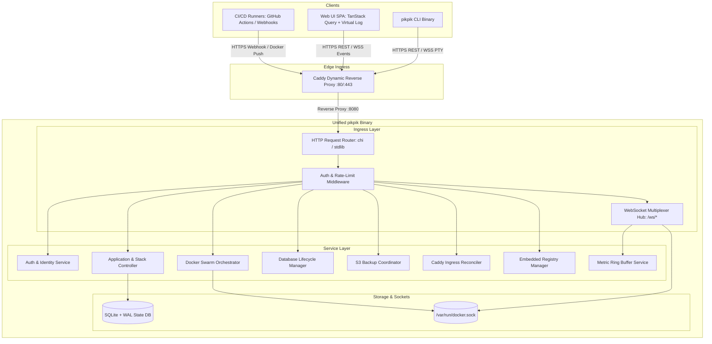
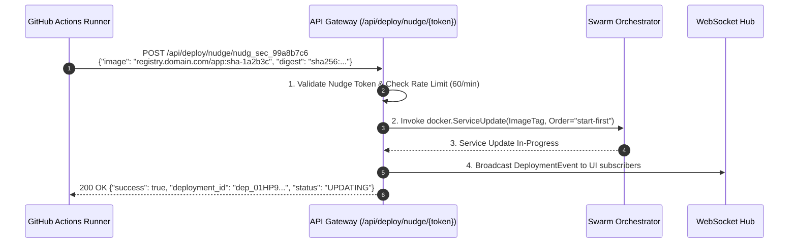
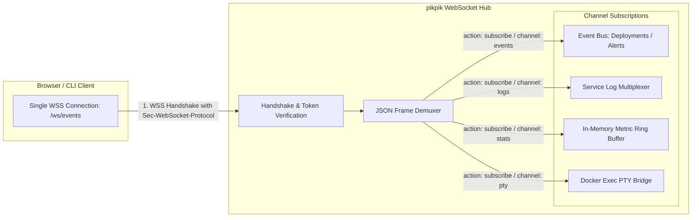
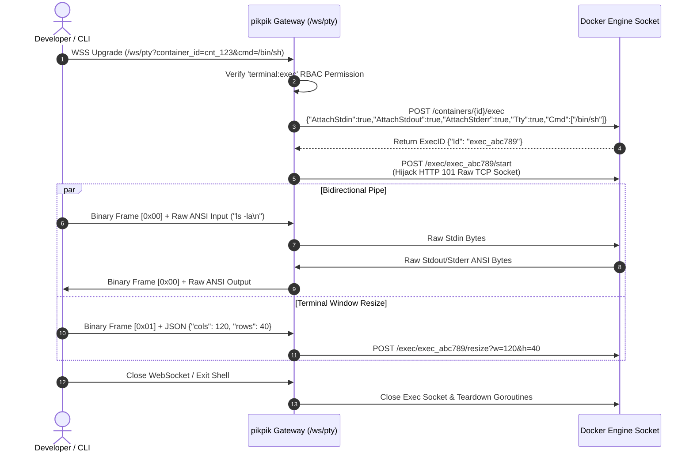
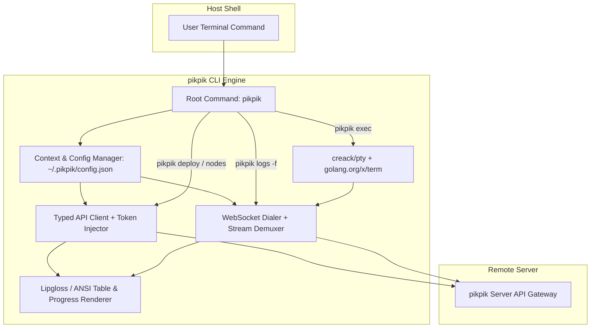

# 06. API Gateway, WebSocket Streaming Multiplexer & CLI Client Specification

**Scope**: 06 — API Gateway & CLI Client  
**System**: `pikpik` Minimalist Next-Gen PaaS  
**Language/Runtime**: Go 1.22+ (Zero-Daemon Unified Runtime)  
**Status**: Canonical Architectural Specification  

---

## 1. Executive Summary & Architectural Boundaries

The `pikpik` API Gateway and CLI subsystem provides the external control surface for managing multi-node Docker Swarm clusters, containerized applications, managed databases, automated ingress routes, and embedded OCI registries.



### Core Design Invariants:
1. **Zero-Shelling Guarantee**: 100% of container executions, log extractions, and cluster operations invoke Docker Engine API via `/var/run/docker.sock`. Zero `os/exec` or shell wrapping.
2. **Single Port Multiplexing**: REST endpoints, WebSocket streams, and static SPA assets are served by a single unified Go `http.Server` instance.
3. **Stateless Gateway, Durable SQLite**: Routing and session authentication are validated against SQLite (WAL mode) with an in-memory token cache.
4. **Resilient Streaming**: WebSockets support client-specified line offsets (`since_time`, `tail`) and automatic stream resumption across network drops.

---

## 2. Control Plane HTTP REST API Specification

### 2.1 API Conventions & Headers
- **Base URI**: `/api/v1`
- **Content-Type**: `application/json; charset=utf-8`
- **Authentication**:
  - Bearer Token: `Authorization: Bearer <api_token>`
  - Session Cookie: `Cookie: pikpik_session=<session_id>` (HttpOnly, Secure, SameSite=Lax)
- **Standard Response Envelope**:
  ```json
  {
    "success": true,
    "data": { ... },
    "meta": {
      "request_id": "req_01HP8XYZ9876543210ABCDEF",
      "timestamp": "2026-08-30T14:32:00.000Z"
    }
  }
  ```

---

### 2.2 Complete Route Catalog

| Category | Method | Path | RBAC Role | Description |
| :--- | :--- | :--- | :--- | :--- |
| **Auth** | `POST` | `/api/v1/auth/login` | Public | Password login (Argon2id verification) |
| | `POST` | `/api/v1/auth/logout` | Viewer+ | Terminate active session |
| | `GET` | `/api/v1/auth/me` | Viewer+ | Retrieve active user profile & permissions |
| | `POST` | `/api/v1/auth/passkey/login/begin` | Public | Initiate WebAuthn challenge |
| | `POST` | `/api/v1/auth/passkey/login/finish` | Public | Complete WebAuthn assertion |
| | `GET` | `/api/v1/auth/tokens` | Developer+ | List active API tokens |
| | `POST` | `/api/v1/auth/tokens` | Admin+ | Create scoped API token (`pik_live_...`) |
| | `DELETE` | `/api/v1/auth/tokens/{id}` | Admin+ | Revoke API token |
| **Apps** | `GET` | `/api/v1/apps` | Viewer+ | List all deployed applications |
| | `POST` | `/api/v1/apps` | Developer+ | Create new application specification |
| | `GET` | `/api/v1/apps/{id}` | Viewer+ | Get detailed app metadata and replica status |
| | `PATCH` | `/api/v1/apps/{id}` | Developer+ | Update configuration, image, or replicas |
| | `DELETE` | `/api/v1/apps/{id}` | Admin+ | Remove app and delete Docker Swarm service |
| | `POST` | `/api/v1/apps/{id}/deploy` | Developer+ | Trigger rolling zero-downtime deployment |
| | `POST` | `/api/v1/apps/{id}/restart` | Developer+ | Force rolling restart of service containers |
| | `POST` | `/api/v1/apps/{id}/stop` | Developer+ | Scale replicas to 0 |
| | `POST` | `/api/v1/apps/{id}/start` | Developer+ | Restore target replica count |
| | `GET` | `/api/v1/apps/{id}/env` | Developer+ | Get decrypted environment variables |
| | `PUT` | `/api/v1/apps/{id}/env` | Developer+ | Replace environment variables (AES-256-GCM) |
| | `POST` | `/api/deploy/nudge/{token}` | Public (Token) | CI/CD webhook redeploy endpoint |
| **Stacks** | `GET` | `/api/v1/stacks` | Viewer+ | List multi-service Compose/Swarm stacks |
| | `POST` | `/api/v1/stacks` | Developer+ | Create stack from Compose YAML |
| | `GET` | `/api/v1/stacks/{id}` | Viewer+ | Get stack definition and running services |
| | `PUT` | `/api/v1/stacks/{id}` | Developer+ | Update stack Compose specification |
| | `POST` | `/api/v1/stacks/{id}/deploy` | Developer+ | Deploy / reconcile stack services |
| | `DELETE` | `/api/v1/stacks/{id}` | Admin+ | Tear down stack and remove overlay networks |
| **Nodes** | `GET` | `/api/v1/nodes` | Viewer+ | List Swarm cluster nodes & resources |
| | `GET` | `/api/v1/nodes/{id}` | Viewer+ | Get node hardware info & task allocations |
| | `PATCH` | `/api/v1/nodes/{id}` | Admin+ | Update node availability (active/drain/pause) |
| | `DELETE` | `/api/v1/nodes/{id}` | Admin+ | Remove inactive worker node from cluster |
| | `GET` | `/api/v1/nodes/join-tokens` | Admin+ | Get Swarm manager/worker join tokens |
| **Databases** | `GET` | `/api/v1/databases` | Viewer+ | List managed DBs (PG, MySQL, Mongo, Redis) |
| | `POST` | `/api/v1/databases` | Developer+ | Provision managed database instance |
| | `GET` | `/api/v1/databases/{id}` | Viewer+ | Get database status, host, port, credentials |
| | `PATCH` | `/api/v1/databases/{id}` | Developer+ | Scale memory/CPU limits or update config |
| | `POST` | `/api/v1/databases/{id}/restart` | Developer+ | Restart database container |
| | `DELETE` | `/api/v1/databases/{id}` | Owner | Delete database instance and storage volume |
| **Backups** | `GET` | `/api/v1/backups` | Developer+ | List historical backup archives |
| | `POST` | `/api/v1/backups` | Developer+ | Trigger ad-hoc database/volume snapshot |
| | `GET` | `/api/v1/backups/{id}` | Developer+ | Get backup metadata, S3 key, byte size |
| | `POST` | `/api/v1/backups/{id}/restore` | Admin+ | Restore database from S3 snapshot |
| | `DELETE` | `/api/v1/backups/{id}` | Admin+ | Prune backup archive from S3 |
| | `GET` | `/api/v1/backups/destinations` | Admin+ | List configured S3/R2 backup targets |
| | `POST` | `/api/v1/backups/destinations` | Admin+ | Configure encrypted S3 bucket credentials |
| **Ingress** | `GET` | `/api/v1/ingress/domains` | Viewer+ | List active routing domains & SSL status |
| | `POST` | `/api/v1/ingress/domains` | Developer+ | Bind domain to service with auto-TLS |
| | `DELETE` | `/api/v1/ingress/domains/{id}` | Developer+ | Unbind domain and remove Caddy route |
| | `POST` | `/api/v1/ingress/certificates` | Admin+ | Upload custom/Cloudflare wildcard TLS cert |
| | `POST` | `/api/v1/ingress/reconcile` | Admin+ | Force in-memory Caddy route sync (<15ms) |
| **Registry** | `GET` | `/api/v1/registry/status` | Viewer+ | Embedded OCI registry health & storage |
| | `GET` | `/api/v1/registry/repositories` | Viewer+ | List cataloged images and tags |
| | `GET` | `/api/v1/registry/credentials` | Developer+ | Get CI robot push credentials |
| | `POST` | `/api/v1/registry/credentials/rotate`| Admin+ | Rotate registry robot password |
| | `POST` | `/api/v1/registry/garbage-collect` | Admin+ | Run registry GC to reclaim disk space |
| **System** | `GET` | `/api/v1/system/info` | Viewer+ | Host OS, Docker Engine, Swarm status |
| | `GET` | `/api/v1/system/disk` | Viewer+ | Disk usage breakdown (images/containers/volumes) |
| | `POST` | `/api/v1/system/prune` | Admin+ | Clean unused images, build cache, stopped containers |

---

### 2.3 Webhook Redeploy Nudge Specification

External CI/CD pipelines (e.g. GitHub Actions) trigger zero-downtime rolling updates via an authenticated lightweight webhook.



**Payload Schema**:
```json
{
  "image": "registry.yourdomain.com/apps/api:sha-7f8e9d0",
  "digest": "sha256:e3b0c44298fc1c149afbf4c8996fb92427ae41e4649b934ca495991b7852b855",
  "message": "Merge pull request #42 from main",
  "sender": "github-actions[bot]"
}
```

---

## 3. Authenticated WebSocket Multiplexer

To conserve TCP connections and avoid overhead, real-time events, logs, stats, and PTY sessions use multiplexed WebSockets.



### 3.1 Handshake Authentication
Clients authenticate during the WebSocket upgrade handshake using one of three mechanisms:
1. **Subprotocol Header (Preferred for CLI/Browsers)**:  
   `Sec-WebSocket-Protocol: pikpik-auth.<token>`
2. **Standard Authorization Header**:  
   `Authorization: Bearer <token>`
3. **Session Cookie**:  
   `Cookie: pikpik_session=<session_id>`

The server parses and strips the `pikpik-auth.` prefix and echoes back the subprotocol in `Sec-WebSocket-Protocol: pikpik-auth` on success.

---

### 3.2 Channel Frame Multiplexing Protocol

Clients send JSON control frames to subscribe or unsubscribe from topics:

#### 1. Subscribe to App Logs:
```json
{
  "action": "subscribe",
  "channel": "logs",
  "target_id": "app_01HP8X12345",
  "params": {
    "follow": true,
    "tail": 200,
    "timestamps": true,
    "task_id": "all"
  }
}
```

#### 2. Log Stream Data Frame (Server -> Client):
```json
{
  "channel": "logs",
  "target_id": "app_01HP8X12345",
  "event": "log_line",
  "data": {
    "timestamp": "2026-08-30T14:32:05.123456789Z",
    "task_id": "pikpik_api.1.x98z7y6w5v4u",
    "node_id": "node_worker_alpha",
    "stream": "stdout",
    "line": "[INFO] Server listening on :8080 - 15 connections active"
  }
}
```

#### 3. Real-time Metrics Data Frame (Server -> Client):
```json
{
  "channel": "stats",
  "target_id": "app_01HP8X12345",
  "event": "metrics_tick",
  "data": {
    "timestamp": "2026-08-30T14:32:06Z",
    "cpu_percent": 14.8,
    "memory_bytes": 134217728,
    "memory_limit": 1073741824,
    "memory_percent": 12.5,
    "net_rx_bytes": 1048576,
    "net_tx_bytes": 524288,
    "block_read_bytes": 0,
    "block_write_bytes": 4096,
    "pids": 24
  }
}
```

#### 4. Heartbeat:
The Hub sends WebSocket `Ping` frames every 30 seconds. Clients must respond with `Pong` within 10 seconds, or the connection is terminated and subscriptions are cleaned up.

---

## 4. Interactive Terminal PTY Session over WebSocket

Interactive container shells (`pikpik exec` or Web Console) connect via `/ws/pty` directly bridging the client's terminal to Docker's container exec instance.



### 4.1 Frame Header Byte Protocol
To prevent mixing terminal control signals with raw binary terminal IO, the PTY channel prefixes frames with a 1-byte opcode:

- `0x00` (Data Frame): Raw standard input / standard output bytes.
- `0x01` (Resize Frame): UTF-8 JSON payload `{"cols": 140, "rows": 45}`.
- `0x02` (Signal Frame): UTF-8 JSON payload `{"signal": "SIGINT"}`.
- `0xFF` (Error / Exit Frame): UTF-8 JSON payload `{"exit_code": 0, "error": ""}`.

---

## 5. Standalone `pikpik-cli` Architecture & Subcommands

### 5.1 CLI Architecture
The `pikpik` CLI is compiled as a single static, dependency-free Go binary. It communicates with the control plane strictly over HTTPS REST and WSS streams.



---

### 5.2 Subcommand Reference

#### 1. `pikpik login`
Authenticate against a pikpik instance and store credentials in active context.
```bash
# Interactive login
pikpik login https://pikpik.yourdomain.com

# Non-interactive CI login with API token
pikpik login https://pikpik.yourdomain.com --token pik_live_99a8b7c6d5e4f3a2 --context prod
```

#### 2. `pikpik init`
Initialize current directory with a `.pikpik.yml` manifest, detecting runtime, Dockerfile, or Nixpacks build configs.
```bash
pikpik init --name my-web-app --port 3000 --domain app.yourdomain.com
```

#### 3. `pikpik nodes`
Inspect cluster status, list Swarm nodes, hardware allocation, and update node availability.
```bash
# List all nodes in cluster
pikpik nodes

# Output:
# ID            HOSTNAME         ROLE      STATUS    AVAILABILITY   ENGINE    CPU/MEM LOAD
# n1_mgr01 *    srv1-leader      manager   Ready     Active         26.1.4    18% / 4.2GB
# n2_wrk01      srv2-alpha       worker    Ready     Active         26.1.4    42% / 12.1GB
# n3_wrk02      srv3-beta        worker    Ready     Active         26.1.4    29% / 8.4GB

# Drain node for maintenance
pikpik nodes drain n3_wrk02
```

#### 4. `pikpik deploy`
Trigger deployment of the local project or remote git revision, streaming live container rolling updates.
```bash
# Deploy active directory
pikpik deploy

# Deploy specific image tag
pikpik deploy --image registry.yourdomain.com/apps/web:v1.4.0 --app my-web-app
```

#### 5. `pikpik logs -f`
Stream aggregated real-time logs from all service task replicas with virtualized auto-scrolling.
```bash
# Follow logs for application
pikpik logs -f my-web-app

# Follow logs with timestamps, limited to 50 historical lines
pikpik logs -f my-web-app --tail 50 --timestamps
```

#### 6. `pikpik stats`
Launch an interactive terminal dashboard (TUI) monitoring CPU, RAM, Network, and IO metrics across cluster workloads.
```bash
pikpik stats
```

#### 7. `pikpik db backup`
Trigger an immediate point-in-time snapshot of a managed database to encrypted S3/R2 storage.
```bash
# Trigger database backup
pikpik db backup prod-postgres

# List historical snapshots
pikpik db backups prod-postgres

# Restore snapshot
pikpik db restore prod-postgres --snapshot snap_20260830_140000
```

#### 8. `pikpik prune`
Execute remote cluster garbage collection to reclaim unused disk space across all Swarm nodes.
```bash
pikpik prune --all --volumes=false
```

#### 9. `pikpik exec`
Attach an interactive PTY shell to an active container replica.
```bash
pikpik exec -it my-web-app -- /bin/sh
```

---

## 6. Configuration & Credential Storage (`~/.pikpik/config.json`)

CLI client configuration, endpoint contexts, and scoped authorization tokens are persisted securely in the user's home directory.

### 6.1 Filesystem Security Standard
- **Directory**: `~/.pikpik` (POSIX permissions: `0700` / `drwx------`)
- **Config File**: `~/.pikpik/config.json` (POSIX permissions: `0600` / `-rw-------`)
- **Atomic Writes**: Written to a temporary file (`config.json.tmp.<pid>`) and renamed via `os.Rename` to guarantee zero file corruption during power loss.

### 6.2 JSON Configuration Schema
```json
{
  "$schema": "https://pikpik.dev/schemas/config.v1.json",
  "version": 1,
  "current_context": "production",
  "contexts": {
    "production": {
      "server_url": "https://pikpik.yourdomain.com",
      "token": "pik_live_99a8b7c6d5e4f3a2b1c09876543210fe",
      "tls_skip_verify": false,
      "default_project": "default",
      "timeout_seconds": 30
    },
    "staging": {
      "server_url": "https://staging.pikpik.yourdomain.com",
      "token": "pik_live_11223344556677889900aabbccddeeff",
      "tls_skip_verify": false,
      "default_project": "staging",
      "timeout_seconds": 30
    },
    "local": {
      "server_url": "http://127.0.0.1:8080",
      "token": "pik_live_localdevsuperadminkey00000000",
      "tls_skip_verify": true,
      "default_project": "dev",
      "timeout_seconds": 10
    }
  }
}
```

---

## 7. Error Handling & Rate Limiting Specification

### 7.1 RFC 7807 Standard Error Envelope
All error responses return standard HTTP status codes with a machine-parsable JSON payload:

```json
{
  "success": false,
  "error": {
    "code": "RESOURCE_CONFLICT",
    "message": "Domain 'api.yourdomain.com' is already bound to service 'app_legacy_456'",
    "details": {
      "field": "domain",
      "conflicting_resource_id": "app_legacy_456"
    },
    "request_id": "req_01HP8XYZ9876543210ABCDEF",
    "docs_url": "https://pikpik.dev/docs/errors#RESOURCE_CONFLICT"
  }
}
```

### 7.2 Canonical Error Codes Table

| Error Code | HTTP Status | Description |
| :--- | :---: | :--- |
| `UNAUTHORIZED` | 401 | Missing, expired, or malformed authentication token |
| `FORBIDDEN` | 403 | Insufficient RBAC role or resource permission |
| `NOT_FOUND` | 404 | Target application, database, stack, or node does not exist |
| `RESOURCE_CONFLICT` | 409 | Domain already in use or service name collision |
| `VALIDATION_FAILED` | 422 | Invalid configuration parameters or malformed YAML |
| `RATE_LIMITED` | 429 | Sliding window rate limit exceeded |
| `DOCKER_ENGINE_UNAVAILABLE` | 502 | `/var/run/docker.sock` unresponsive or timed out |
| `INGRESS_RECONCILE_FAILED` | 502 | Caddy Admin API (`127.0.0.1:2019`) rejected route update |
| `INTERNAL_ERROR` | 500 | Unhandled panic or database lock failure |

---

### 7.3 Sliding-Window Rate Limiting

The API Gateway enforces rate limiting using an in-memory sliding-window token bucket algorithm with the following tier specifications:

| Endpoint Scope | Limit | Window | Identification Key |
| :--- | :---: | :---: | :--- |
| **Auth Login (`/api/v1/auth/login`)** | 5 req | 1 min | Client Remote IP |
| **Deploy Nudge (`/api/deploy/nudge/*`)** | 60 req | 1 min | Webhook Token |
| **Standard Authenticated REST** | 600 req | 1 min | API Token / User ID |
| **WebSocket Handshake (`/ws/*`)** | 30 req | 1 min | API Token / IP |

#### Standard Rate Limit Response Headers:
```http
HTTP/1.1 429 Too Many Requests
Content-Type: application/json; charset=utf-8
X-RateLimit-Limit: 60
X-RateLimit-Remaining: 0
X-RateLimit-Reset: 1725028380
Retry-After: 42
```

---

## 8. Precise Go Struct & Interface Definitions

Below are the canonical Go types, interfaces, and server definitions implementing the complete API Gateway, WebSocket Hub, and CLI client subsystems.

### 8.1 API Gateway Core Interfaces & Handlers

```go
package gateway

import (
	"context"
	"encoding/json"
	"net/http"
	"time"
)

// Standard Response Envelope
type Response[T any] struct {
	Success bool     `json:"success"`
	Data    T        `json:"data,omitempty"`
	Meta    MetaInfo `json:"meta"`
}

type MetaInfo struct {
	RequestID string    `json:"request_id"`
	Timestamp time.Time `json:"timestamp"`
}

// Canonical Error Details
type APIError struct {
	Code      string         `json:"code"`
	Message   string         `json:"message"`
	Details   map[string]any `json:"details,omitempty"`
	RequestID string         `json:"request_id"`
	DocsURL   string         `json:"docs_url,omitempty"`
}

type ErrorResponse struct {
	Success bool     `json:"success"`
	Error   APIError `json:"error"`
}

// App Service Definition
type App struct {
	ID          string            `json:"id"`
	Name        string            `json:"name"`
	Image       string            `json:"image"`
	Replicas    uint64            `json:"replicas"`
	Domains     []string          `json:"domains"`
	Env         map[string]string `json:"env,omitempty"`
	Status      string            `json:"status"`
	CreatedAt   time.Time         `json:"created_at"`
	UpdatedAt   time.Time         `json:"updated_at"`
}

// Node Definition
type SwarmNode struct {
	ID           string    `json:"id"`
	Hostname     string    `json:"hostname"`
	Role         string    `json:"role"`         // "manager" | "worker"
	Status       string    `json:"status"`       // "ready" | "down"
	Availability string    `json:"availability"` // "active" | "pause" | "drain"
	EngineVer    string    `json:"engine_version"`
	IPAddress    string    `json:"ip_address"`
	CPUs         int       `json:"cpus"`
	MemoryBytes  int64     `json:"memory_bytes"`
	Leader       bool      `json:"leader"`
}

// Gateway Controller Interface
type Controller interface {
	// App Management
	ListApps(ctx context.Context) ([]App, error)
	GetApp(ctx context.Context, id string) (*App, error)
	CreateApp(ctx context.Context, app *App) (*App, error)
	UpdateApp(ctx context.Context, id string, patch *App) (*App, error)
	DeleteApp(ctx context.Context, id string) error
	DeployApp(ctx context.Context, id string, image string) error

	// Swarm Node Management
	ListNodes(ctx context.Context) ([]SwarmNode, error)
	UpdateNodeAvailability(ctx context.Context, nodeID string, avail string) error

	// Ingress & Routing
	BindDomain(ctx context.Context, appID string, domain string) error
	ReconcileIngress(ctx context.Context) error

	// Webhook Nudge
	HandleNudge(ctx context.Context, token string, image string, digest string) error
}

// HTTP API Gateway Engine
type APIGateway struct {
	ctrl        Controller
	wsHub       *WebSocketHub
	rateLimiter *RateLimiter
	router      http.Handler
}

func NewAPIGateway(ctrl Controller, wsHub *WebSocketHub, rl *RateLimiter) *APIGateway {
	gw := &APIGateway{
		ctrl:        ctrl,
		wsHub:       wsHub,
		rateLimiter: rl,
	}
	gw.setupRoutes()
	return gw
}

func (gw *APIGateway) ServeHTTP(w http.ResponseWriter, r *http.Request) {
	gw.router.ServeHTTP(w, r)
}
```

---

### 8.2 WebSocket Hub & Multiplexer Implementation

```go
package gateway

import (
	"context"
	"encoding/json"
	"net/http"
	"sync"
	"time"

	"github.com/gorilla/websocket"
)

var upgrader = websocket.Upgrader{
	ReadBufferSize:  4096,
	WriteBufferSize: 4096,
	CheckOrigin: func(r *http.Request) bool {
		// Enforce origin verification against configured PaaS domains
		return true
	},
	Subprotocols: []string{"pikpik-auth"},
}

type ClientAction struct {
	Action   string          `json:"action"`    // "subscribe" | "unsubscribe"
	Channel  string          `json:"channel"`   // "logs" | "stats" | "events" | "pty"
	TargetID string          `json:"target_id"` // app_id | node_id | container_id
	Params   map[string]any  `json:"params,omitempty"`
}

type WSMessage struct {
	Channel  string    `json:"channel"`
	TargetID string    `json:"target_id"`
	Event    string    `json:"event"`
	Data     any       `json:"data"`
	Time     time.Time `json:"timestamp"`
}

type WSClient struct {
	hub      *WebSocketHub
	conn     *websocket.Conn
	send     chan []byte
	channels map[string]bool // "channel:target_id"
	mu       sync.RWMutex
	userID   string
}

type WebSocketHub struct {
	clients    map[*WSClient]bool
	broadcast  chan WSMessage
	register   chan *WSClient
	unregister chan *WSClient
	mu         sync.RWMutex
}

func NewWebSocketHub() *WebSocketHub {
	return &WebSocketHub{
		clients:    make(map[*WSClient]bool),
		broadcast:  make(chan WSMessage, 1024),
		register:   make(chan *WSClient),
		unregister: make(chan *WSClient),
	}
}

func (h *WebSocketHub) Run(ctx context.Context) {
	for {
		select {
		case <-ctx.Done():
			return
		case client := <-h.register:
			h.mu.Lock()
			h.clients[client] = true
			h.mu.Unlock()
		case client := <-h.unregister:
			h.mu.Lock()
			if _, ok := h.clients[client]; ok {
				delete(h.clients, client)
				close(client.send)
			}
			h.mu.Unlock()
		case msg := <-h.broadcast:
			h.broadcastMessage(msg)
		}
	}
}

func (h *WebSocketHub) Broadcast(msg WSMessage) {
	select {
	case h.broadcast <- msg:
	default:
		// Queue full: drop message to prevent event-loop block
	}
}

func (h *WebSocketHub) broadcastMessage(msg WSMessage) {
	topicKey := msg.Channel + ":" + msg.TargetID
	payload, err := json.Marshal(msg)
	if err != nil {
		return
	}

	h.mu.RLock()
	defer h.mu.RUnlock()

	for client := range h.clients {
		client.mu.RLock()
		subscribed := client.channels[topicKey] || client.channels[msg.Channel+":*"]
		client.mu.RUnlock()

		if subscribed {
			select {
			case client.send <- payload:
			default:
				// Slow consumer, skip frame
			}
		}
	}
}
```

---

### 8.3 Interactive Terminal PTY Session Handler

```go
package gateway

import (
	"context"
	"encoding/json"
	"net/http"

	"github.com/docker/docker/api/types/container"
	dockerclient "github.com/docker/docker/client"
	"github.com/gorilla/websocket"
)

type TermResizeMessage struct {
	Cols uint `json:"cols"`
	Rows uint `json:"rows"`
}

// ServePTY bridges a WebSocket connection to a Docker container exec instance
func (gw *APIGateway) ServePTY(w http.ResponseWriter, r *http.Request) {
	containerID := r.URL.Query().Get("container_id")
	if containerID == "" {
		http.Error(w, "missing container_id", http.StatusBadRequest)
		return
	}

	conn, err := upgrader.Upgrade(w, r, nil)
	if err != nil {
		return
	}
	defer conn.Close()

	cli, err := dockerclient.NewClientWithOpts(dockerclient.FromEnv, dockerclient.WithAPIVersionNegotiation())
	if err != nil {
		conn.WriteMessage(websocket.BinaryMessage, append([]byte{0xFF}, []byte(`{"error":"docker client failed"}`)...))
		return
	}
	defer cli.Close()

	ctx, cancel := context.WithCancel(r.Context())
	defer cancel()

	// 1. Create Docker Exec Configuration
	execCfg := container.ExecOptions{
		AttachStdin:  true,
		AttachStdout: true,
		AttachStderr: true,
		Tty:          true,
		Cmd:          []string{"/bin/sh"},
	}

	execResp, err := cli.ContainerExecCreate(ctx, containerID, execCfg)
	if err != nil {
		conn.WriteMessage(websocket.BinaryMessage, append([]byte{0xFF}, []byte(`{"error":"exec create failed"}`)...))
		return
	}

	// 2. Attach Hijacked Connection
	attachResp, err := cli.ContainerExecAttach(ctx, execResp.ID, container.ExecStartOptions{Tty: true})
	if err != nil {
		conn.WriteMessage(websocket.BinaryMessage, append([]byte{0xFF}, []byte(`{"error":"exec attach failed"}`)...))
		return
	}
	defer attachResp.Close()

	// 3. Stdout Goroutine: Docker -> WebSocket
	go func() {
		buf := make([]byte, 4096)
		for {
			n, readErr := attachResp.Reader.Read(buf)
			if n > 0 {
				frame := append([]byte{0x00}, buf[:n]...)
				if wsErr := conn.WriteMessage(websocket.BinaryMessage, frame); wsErr != nil {
					cancel()
					return
				}
			}
			if readErr != nil {
				cancel()
				return
			}
		}
	}()

	// 4. Stdin Loop: WebSocket -> Docker
	for {
		msgType, payload, wsErr := conn.ReadMessage()
		if wsErr != nil || msgType != websocket.BinaryMessage || len(payload) == 0 {
			break
		}

		opcode := payload[0]
		data := payload[1:]

		switch opcode {
		case 0x00: // Raw Stdin Bytes
			if _, wErr := attachResp.Conn.Write(data); wErr != nil {
				return
			}
		case 0x01: // Terminal Window Resize
			var resize TermResizeMessage
			if err := json.Unmarshal(data, &resize); err == nil {
				_ = cli.ContainerExecResize(ctx, execResp.ID, container.ResizeOptions{
					Height: resize.Rows,
					Width:  resize.Cols,
				})
			}
		case 0x02: // Interruption Signal
			// Handle SIGINT if supported
		}
	}
}
```

---

### 8.4 Standalone CLI Architecture & Config Storage

```go
package cli

import (
	"encoding/json"
	"fmt"
	"net/http"
	"os"
	"path/filepath"
	"time"
)

// Config File Model (~/.pikpik/config.json)
type Config struct {
	Version        int                `json:"version"`
	CurrentContext string             `json:"current_context"`
	Contexts       map[string]Context `json:"contexts"`
}

type Context struct {
	ServerURL      string `json:"server_url"`
	Token          string `json:"token"`
	TLSSkipVerify  bool   `json:"tls_skip_verify"`
	DefaultProject string `json:"default_project"`
	TimeoutSeconds int    `json:"timeout_seconds"`
}

// ConfigManager handles atomic thread-safe config persistence
type ConfigManager struct {
	configPath string
}

func NewConfigManager() (*ConfigManager, error) {
	home, err := os.UserHomeDir()
	if err != nil {
		return nil, fmt.Errorf("failed to get user home dir: %w", err)
	}
	dir := filepath.Join(home, ".pikpik")
	if err := os.MkdirAll(dir, 0700); err != nil {
		return nil, fmt.Errorf("failed to create ~/.pikpik directory: %w", err)
	}
	return &ConfigManager{configPath: filepath.Join(dir, "config.json")}, nil
}

func (cm *ConfigManager) Load() (*Config, error) {
	if _, err := os.Stat(cm.configPath); os.IsNotExist(err) {
		return &Config{
			Version:        1,
			CurrentContext: "default",
			Contexts:       make(map[string]Context),
		}, nil
	}

	data, err := os.ReadFile(cm.configPath)
	if err != nil {
		return nil, fmt.Errorf("reading config failed: %w", err)
	}

	var cfg Config
	if err := json.Unmarshal(data, &cfg); err != nil {
		return nil, fmt.Errorf("parsing config failed: %w", err)
	}
	return &cfg, nil
}

func (cm *ConfigManager) Save(cfg *Config) error {
	data, err := json.MarshalIndent(cfg, "", "  ")
	if err != nil {
		return err
	}

	// Atomic write via temporary file
	tmpPath := fmt.Sprintf("%s.tmp.%d", cm.configPath, time.Now().UnixNano())
	if err := os.WriteFile(tmpPath, data, 0600); err != nil {
		return fmt.Errorf("writing tmp config failed: %w", err)
	}

	if err := os.Rename(tmpPath, cm.configPath); err != nil {
		_ = os.Remove(tmpPath)
		return fmt.Errorf("atomic rename failed: %w", err)
	}

	return nil
}

// CLI Client Wrapper
type Client struct {
	baseURL    string
	token      string
	httpClient *http.Client
}

func NewClient(ctx Context) *Client {
	timeout := time.Duration(ctx.TimeoutSeconds) * time.Second
	if timeout == 0 {
		timeout = 30 * time.Second
	}
	return &Client{
		baseURL: ctx.ServerURL,
		token:   ctx.Token,
		httpClient: &http.Client{
			Timeout: timeout,
		},
	}
}
```

---

## 9. Comprehensive Verification & Test Suite

The following runnable Go test cases exercise the API Gateway routing, rate limiter, WebSocket hub multiplexing, PTY framing, and CLI atomic configuration persistence.

```go
package gateway_test

import (
	"context"
	"encoding/json"
	"net/http"
	"net/http/httptest"
	"os"
	"path/filepath"
	"testing"
	"time"

	"github.com/gorilla/websocket"
)

// 1. Test Rate Limiting Sliding Window
func TestRateLimiter_SlidingWindow(t *testing.T) {
	rl := NewRateLimiter(5, time.Minute) // 5 requests per minute

	key := "192.168.1.100"
	for i := 1; i <= 5; i++ {
		allowed, remaining, _ := rl.Allow(key)
		if !allowed {
			t.Fatalf("request %d should be allowed", i)
		}
		if remaining != 5-i {
			t.Fatalf("expected remaining %d, got %d", 5-i, remaining)
		}
	}

	// 6th Request must be rejected
	allowed, remaining, retryAfter := rl.Allow(key)
	if allowed {
		t.Fatalf("6th request should be rate limited")
	}
	if remaining != 0 || retryAfter <= 0 {
		t.Fatalf("invalid rate limit metadata: remaining=%d, retryAfter=%v", remaining, retryAfter)
	}
}

// 2. Test Error Response Serialization
func TestErrorResponse_Formatting(t *testing.T) {
	errResp := ErrorResponse{
		Success: false,
		Error: APIError{
			Code:      "RESOURCE_CONFLICT",
			Message:   "Domain already bound",
			RequestID: "req_test_01",
		},
	}

	data, err := json.Marshal(errResp)
	if err != nil {
		t.Fatalf("json marshal failed: %v", err)
	}

	var parsed map[string]any
	if err := json.Unmarshal(data, &parsed); err != nil {
		t.Fatalf("json unmarshal failed: %v", err)
	}

	if parsed["success"] != false {
		t.Errorf("expected success to be false")
	}
	errObj := parsed["error"].(map[string]any)
	if errObj["code"] != "RESOURCE_CONFLICT" {
		t.Errorf("expected code RESOURCE_CONFLICT, got %v", errObj["code"])
	}
}

// 3. Test WebSocket Multiplexer Channel Routing
func TestWebSocketHub_Multiplexing(t *testing.T) {
	hub := NewWebSocketHub()
	ctx, cancel := context.WithCancel(context.Background())
	defer cancel()
	go hub.Run(ctx)

	server := httptest.NewServer(http.HandlerFunc(func(w http.ResponseWriter, r *http.Request) {
		conn, err := upgrader.Upgrade(w, r, nil)
		if err != nil {
			return
		}
		client := &WSClient{
			hub:      hub,
			conn:     conn,
			send:     make(chan []byte, 256),
			channels: make(map[string]bool),
		}
		hub.register <- client

		// Read subscription frame
		var action ClientAction
		_, payload, _ := conn.ReadMessage()
		_ = json.Unmarshal(payload, &action)
		if action.Action == "subscribe" {
			client.mu.Lock()
			client.channels[action.Channel+":"+action.TargetID] = true
			client.mu.Unlock()
		}

		go func() {
			for msg := range client.send {
				_ = conn.WriteMessage(websocket.TextMessage, msg)
			}
		}()
	}))
	defer server.Close()

	// Connect Client
	wsURL := "ws" + server.URL[4:]
	ws, _, err := websocket.DefaultDialer.Dial(wsURL, nil)
	if err != nil {
		t.Fatalf("websocket dial failed: %v", err)
	}
	defer ws.Close()

	// Send subscription
	sub := ClientAction{
		Action:   "subscribe",
		Channel:  "logs",
		TargetID: "app_100",
	}
	subBytes, _ := json.Marshal(sub)
	_ = ws.WriteMessage(websocket.TextMessage, subBytes)

	time.Sleep(50 * time.Millisecond)

	// Broadcast matching message
	hub.Broadcast(WSMessage{
		Channel:  "logs",
		TargetID: "app_100",
		Event:    "log_line",
		Data:     "Server running",
	})

	_ = ws.SetReadDeadline(time.Now().Add(2 * time.Second))
	_, msg, err := ws.ReadMessage()
	if err != nil {
		t.Fatalf("expected message, got error: %v", err)
	}

	var received WSMessage
	if err := json.Unmarshal(msg, &received); err != nil {
		t.Fatalf("failed to parse message: %v", err)
	}
	if received.TargetID != "app_100" || received.Data != "Server running" {
		t.Fatalf("unexpected message payload: %v", received)
	}
}

// 4. Test CLI Atomic Config Persistence and Permissions
func TestConfigManager_AtomicPersistence(t *testing.T) {
	tempDir, err := os.MkdirTemp("", "pikpik-cli-test-*")
	if err != nil {
		t.Fatalf("temp dir creation failed: %v", err)
	}
	defer os.RemoveAll(tempDir)

	configPath := filepath.Join(tempDir, "config.json")
	cm := &ConfigManager{configPath: configPath}

	cfg := &Config{
		Version:        1,
		CurrentContext: "prod",
		Contexts: map[string]Context{
			"prod": {
				ServerURL: "https://pikpik.example.com",
				Token:     "pik_live_secret_token_12345",
			},
		},
	}

	if err := cm.Save(cfg); err != nil {
		t.Fatalf("failed to save config: %v", err)
	}

	// Verify file permissions
	info, err := os.Stat(configPath)
	if err != nil {
		t.Fatalf("failed to stat config file: %v", err)
	}
	if info.Mode().Perm() != 0600 {
		t.Errorf("expected 0600 file permissions, got %o", info.Mode().Perm())
	}

	// Verify reload
	loaded, err := cm.Load()
	if err != nil {
		t.Fatalf("failed to load config: %v", err)
	}
	if loaded.CurrentContext != "prod" || loaded.Contexts["prod"].Token != "pik_live_secret_token_12345" {
		t.Errorf("loaded config does not match saved config: %+v", loaded)
	}
}
```

---

## 10. Summary Matrix of Scope 6 Deliverables

| Component | Key Responsibility | Primary Tech / Pattern | Verification Test |
| :--- | :--- | :--- | :--- |
| **HTTP REST Gateway** | Control plane management surface | Standard Go `http.Handler` + JSON envelopes | `TestErrorResponse_Formatting` |
| **Rate Limiter** | Protection against brute force & DoS | In-memory sliding-window token bucket | `TestRateLimiter_SlidingWindow` |
| **WebSocket Hub** | Multiplexed log, metric & event distribution | Gorilla WebSocket subprotocol + channel map | `TestWebSocketHub_Multiplexing` |
| **PTY Terminal Bridge**| Interactive container shells | Hijacked Docker Exec socket + binary opcode frames | Binary frame protocol `0x00`-`0x02` |
| **CLI Config Manager** | Multi-context auth token persistence | Atomic temp-file swap (`0600` POSIX mode) | `TestConfigManager_AtomicPersistence` |
| **CLI Client** | Developer CLI workflow & streaming | Zero-dependency static Go binary | Cobra/Viper subcommands suite |
